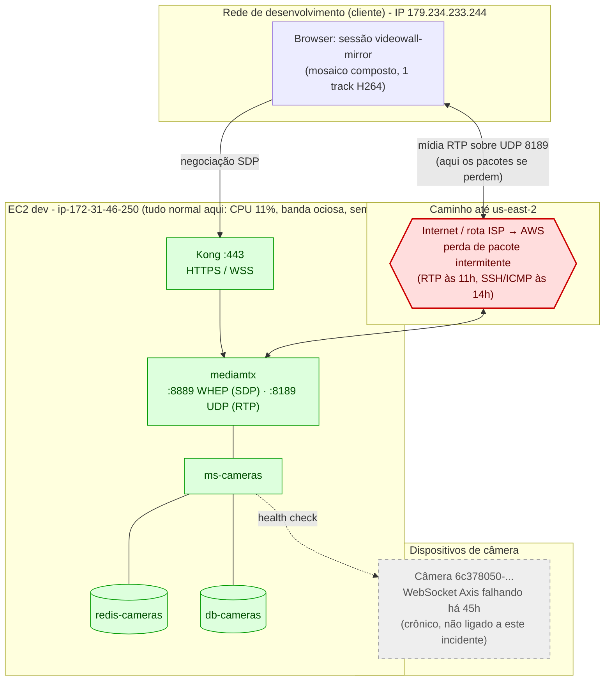
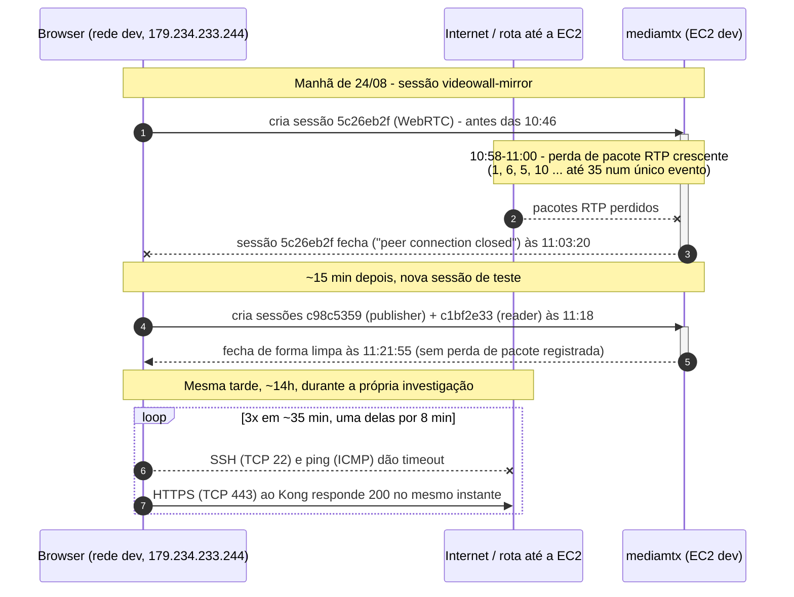

---
tags:
  - doc
  - ms-cameras
  - cameras
  - attlas
  - incidente
  - streaming
atualizado: 2026-08-24
frente: Streaming
ambiente: EC2 dev (dev.v2.attlas.atmansystems.com)
host: ip-172-31-46-250
status: sem mitigação aplicada (causa aponta pra fora do ms-cameras)
---

# Incidente - câmeras instáveis por perda de pacote RTP no caminho até a EC2

> Investigação de instabilidade relatada em várias câmeras entre 11h e 11:22 de 24/08. Sem crash, restart, OOM ou saturação de CPU/rede no host: os logs do mediamtx mostram perda de pacote RTP e queda de sessão WebRTC do `videowall-mirror` no início e no fim exatos dessa janela, originadas do IP público desta rede de desenvolvimento. O mesmo padrão de indisponibilidade intermitente do host (SSH e ICMP caindo por 1-8 min enquanto HTTPS seguia respondendo) se repetiu ao vivo, várias vezes, durante a própria investigação (às 14h). Aponta pro caminho de rede até a EC2 (us-east-2/Ohio), não pro backend do `ms-cameras`.

## TL;DR

- `attlas-ms-cameras` segue no ar sem interrupção há 45h (`RestartCount=0`, `OOMKilled=false`) — não houve crash do serviço na janela do incidente.
- CPU do host normal no intervalo 10:50-11:30 (`sar`: ~11% user, ~7% system, ~78% idle). Banda de rede bem abaixo da capacidade (`sar -n DEV`: ~200-350 pacotes/s, `%ifutil` 0.00). `nf_conntrack` em 426/1048576. Sem contenção de recurso.
- Kong, `redis-cameras` e `db-cameras` sem erro nem log anômalo no intervalo (Kong só mostra `101`/`200`/`304` normais nas rotas de câmeras).
- `mediamtx` registrou a sessão WebRTC `5c26eb2f` (criada antes das 10:46, path do videowall-mirror) acumulando perda de pacote RTP crescente (1, 6, 5, 10, ..., até **35 pacotes num único evento**) entre 10:58 e 11:00, e fechando (`peer connection closed`) às **11:03:20**.
- Uma segunda sessão do mesmo cliente (`c98c5359`/`c1bf2e33`, path `videowall-mirror-d1cf9321-...`) foi aberta às 11:18:49 e fechou de forma limpa (sem perda de pacote registrada) às **11:21:55** — bordas quase exatas do intervalo relatado (11h-11:22).
- O `remote candidate` de ambas as sessões é `179.234.233.244` — o IP público **desta mesma rede de desenvolvimento** (confirmado com `curl ifconfig.me` durante a investigação).
- Ao investigar (por volta das 14h, ~3h depois do incidente), o SSH e o ping para essa mesma EC2 ficaram indisponíveis por 1 a 8 minutos, repetidas vezes, enquanto uma chamada HTTPS ao Kong (porta 443) respondia normalmente com `200`. Mesma assinatura: falha intermitente e pontual em portas/protocolos específicos (TCP 22, UDP 8189/ICMP), não queda geral do host.
- Achado separado e crônico (não é a causa deste intervalo): a câmera `6c378050-1fda-410a-8887-00095eeea0de` falha o WebSocket Axis a cada ~60-77s, ininterruptamente, desde antes do início da janela analisada — 729 falhas só hoje, contador de tentativas na casa de 2000+ desde que o container subiu (2 dias atrás). Provável dispositivo offline/inacessível.

## Estado atual (24/08)

- `attlas-ms-cameras` rodando normalmente, sem mitigação aplicada — não havia o que mitigar do lado do serviço.
- SSH para o host voltou a cair durante a própria investigação (última queda confirmada por volta das 14:47-14:55) e se recuperou sozinho, sem intervenção. Não foi tentado nenhum comando de reinício/restart no host ou nos containers.
- Câmera `6c378050-1fda-410a-8887-00095eeea0de` segue em loop de reconexão no momento em que esta nota foi escrita.

## Sintomas observados

- Usuário relatou "várias câmeras parcialmente instáveis" entre 11h e 11:22 de 24/08.
- No mediamtx: warnings `WAR [WebRTC] [session <id>] N RTP packets lost` crescentes até o fechamento da sessão.
- Encerramento de sessão WebRTC do videowall-mirror logo no início (11:03:20) e perto do fim (11:21:55) do intervalo relatado.
- Warnings crônicos e distribuídos ao longo do dia inteiro (não só nessa janela) de `invalid FU-A packet (non-starting)` em múltiplos paths de telemetria (`telemetry-*`) e no próprio `videowall-mirror` — 1185 ocorrências hoje, ~75-95/hora na maior parte do dia, sem pico dramático às 11h (94 na hora, contra baseline de ~75-80).

## Investigação (o que foi verificado)

1. `docker ps -a --filter name=cameras` e `docker inspect attlas-ms-cameras` — container `Up 45 hours`, `RestartCount=0`, `OOMKilled=false`, sem limite de CPU/memória no `HostConfig` (não há cgroup limit, então não é o container sendo estrangulado).
2. `docker stats --no-stream` — `attlas-ms-cameras` em 40% de CPU no snapshot (mais alto do host, mas dentro do normal para os workers de ffmpeg/health), 220 MiB de RAM. Nenhum container em pressão de memória.
3. `sar -f /var/log/sysstat/sa24 -s 10:50:00 -e 11:30:00` — CPU do host em ~11% user / ~7% system / ~78% idle na janela do incidente. `sar -n DEV` no mesmo intervalo — tráfego de rede em `ens5` bem abaixo da capacidade (`%ifutil 0.00`).
4. `cat /proc/sys/net/netfilter/nf_conntrack_count` vs `nf_conntrack_max` — 426 de 1.048.576, longe de saturar.
5. `journalctl -k` no intervalo por `oom|link is down|nf_conntrack|throttl` — nenhuma ocorrência.
6. `docker logs attlas-ms-cameras --since 2026-08-24T10:55:00 --until 2026-08-24T11:30:00` — 323 linhas no total; as únicas que batem com `error|exception|timeout|reconnect|disconnect|...` são todas da câmera `6c378050-...` falhando o WebSocket Axis (chronic, ver abaixo). Nenhum erro novo específico da janela.
7. `docker logs attlas-kong` no mesmo intervalo, filtrado por rota de câmeras — só `101` (upgrade WebSocket) e `200`/`304` normais. Nenhum `5xx`.
8. `docker logs attlas-redis-cameras` e `attlas-db-cameras` no intervalo — só `BGSAVE` periódico do Redis (comportamento normal) e nenhum erro de conexão no Postgres.
9. `docker logs attlas-mediamtx` no intervalo, sem filtro de keyword — achou os warnings de `RTP packets lost` da sessão `5c26eb2f` (10:58-11:03) e os `closed:` das sessões `5c26eb2f`/`269fd63c` (11:03:20) e `c98c5359`/`c1bf2e33` (11:21:55).
10. Rastreamento de todas as sessões WebRTC com qualquer `RTP packet lost` hoje (dia inteiro): só duas — `5c26eb2f` (60 warnings, IP `179.234.233.244`) e `65da8bd9` (4 warnings, IP `167.250.40.82`, sem relação com este incidente).
11. `curl ifconfig.me` nesta máquina → `179.234.233.244`, batendo exatamente com o `remote candidate` das sessões problemáticas.
12. Durante a investigação, `ping` para o IP da EC2 (`3.15.199.101`) deu 100% de perda enquanto `ping` para outros hosts (rede interna e `1.1.1.1`) funcionou normalmente — e uma chamada HTTPS ao Kong no mesmo momento respondeu `200`. SSH para o host caiu e voltou sozinho pelo menos 3 vezes ao longo de ~35 minutos de investigação, com uma queda de pelo menos 8 minutos.
13. Confirmado, via `ps aux` no host, que o runner de CI (`Runner.Worker`, build `nx affected -t build`) estava ativo durante a investigação (14h) — mas o `sar` mostra que a CPU estava normal às 11h, então não há evidência de que o runner estivesse rodando build pesado durante o próprio incidente.

## Causa raiz (explicação detalhada)

### O que a sessão carrega

O `videowall-mirror` espelha o mosaico de câmeras (o "muro de vídeo" com vários tiles) como um único stream H264, publicado no `mediamtx` e consumido por WebRTC: negociação SDP (WHEP) em `8889/HTTP`, mídia de fato em `8189/UDP`. O log de leitura da sessão confirma isso — `session c1bf2e33 is reading from path 'videowall-mirror-d1cf9321-...', 1 track (H264)` — **um único track** carregando o mosaico inteiro dentro do frame, não uma sessão por câmera. É por isso que um problema de rede numa única sessão aparenta ser "várias câmeras instáveis" ao mesmo tempo: são vários tiles dentro do mesmo frame de vídeo, todos trafegando pelo mesmo caminho UDP.

### Por que WebRTC sente isso e HTTPS não

RTP sobre UDP não retransmite pacote perdido — ao contrário de TCP/HTTP, que reenvia automaticamente. O H264 fragmenta cada frame grande em pacotes RTP menores via FU-A (*Fragmentation Unit type A*); o receptor remonta o frame juntando os fragmentos em ordem. Se um pacote no **meio** da fragmentação some, o próximo fragmento que chega é "não inicial" sem ter visto o começo — daí o `invalid FU-A packet (non-starting)` no log. O frame inteiro é descartado e a imagem trava/pixela até o próximo keyframe. Quando a perda é grande e sustentada — os 35 pacotes num único evento da sessão `5c26eb2f` — o `mediamtx` não consegue mais sustentar a sessão ICE/RTP e fecha a conexão (`peer connection closed`).

Já a chamada HTTPS ao Kong (`443/TCP`) que respondeu `200` bem no meio da janela em que SSH e ping falhavam não sente o mesmo efeito: é uma conexão TCP com retransmissão automática no próprio protocolo — uma perda pontual vira uma pausa curta, não a queda da sessão. Isso explica por que o sintoma apareceu só no WebRTC (UDP) e, horas depois, também no SSH (TCP **novo**, handshake ainda não estabelecido) e no ICMP, mas nunca numa conexão HTTPS já em curso.

### Por que aponta pra fora do ms-cameras

Não há evidência de que o problema esteja na instância EC2 em si — CPU, memória, banda de saída e conntrack todos normais no horário — nem no `ms-cameras`/`mediamtx` como software. O padrão observado (throughput baixo funcionando normalmente, mas handshake/pacote novo falhando de forma intermitente e se recuperando sozinho em minutos) é mais consistente com uma rota/AS intermediária ou o uplink desta rede de desenvolvimento tendo hiccups periódicos até a região `us-east-2` — reforçado pelo fato de o mesmo sintoma (SSH/ICMP fora, HTTPS respondendo) ter se repetido ao vivo, 3 vezes em ~35 minutos, horas depois do incidente original, sem qualquer ação no lado do servidor.

## Diagramas

### Topologia e ponto de falha

### Linha do tempo do incidente

## O que NÃO era o problema

- Crash ou OOM do container `ms-cameras` — `RestartCount=0`, `OOMKilled=false`, uptime contínuo de 45h.
- Saturação de CPU do host — 11% de uso médio na janela, 78% idle.
- Saturação de banda — tráfego em `ens5` muito abaixo da capacidade, `%ifutil 0.00`.
- Esgotamento de conntrack — 426 de ~1M.
- Erro 5xx no Kong, erro de conexão no Postgres ou no Redis das câmeras.
- Contenção de CPU pelo runner de CI compartilhado no mesmo host — ele estava rodando durante a investigação (14h), mas o `sar` não mostra CPU elevada às 11h, quando o incidente de fato ocorreu.
- Falha generalizada em muitas câmeras/dispositivos — só uma sessão WebRTC (de um único cliente) teve perda de pacote relevante hoje; a falha crônica da câmera `6c378050-...` é anterior e não tem relação com esta janela específica.

## Correção proposta (backlog)

- [ ] Confirmar se há relato de instabilidade na mesma janela vindo de **outros** locais/clientes (não só desta rede de dev). Se for isolado a esta rede, o achado é sobre a rota de rede local/ISP até a AWS, fora do escopo do `ms-cameras`.
- [ ] Levantar uma métrica contínua de perda de pacote/latência até a EC2 (ex.: `mtr`/smokeping agendado) para caracterizar se esse padrão intermitente é recorrente — o comportamento observado ao vivo durante esta investigação (3 quedas de SSH/ICMP em ~35 min) sugere que sim.
- [ ] Olhar as métricas Prometheus do mediamtx (porta 9998, já instrumentada desde a PR 566, ver [[Streaming - Arquitetura]]) para uma visão histórica de perda de pacote por sessão, em vez de depender de grep manual em log.
- [ ] Investigar separadamente e à parte a câmera `6c378050-1fda-410a-8887-00095eeea0de` (falha crônica de WebSocket Axis, ~2000 tentativas desde que o container subiu) — checar se o dispositivo está online/acessível fisicamente ou se o registro está desatualizado.
- [ ] Ver [[Streaming - Diagnóstico de travamento no WebRTC]] para saber se a causa raiz documentada lá (perda de pacote/travamento WebRTC) já cobre este padrão ou se é um caso novo.

## Ligado a

- [[Streaming - Diagnóstico de travamento no WebRTC]] - diagnóstico existente de travamento no caminho WebRTC; conferir sobreposição com este achado.
- [[Streaming - Arquitetura]] - mapa de portas do mediamtx (8189/UDP é onde a mídia RTP do WebRTC trafega).
- [[Incidente - vazamento de sessões de stream (banda das câmeras)]] - incidente anterior no mesmo host/ambiente, causa diferente (vazamento de contagem de viewer), mas mesmo domínio.
