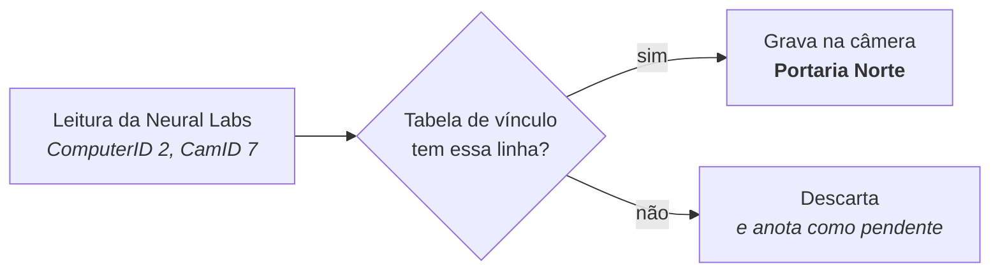

---
tags:
  - doc
  - analitico
  - neural-labs
  - lpr
aliases:
  - "Neural Labs - resumo ilustrado"
  - "Neural Labs - Como funciona a associação e o mapeamento de câmeras"
  - "Neural Labs - Como cada leitura chega na câmera certa"
atualizado: 2026-10-07
---

# Analítico - Neural Labs - Explicação - Como cada leitura chega na câmera certa

Volta para [[Analítico - Neural Labs]].

## Resumo

Toda leitura que a Neural Labs manda diz, dentro dela mesma, de qual câmera veio: o `ComputerID` (qual
computador da Neural Labs) e o `CamID` (qual câmera daquele computador). O Attlas tem uma **tabela de
vínculo** que diz "este `ComputerID` + `CamID` é esta câmera do Attlas". A leitura só entra se achar uma
linha nessa tabela; se não achar, é descartada. O Attlas nunca escolhe uma câmera por palpite.



## Exemplo completo

**O cenário.** O NEURAL SERVER da prefeitura chega ao Attlas pelo IP `10.1.5.20` e foi cadastrado como a
instância "Neural Vitória". Ele tem dois computadores lendo placas, e cada computador numera as suas
câmeras a partir de 1.

**Passo 1: de qual instância veio.** O NEURAL SERVER abre a conexão com o Attlas. O Attlas olha o IP de
origem, `10.1.5.20`, e encontra a instância "Neural Vitória". Se a conexão viesse de um IP que nenhuma
instância tem, seria fechada na hora, sem ler nada.

**Passo 2: a leitura chega.** Pela conexão chega este XML (resumido):

```xml
<infoplate>
  <Engine>LPR</Engine>
  <ComputerID>2</ComputerID>
  <CamID>7</CamID>
  <CamName>Portaria Norte</CamName>
  <Plate>ABC1D23</Plate>
  <DateHour>2026-09-29 10:15:02.000</DateHour>
</infoplate>
```

**Passo 3: procura na tabela de vínculo.** A tabela da instância "Neural Vitória" está assim:

| ComputerID | CamID | Câmera do Attlas |
| --- | --- | --- |
| 1 | 7 | Av. Beira Mar |
| 2 | 7 | Portaria Norte |
| 2 | 8 | Rua Sete |

A leitura tem `ComputerID` 2 e `CamID` 7, então cai na segunda linha: é gravada na câmera **Portaria
Norte**.

Repare que existem dois `CamID` 7, um em cada computador. É por isso que a busca usa o par `ComputerID` +
`CamID`, e não o `CamID` sozinho.

**Passo 4: e se não tiver linha?** Chega uma leitura de `ComputerID` 2, `CamID` 9, `CamName` "Pátio Sul".
Não existe essa linha, então:

1. a leitura é **descartada** e o par 2 + 9 aparece na página da instância, em "Aguardando vínculo";
2. com o vínculo automático ligado na instância, o Attlas procura no cadastro uma câmera chamada "Pátio
   Sul";
3. se existe **exatamente uma**, e ninguém a tirou da Neural Labs, ele cria a linha `2 | 9 | Pátio Sul`
   sozinho, e a partir da próxima leitura os dados entram nela;
4. se não existe nenhuma, ou existem duas com esse nome, não cria nada: a câmera continua em "Aguardando
   vínculo" até alguém resolver, e o Attlas tenta de novo a cada minuto.

## Por que isso garante que o dado está na câmera certa

- **Sem linha, sem dado.** O Attlas não adivinha. Uma leitura que não se encaixa na tabela é descartada.
- **Uma linha por câmera, nos dois sentidos.** Um par `ComputerID` + `CamID` aponta para uma câmera só, e
  uma câmera do Attlas recebe um par só em cada instância. Uma leitura nunca cai em duas câmeras, e duas
  câmeras da Neural Labs nunca caem na mesma.
- **A linha não muda sozinha.** Depois de criada, ela fica. Se estiver errada, é preciso remover e vincular
  de novo; nada troca a câmera por cima, porque isso moveria o histórico de leituras. A única exceção é
  substituir a câmera no cadastro do Attlas: o vínculo passa para a câmera nova, porque o par da Neural
  Labs continua o mesmo.
- **Nome repetido não vincula.** Se o nome bate com duas câmeras, o Attlas não escolhe.
- **Instância pelo IP.** Uma leitura de um NEURAL SERVER nunca se mistura com a de outro, porque a tabela é
  separada por instância e a instância vem do IP da conexão.

## O único ponto que pode dar errado

A linha criada sozinha confia no **nome**. Se na Neural Labs a câmera "Portaria Norte" for, fisicamente,
outra câmera que não a "Portaria Norte" do Attlas, a linha é criada errada e os dados vão para a câmera
errada, sem aviso.

Como evitar: antes de ligar em produção, pedir à Neural Labs a lista de câmeras com `ComputerID`, `CamID`
e o número de série ou o IP de cada uma, e importar essa lista pela API de importação do vínculo (rota em
[[Analítico - Neural Labs - Arquitetura e estratégias#Rotas públicas]]). Cada linha vincula a câmera do
Attlas com aquela série ou aquele IP, sem depender do nome, e a linha que não acha câmera, acha mais de
uma ou discorda volta num relatório com o motivo.

Depois de ligado, a página da instância mostra, ao lado do nome e do IP de cada câmera vinculada, o par
`ComputerID` + `CamID`; passando o mouse, ela diz se o vínculo foi criado sozinho pelo nome ou à mão, e em
que data. Uma câmera com o par errado aparece ali.

As regras completas estão em [[Analítico - Neural Labs - Vínculo de câmeras]], e a integração inteira em
[[Analítico - Neural Labs - Arquitetura e estratégias]].
