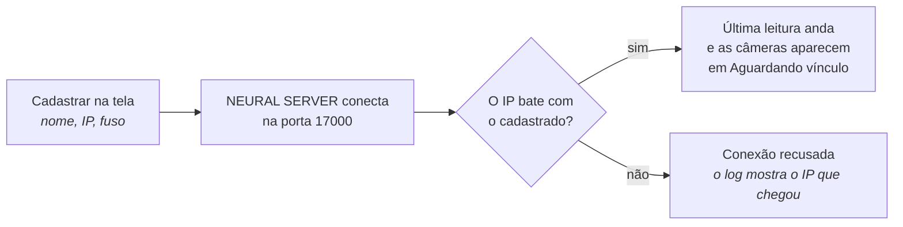

---
tags:
  - doc
  - analitico
  - neural-labs
  - lpr
aliases:
  - "Neural Labs - Como cadastrar"
  - "Como cadastrar o analítico da Neural Labs"
atualizado: 2026-10-06
---

# Analítico - Neural Labs - Explicação - Como cadastrar a Neural Labs

## A resposta curta

A Neural Labs **não aparece** em "Encontrados na rede". A varredura procura câmeras com analítico
embarcado da Atman; o servidor da Neural Labs (o NEURAL SERVER) é que liga para o Attlas. Por isso o
cadastro é uma caixa própria no mesmo painel:

**Analítico > Instâncias > Adicionar analítico > "Cadastrar servidor Neural Labs"**, logo abaixo de
"Cadastrar manualmente".

## Quando a caixa aparece

Não é um estado de câmera nem de instância. A caixa aparece sempre que o Attlas está com a Neural Labs
ligada no servidor, isto é, o serviço de analítico (`ms-video-analytics`) está com a Neural Labs
habilitada e respondendo. No dev.v2 isso já está ligado. Se a caixa não aparece, a Neural Labs está
desligada naquele ambiente; não há nada a fazer na tela.

Também é preciso a permissão de gerenciar instâncias.

## O que preencher

| Campo | O que pôr |
| --- | --- |
| Nome | Um nome para reconhecer o servidor, por exemplo "NEURAL SERVER Centro" |
| IP de origem | O IP de onde o servidor da Neural Labs vai conectar no Attlas. Se ele sai para a internet por um roteador (NAT), é o IP público dessa rede |
| Fuso do relógio do servidor | O fuso em que o relógio do servidor da Neural Labs está. Já vem o do seu navegador; troque se o servidor estiver em outro fuso |
| Vincular câmeras automaticamente pelo nome | Ligado: cada câmera da Neural Labs que tiver o mesmo nome de uma câmera do Attlas é vinculada sozinha |

Depois de "Cadastrar Neural Labs", a instância aparece na lista com o tipo "Leitura de placas" e fica
"sem relato" até o servidor conectar.

## O que fazer no servidor da Neural Labs

No NEURAL SERVER, configurar o envio para o Attlas:

- **Client mode**, com o endereço do Attlas e a **porta 17000**.
- **XML completo** (não o "light weight").
- **Send Image desligado**: a imagem deixa a mensagem grande demais.
- Se houver mais de um servidor da Neural Labs saindo pelo mesmo roteador, cada um com um `ComputerID`
  diferente.

## Como saber que funcionou

- Na página da instância, "Última leitura" passa a mostrar a hora da última mensagem.
- As câmeras do servidor aparecem em **Aguardando vínculo**. Com o vínculo automático ligado, as que
  têm nome igual ao de uma câmera do Attlas saem dessa lista sozinhas; as outras se vinculam à mão ou
  pela lista do equipamento.
- Se nada acontece, quase sempre é o IP: o Attlas só aceita a conexão que vem do IP cadastrado. O log do
  serviço (`neural_lpr_connection_rejected`) mostra o IP que chegou, e é esse que se cadastra.

Detalhes técnicos em [[Analítico - Neural Labs - Arquitetura e estratégias]] e o vínculo das câmeras em
[[Analítico - Neural Labs - Explicação - Como cada leitura chega na câmera certa]].
