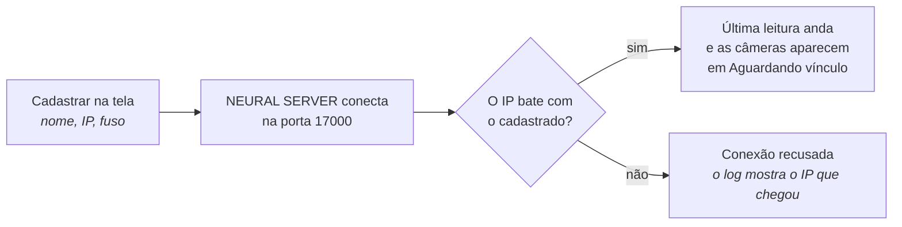

---
tags:
  - doc
  - analitico
  - neural-labs
  - lpr
aliases:
  - "Neural Labs - Como cadastrar"
  - "Como cadastrar o analítico da Neural Labs"
atualizado: 2026-10-07
---

# Analítico - Neural Labs - Explicação - Como cadastrar a Neural Labs

Volta para [[Analítico - Neural Labs]].

## Resumo

A Neural Labs **não aparece** em "Encontrados na rede". A varredura procura câmeras com analítico
embarcado da Atman, e o servidor da Neural Labs (o NEURAL SERVER) é que liga para o Attlas. Por isso o
cadastro é uma caixa própria no mesmo painel:

**Analítico > Instâncias > Adicionar analítico > "Cadastrar servidor Neural Labs"**, logo abaixo de
"Cadastrar manualmente".

## Quando a caixa aparece

A caixa não depende de câmera nem de instância. Ela aparece sempre que a Neural Labs está ligada no
Attlas, isto é, o serviço de analítico está com a Neural Labs habilitada e respondendo. No dev.v2 isso já
está ligado. Se a caixa não aparece, a Neural Labs está desligada naquele ambiente, e não há nada a fazer
na tela.

Também é preciso a permissão de gerenciar instâncias.

## O que preencher

| Campo | O que pôr |
| --- | --- |
| Nome | um nome para reconhecer o servidor, por exemplo "NEURAL SERVER Centro" |
| IP de origem | o IP de onde o servidor da Neural Labs vai conectar no Attlas, no formato `200.10.20.30`; se ele sai para a internet por um roteador (NAT), é o IP público dessa rede |
| Fuso do relógio do servidor | o fuso em que o relógio do servidor da Neural Labs está; a Neural Labs manda a hora da leitura sem fuso, e o Attlas a converte por este. Já vem o do seu navegador; troque se o servidor estiver em outro fuso |
| Vincular câmeras automaticamente pelo nome (CamName) | ligado: cada câmera da Neural Labs que tiver o mesmo nome de uma câmera do Attlas é vinculada sozinha |

Depois de "Cadastrar Neural Labs", aparece o aviso "Neural Labs ... cadastrada. As placas entram quando o
NEURAL SERVER conectar de ...", e a instância entra na lista com o tipo "Leitura de placas" e o estado
"Não monitorado" até o servidor mandar a primeira leitura. Se o IP já está cadastrado em outra instância,
o aviso é "Já existe uma instância Neural Labs cadastrada com este endereço de origem." e nada é gravado.

## O que fazer no servidor da Neural Labs

No NEURAL SERVER, configurar o envio para o Attlas:

- **Client mode**, com o endereço do Attlas e a **porta 17000**.
- **XML completo** (não o "light weight" nem o JSON).
- **Send Image desligado**: a imagem deixa a mensagem grande demais.
- Se houver mais de um servidor da Neural Labs saindo pelo mesmo roteador, cada um com um `ComputerID`
  diferente.

## Como saber que funcionou

- A instância passa de "Não monitorado" para "Online", e "Última leitura" mostra a hora da última
  mensagem. A página não se atualiza sozinha: recarregue para ver.
- As câmeras do servidor aparecem em **Aguardando vínculo**. Com o vínculo automático ligado, as que têm
  nome igual ao de uma câmera do Attlas saem dessa lista sozinhas a partir da leitura seguinte; as outras
  se vinculam à mão ou pela lista do equipamento.
- Se nada acontece, quase sempre é o IP: o Attlas só aceita a conexão que vem do IP cadastrado. O log do
  serviço de analítico (`neural_lpr_connection_rejected`) mostra o IP que chegou, e é esse que se
  cadastra.

## Corrigir um cadastro

Pela tela não se edita nem se remove uma instância da Neural Labs: a linha dela só tem a ação "ver", e o
nome, o IP, o fuso e o vínculo automático aparecem na página só para leitura. Para corrigir um IP ou um
fuso errado, ou para desligar a instância, peça ao time técnico.

Detalhes técnicos em [[Analítico - Neural Labs - Arquitetura e estratégias]], e o vínculo das câmeras em
[[Analítico - Neural Labs - Explicação - Como cada leitura chega na câmera certa]].
