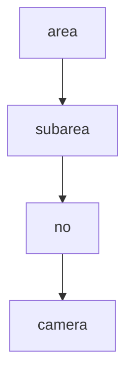

---
tags:
  - diagramas
  - guia
---

# Excalidraw e Canvas

Esta pasta guarda seus esbocos. Duas opcoes:

## Excalidraw (desenho livre, recomendado pra diagrama)

Precisa instalar o plugin antes (ver [[Home#Plugins a instalar]]).

Depois de instalado:
1. Clique direito na pasta `Diagramas` > **New drawing** (ou comando `Excalidraw: Create new drawing`).
2. Desenha. Salva sozinho como arquivo `.excalidraw.md` aqui na pasta.
3. Da pra embutir um desenho dentro de qualquer nota com `![[nome-do-desenho.excalidraw]]`.

## Canvas (quadro de notas conectadas, nativo, sem plugin)

Ja vem ligado no Obsidian.
1. Clique direito na pasta > **New canvas**.
2. Arraste notas, imagens (tipo aquele print do fluxo de cameras), cartoes de texto e conecta com setas.

## Mermaid (diagrama por codigo, dentro de qualquer nota)

Tambem nativo. Em qualquer nota:

````

````

> Para diagramas mais limpos, lembra do layout ELK (front-matter `config.layout: elk`).
