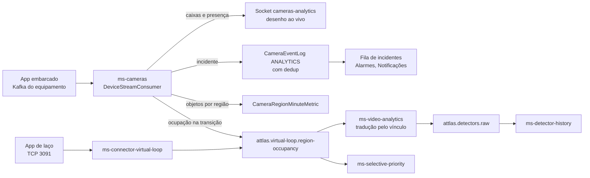

---
tags:
  - doc
  - analitico
  - fluxos
aliases:
  - "Plano - o vínculo da região do analítico com o detector"
  - "Vínculo região-detector"
  - "Região associada continua sem vínculo"
  - "Sem faixa vinculada"
  - "Sem detector na ACOM"
atualizado: 2026-10-07
---

# Analítico - Fluxos

Volta para [[Analítico]].

## Resumo

| Fluxo | Gatilho | Resultado |
| --- | --- | --- |
| [[#Pôr uma câmera para funcionar com o embarcado]] | Câmera Axis com app da Atman entra no cadastro | Região acesa ao vivo e ocupação virando leitura de detector |
| [[#Tela ao vivo]] | Operador abre a câmera na Detecção ou no detalhe da câmera | Regiões acesas e caixas sobre o vídeo; nada é gravado |
| [[#Incidente]] | Quadro do app com incidente | Linha na fila de incidentes, alarme para três tipos, mídia lida do equipamento |
| [[#Ocupação até o detector]] | Região muda de vazia para ocupada, ou o contrário | Leitura de detector `VIRTUAL_LOOP` no `ms-detector-history` |
| [[#Métricas]] | Operador abre a aba Métricas | Cartões com o que cada fonte mede, vazios quando não há fonte |
| [[#Vínculo região-detector]] | Operador escolhe a faixa de uma região | A ocupação da região passa a alimentar aquele detector |

Onde cada peça mora está em [[Analítico - Arquitetura e estratégias]]; a placa ACOM, em
[[Analítico - Vínculo com a ACOM]]; a leitura de placas, em [[Analítico - Neural Labs - Arquitetura e estratégias]].

## Pôr uma câmera para funcionar com o embarcado

**Gatilho.** Uma câmera Axis com o app da Atman instalado entra no cadastro de câmeras.

**Passos.**

1. Cadastrar a câmera. A sonda de credencial identifica a arquitetura ARTPEC e lê o `source_id` que o app já
   reporta.
2. O cadastro oferece só os tipos de analítico que a matriz de compatibilidade permite para aquela arquitetura
   (`analytics-compatibility.matrix.ts`).
3. Registrar a unidade em Analítico, aba Instâncias, à mão ou pela descoberta na rede, que só lê o equipamento.
4. **Vincular**, no cartão do equipamento na página da instância: o serviço grava no app o `source_id` e o broker
   de destino, liga o producer, relê o equipamento e só então guarda o `deviceSourceId`.
5. Desenhar região e laço na aba Detecção, sobre o quadro congelado do preset, e salvar. Salvar é a única escrita
   de configuração no equipamento.
6. Escolher a faixa da região no campo "Faixa associada" do bloco "Métricas de desempenho" da Detecção, o que cria
   o vínculo região-detector ([[#Vínculo região-detector]]).

**Resultado.** A região acende na tela ao vivo em até 30 s, e a ocupação dela vira leitura de detector.

**Erros.**

| Situação | Resposta |
| --- | --- |
| Câmera não Axis ou arquitetura não identificada | O cadastro recusa o embarcado |
| ARTPEC 8 ou 9 com o outro tipo já ativo | O cadastro recusa: na matriz, os dois apps são exclusivos nessa arquitetura |
| O app publica com a identidade de outra instalação | Vincular responde 409 e a tela pede confirmação; confirmar envia `confirmTakeover` e toma o equipamento |
| A câmera não tem credencial | Vincular responde 422 |

## Tela ao vivo

**Gatilho.** O operador abre a câmera na aba Detecção, ou a aba Analítico do detalhe da câmera, e inicia o vídeo.

**Passos.**

1. A tela entra na sala `camera:<cameraId>` do socket `cameras-analytics` e recebe a saúde e a ocupação atuais.
2. O consumidor casa o `source_id` de cada quadro com as câmeras vinculadas e emite na sala da câmera.
3. Caixas só saem de build que as reporta (capacidade `FRAME_REPORTING`). O SDCT e o app de laço só acendem a
   região, pela ocupação.
4. A presença ao vivo sai no primeiro quadro ocupado, sem esperar a histerese da ocupação do Kafka, e apaga quando o
   silêncio passa de 1,5 vez o maior intervalo recente entre quadros, limitado entre 250 ms e 2 s.
5. O player compartilhado desenha região e caixa só com a imagem em `live`. Na Detecção, a própria tela desenha e
   segura caixas, regiões e cards no instante da pausa.

**Resultado.** Regiões acesas e caixas sobre o vídeo. Este caminho não grava nada.

**Erros.**

| Situação | Resposta |
| --- | --- |
| Desenho vazio | `camera:analytics:stream` diz o motivo: broker sem quadro, câmera sem vínculo ou build sem caixa |
| Último quadro com mais de 60 s | Saúde `DEGRADED` |
| Último quadro com mais de 300 s | Saúde `OFFLINE` |
| Câmera sem `CameraAnalytic` | Saúde `NOT_CONFIGURED`, sem consultar o Redis |

## Incidente

**Gatilho.** Um quadro traz incidente (`obj_incidents` ou `region_incidents`) e o build declara que reporta
incidente. Reportam os builds `atspm-http` e `horus-http`; só o `atspm-http` guarda imagem.

**Passos.**

1. O incidente vira linha em `CameraEventLog` com categoria `ANALYTICS`, uma por câmera, região, tipo e janela de
   dedup de 30 s.
2. A fila e a página do incidente recebem `camera:incidents:changed` pela sala `incidents:<systemId>`.
3. Congestionamento, contramão e veículo parado no trânsito viram alarme no domínio `analytics` (`ANLT_*`).
4. O operador trata o incidente: Não reconhecido, Confirmado, Em tratamento, Resolvido ou Falso positivo, só com as
   transições que o ciclo permite. A mudança de tratamento notifica.
5. Ao abrir o incidente, a imagem do app e a gravação da câmera são lidas do equipamento. A lista fica no Redis e os
   arquivos ficam por 7 dias no object storage do `ms-cameras`.

**Resultado.** O incidente na fila, com criticidade do tipo, mídia do equipamento e, para os três tipos mapeados, um
alarme. O tratamento em detalhe está em [[Câmeras - Eventos, incidentes e alarmes - Fluxos]].

**Erros.**

| Situação | Resposta |
| --- | --- |
| Mídia que o equipamento já descartou (retenção do app, limpeza do SD) | O item aparece como ausente; a rota responde 404 |
| Câmera sem leitor de evidência (SDCT, laço por TCP) | A lista de mídia vem vazia |
| Equipamento lento | A leitura desiste depois de 15 s sem cabeçalho ou 120 s de transferência |

## Ocupação até o detector

**Gatilho.** Uma região muda de vazia para ocupada, ou o contrário, depois da histerese.

**Passos.**

1. O `ms-cameras` (builds HTTP) ou o `ms-connector-virtual-loop` (app de laço por TCP) publica a ocupação em
   `attlas.virtual-loop.region-occupancy`, só na transição.
2. O `ms-video-analytics` acha o detector da região e do agente (veículo ou pedestre) na lista que relê de
   `GET /api/internal/virtual-loop/sources`, e publica em `attlas.detectors.raw`.
3. O `ms-detector-history` guarda a série igual à do laço físico.
4. O `ms-selective-priority` lê a mesma ocupação para o avistamento de veículo prioritário.

**Resultado.** Leitura de detector `VIRTUAL_LOOP` com o endereço do vínculo.

**Erros.**

| Situação | Resposta |
| --- | --- |
| Região sem vínculo para aquele agente | A ocupação é descartada e contada como `discarded_no_binding`; o serviço nunca inventa endereço |
| Ocupação de pedestre | Só vai para o vínculo de pedestre da região, nunca para o detector de veículo ao lado |

> [!warning] O caminho do app de laço por TCP não fecha sozinho
> O conector atende o app e publica a ocupação, mas o `ms-cameras` nunca grava o `deviceId` que o equipamento
> anuncia no handshake. O adaptador `virtual-loop-tcp` não passa da sonda, e o endereçamento do conector
> (`PUT /internal/devices/:deviceId/addressing`) só é escrito à mão. Ver [[Analítico - Pendências]].

## Métricas

**Gatilho.** O operador abre Analítico, aba Métricas, e escolhe a câmera, a face e a janela.

**Passos.**

1. A face Laço Virtual lê as janelas do detector vinculado no `ms-detector-history` e as métricas por região
   gravadas pelo `ms-cameras`.
2. A face ATSPM lê as medidas que o app ATSPM calcula (`device-metrics`, só build `atspm-http`), as métricas por
   região e os leitores de detector.
3. A face Incidentes lê `GET /api/cameras/incidents/metrics`, do Sistema inteiro, sem escolha de câmera.
4. A tela relê quando chega `camera:analytics:metrics` (janela gravada) ou ocupação da câmera em foco; não há
   polling.

**Resultado.** Cartões com o que cada fonte mede. Cartão sem fonte aparece vazio, nunca com zero.

**Erros.**

| Situação | Resposta |
| --- | --- |
| O equipamento não calcula ou não responde | `device-metrics` responde indisponível, guardado no Redis por 60 s |
| A câmera não tem o analítico da face | A face não abre para ela |
| Câmera com mais de um vínculo | As faces leem só o primeiro. Ver [[Analítico - Pendências]] |

## Vínculo região-detector

O vínculo (`VirtualLoopDetectorBinding`, no `ms-cameras`) diz qual detector de faixa uma região alimenta. Um
endereço de detector nunca é referenciado por duas regiões, e uma região alimenta no máximo um endereço por agente.

**Gatilho.** O operador escolhe a "Faixa associada" de uma região na Detecção, ou usa o diálogo "Vincular laço a um
detector" na aba Métricas.

**Passos.**

1. A tela lista os detectores da interseção da câmera, lidos do Modelo de Tráfego.
2. A tela envia `POST /api/cameras/:cameraId/virtual-loop-bindings` com a região, o controlador, o índice do
   detector e o propósito.
3. O serviço confere as unicidades e a trava de contagem dupla, grava e audita.
4. O sistema mantém o vínculo: detector que muda de slot ou canal no mesmo controlador leva o vínculo; detector que
   sai do controlador ou deixa de existir o desfaz.

**Resultado.** A ocupação da região passa a virar leitura daquele detector. Quem lê o vínculo: o campo "Faixa
associada" da Detecção, as faces de Métricas e a aba ACOM do controlador, que deriva dele a entrada de detector da
fiação e mostra "Sem detector" para laço sem vínculo.

**Erros.**

| Situação | Resposta |
| --- | --- |
| A região já alimenta um endereço do mesmo agente | 409 `REGION_AGENT_ALREADY_BOUND` |
| O endereço já é de outra região | 409 `DETECTOR_ADDRESS_ALREADY_BOUND` |
| O endereço já é publicado como laço físico pelo caminho ACP | 409 `DETECTOR_ADDRESS_ALREADY_BOUND`. Sem `MS_DETECTOR_HISTORY_INTERNAL_URL` a trava não roda e o vínculo é aceito com aviso no log |
| A aba ACOM salva a fiação com o `ms-cameras` fora | 503 `ACOM_BINDING_PROVIDER_UNAVAILABLE`, e nada é gravado |

## Glossário

| Termo | O que é |
| --- | --- |
| `source_id` | Identidade que o app grava em cada quadro e que o Attlas usa para achar a câmera |
| Producer | O publicador Kafka dentro do app; desligado, nenhum quadro sai |
| Histerese | Atraso proposital para ligar e desligar a ocupação, que evita piscar em quadro isolado |
| Agente | Quem a região conta: veículo (`VEHICLE`) ou pedestre (`PEDESTRIAN`) |
| Dedup | Janela em que o mesmo incidente da mesma região não gera segunda linha |
| Caminho ACP | A leitura de detector físico que o `ms-controllers` faz no controlador |
