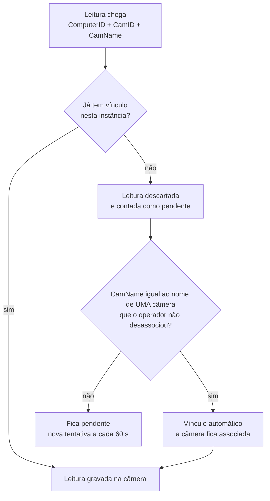

---
tags:
  - doc
  - analitico
  - neural-labs
  - lpr
aliases:
  - "Analítico - Associação e vínculo de câmeras com a Neural Labs"
  - "Associação e vínculo Neural Labs"
  - "Neural Labs - Identificação das câmeras"
  - "Identificação das câmeras da Neural Labs"
  - "Vínculo Neural Labs por endereço"
  - "Neural Labs - Vínculo de câmeras"
atualizado: 2026-10-07
---

# Analítico - Neural Labs - Vínculo de câmeras

Volta para [[Analítico - Neural Labs]].

## Resumo

Cada câmera do Attlas responde a duas perguntas sobre a Neural Labs, e cada uma tem dono e modo
automático próprios. A Neural Labs identifica a câmera pelo par `ComputerID` + `CamID`, sem IP nem série,
então o vínculo é o que diz em qual câmera do Attlas cada leitura entra. A explicação com exemplo, para
usuário, está em [[Analítico - Neural Labs - Explicação - Como cada leitura chega na câmera certa]].

| | Associação | Vínculo |
| --- | --- | --- |
| Pergunta | A Neural Labs processa esta câmera? | Qual câmera da Neural Labs é esta câmera do Attlas? |
| Automático | associada quando o vínculo existe | pelo nome, quando a leitura chega |
| Manual | página da instância: adicionar associa, remover desassocia | pela lista do equipamento, pela página da instância ou pela API |
| Onde mora | `ms-cameras`, `CameraServerAnalytic`, só a decisão manual | `ms-video-analytics`, `ExternalCameraMap`, por instância |

## A associação

**É o dado que associa**: a câmera passa a ser da Neural Labs quando a primeira leitura dela gera o
vínculo. O automático da associação não é gravado; ele é resolvido na leitura pelo catálogo de tipos
(`AnalyticTypeCatalog.SERVER`, com `NEURAL_LABS` em `assumedWhenMapped: true`) e pelo
`ServerAnalyticAssignmentResolver`. Só a decisão manual vira linha em `CameraServerAnalytic`.

O embarcado não entra na regra: a câmera com analítico embarcado que a Neural Labs também lê fica com as
duas coberturas. Cada câmera cai em uma de quatro coberturas, cruzando embarcado configurado e associação
à Neural Labs: embarcado e servidor, só embarcado, só servidor ou nenhum.

## Como a Neural Labs identifica uma câmera

Em todo canal do fabricante a câmera é o par `ComputerID` + `CamID`, e o nome é só rótulo.

| Canal | Identifica por | Traz endereço ou série? |
| --- | --- | --- |
| XML de leitura completo | `ComputerID`, `CamID`, `CamName`, `LocationID`, `LaneID` | não |
| XML curto | `CamID`, `LocationID` | não, nem o `ComputerID` |
| Trigger 73 | máscara das câmeras ativas | não |
| API Web da Neural Platform | `cameraId`, `computerId`, `cameraName`, localidade | não |
| Heartbeat do Orchestrator | `ComputerId`, `Id`, `Name`, estado | não |
| Cadastro da câmera no NEURAL SERVER | ID, nome, localização, tipo | **sim: a URL do stream, com o IP da câmera** |

- O `ComputerID` é escolhido pelo operador na instalação e ligado à licença; a unicidade entre servidores é
  só recomendada. O Attlas separa servidores pela instância, que é o IP de origem; servidores atrás do
  mesmo NAT chegam com o mesmo IP e aí precisam de `ComputerID` diferente.
- O `CamID` é único dentro do servidor e pequeno, porque as câmeras são endereçadas por máscara de bits.
- O manual público limita cada servidor a 16 câmeras: as cerca de 800 câmeras da instalação seriam
  dezenas de servidores, cada um uma instância no Attlas.
- A Neural Labs e o Attlas leem a mesma câmera física pelo mesmo endereço de rede, então o IP da URL é um
  elo determinístico. No Attlas o IP é único entre as câmeras ativas de um Sistema
  (`Camera_active_ip_unique`), e a série lida da câmera confere.

O detalhe de cada canal está em [[Analítico - Neural Labs - Envio XML do NEURAL SERVER]],
[[Analítico - Neural Labs - Configuração de câmera no NEURAL SERVER]],
[[Analítico - Neural Labs - API Web do NS Backend]] e
[[Analítico - Neural Labs - Heartbeat e eventos do Orchestrator]].

## Os três jeitos de vincular

1. **Pela lista do equipamento**, o caminho para a instalação inteira. Cada linha traz `ComputerID`,
   `CamID` e o número de série ou o IP que a câmera tem no Attlas. Vincula antes da primeira leitura, sem
   depender do nome. Só pela API (`POST .../camera-mappings/import`).
2. **Automático pelo nome**, ligado por padrão em cada instância (`NeuralInstance.autoLinkEnabled`):
   leitura de câmera sem vínculo cujo `CamName` é igual ao nome de exatamente uma câmera do Attlas que o
   operador não desassociou.
3. **Manual**, na página da instância (adicionar associa, e o nome vincula na próxima leitura) ou pela
   API.

Todo vínculo guarda a origem: `MANUAL` ou `AUTOMATIC`, e o da lista conta como manual. O vínculo guarda a
câmera do Attlas, não o IP nem a série, então mudar o IP depois não o afeta. Um par aponta para uma
câmera, e uma câmera recebe um par por instância (`@@unique` nos dois sentidos). O vínculo nunca troca de
câmera: ele só é desfeito e feito de novo, e as leituras já recebidas ficam com a câmera em que foram
lidas.

Quando a câmera é substituída no Attlas dentro do mesmo Sistema, o vínculo passa para a câmera nova,
porque o par da Neural Labs continua o mesmo. A troca é feita depois da substituição, sem bloqueá-la: se
a câmera nova já tem vínculo naquela instância, o antigo não é movido e fica o log
`neural_labs_link_not_moved`; se a troca falha, a importação da lista vincula de novo.

## A lista do equipamento

- O número de série vale sem diferença de maiúscula, e o IP é único entre as câmeras ativas do Sistema.
- Com as duas chaves, as duas precisam apontar para a mesma câmera.
- A importação procura só no Sistema de quem chama.
- A primeira linha de um par ou de uma câmera é a que vale; as seguintes voltam como repetidas.

Cada linha volta com um resultado:

| Resultado | Quando |
| --- | --- |
| `LINKED` | vinculou |
| `ALREADY_LINKED` | o mesmo vínculo já existia |
| `NO_KEY` | a linha não tem série nem IP |
| `CAMERA_NOT_FOUND` | nenhuma câmera responde à chave |
| `CAMERA_AMBIGUOUS` | mais de uma câmera responde |
| `KEYS_DISAGREE` | a série e o IP apontam para câmeras diferentes |
| `CAMERA_UNASSIGNED` | o operador desassociou a câmera da Neural Labs |
| `EXTERNAL_CAMERA_LINKED_TO_OTHER_CAMERA` | o par já está vinculado a outra câmera |
| `CAMERA_LINKED_TO_OTHER_EXTERNAL_CAMERA` | a câmera já está vinculada a outro par na instância |
| `DUPLICATE_IN_FILE` | o par ou a câmera já apareceu numa linha anterior da lista |

## O vínculo manual pela API

O vínculo manual recebe um lote de pares com a câmera de cada um e devolve `accepted` e `conflicts`. Um
vínculo existente nunca é reescrito. O lote relê o que gravou: a linha que o vínculo automático tomou
antes, entre a conferência e a gravação, volta em `conflicts`, e só o que foi aceito gera auditoria. `ComputerID` e `CamID` chegam
aparados, como o socket compara.

| Motivo do conflito | Quando |
| --- | --- |
| `EXTERNAL_CAMERA_MAPPED_TO_OTHER_CAMERA` | o par já está vinculado a outra câmera |
| `CAMERA_MAPPED_TO_OTHER_EXTERNAL_CAMERA` | a câmera já está vinculada a outro par na instância |
| `CAMERA_NOT_IN_SYSTEM` | a câmera não é do Sistema de quem chama |
| `DUPLICATE_IN_BATCH` | o par ou a câmera se repete no mesmo lote |

## O vínculo automático pelo nome

- Compara sem maiúscula e sem espaço nas pontas; acento e espaço interno contam.
- Nome repetido em duas câmeras do Attlas não vincula. IP e ordem numérica nunca decidem aqui.
- As candidatas vêm de todos os Sistemas, porque o servidor é da instalação.
- A primeira leitura sem vínculo é descartada; o vínculo vale a partir da seguinte.
- Câmera desassociada pelo operador nunca volta pelo nome nem pela lista, até ser adicionada de novo.
- Com o vínculo automático desligado na instância, a tentativa termina como `skipped`.
- O socket nunca espera essa consulta: o `NeuralCameraAutoLinker` faz uma tentativa por câmera externa a
  cada `NEURAL_LPR_AUTO_LINK_RETRY_INTERVAL_MS` (60 s) e conta em
  `neural_lpr_auto_link_attempts_total{outcome}`.

O risco do nome: se a "Portaria Norte" da Neural Labs for outra câmera física que a "Portaria Norte" do
Attlas, o vínculo nasce errado e os dados vão para a câmera errada sem aviso. Por isso a lista do
equipamento vem antes.

## Na tela

A instância Neural Labs é uma linha da tabela de Analítico > Instâncias, com tipo "Leitura de placas",
ambiente servidor, fornecedor terceiro, fabricante "Neural Labs" e código próprio com prefixo `NL-`. A
linha só tem a ação "ver". O estado sai do cadastro e da última leitura:

| Estado | Quando |
| --- | --- |
| Online | habilitada e já recebeu ao menos um quadro |
| Não monitorado | habilitada e ainda sem nenhum quadro |
| Offline | desabilitada |

A página da instância é a mesma `/analytics/instances/:instanceId` da Atman, sem editar a instância e sem
log. Ela mostra:

- **Dados gerais**: endereço de origem, "Última leitura", fuso, vínculo automático ligado ou desligado e
  as leituras da última hora somadas dos vínculos da instância, tudo só leitura.
- **Câmeras vinculadas**: as associadas cujo vínculo é desta instância. Câmera associada que nenhuma
  leitura vinculou ainda aparece em todas as instâncias, até o primeiro vínculo. Ao lado do nome e do IP
  vai uma pílula "ComputerID 3 · CamID 7", com o tooltip de como e quando o vínculo nasceu ("Vinculada
  automaticamente pelo nome em ..." ou "Vinculada manualmente em ..."). Uma terceira linha diz como o
  vínculo vem lendo: "42 leituras na última hora, a última em ..." ou "Nenhuma leitura recebida ainda".
  Câmera que o embarcado também lê leva um ícone com tooltip. A busca acha a câmera pelo par.
- **Aguardando vínculo**: no lugar do log, as câmeras externas sem vínculo da instância, com o último
  nome recebido (ou "Sem nome na Neural Labs"), o par, quantas leituras mandou e a última, a mais recente
  primeiro. Câmera vinculada sai da lista. Sem nenhuma, a linha diz "Toda câmera que enviou leitura já
  está vinculada."
- **"Editar vínculos"**: o mesmo painel da Atman. Adicionar associa a câmera, e a leitura dela vincula
  pelo nome quando chegar. Remover desassocia e apaga o vínculo dela em cada instância que o tem, porque
  a associação é da câmera. O botão só aparece para quem tem `CAMERA_EDIT` e `INSTANCES_MANAGE`.

Não há tempo real nem polling: cada escrita relê a página. Quando a leitura da Neural Labs falha ou
responde `neuralAvailable = false`, a listagem mostra só a frota Atman, e a página de uma instância
Neural Labs responde como não encontrada.

## Divergências

Associação e vínculo podem discordar, e a leitura pública devolve os dois casos em `divergences` de cada
câmera e em `summary.byDivergence`:

| Divergência | O que quer dizer |
| --- | --- |
| `ASSIGNED_WITHOUT_MAPPING`, associada sem vínculo | o Attlas espera leitura dessa câmera, mas a leitura dela chegaria sem câmera e ficaria fora do tempo medido |
| `MAPPED_BUT_NOT_ASSIGNED`, vinculada sem associação | o operador tirou a associação, mas o vínculo ainda atribui leitura a ela |

> [!warning] A tela não mostra as divergências
> A regra do módulo pede que a tela mostre os dois casos e avise quando o lado Neural Labs está
> indisponível. A página da instância não exibe nenhuma das duas coisas: as divergências só existem na
> resposta da API.

## Rotas

As rotas públicas e internas do vínculo estão em
[[Analítico - Neural Labs - Arquitetura e estratégias#Rotas públicas]] e
[[Analítico - Neural Labs - Arquitetura e estratégias#Rotas internas]].

## Pendências

- **A lista do equipamento não aceita a URL do stream** como coluna, só série ou IP. A URL é o que o
  cadastro do NEURAL SERVER tem.
- **Ler o cadastro direto do banco da Neural Labs**, com usuário SQL somente leitura, resolvendo cada
  câmera pelo IP da URL. É o padrão do plugin oficial do Milestone. Depende de a Neural Labs informar a
  tabela e liberar o acesso.
- **Câmera lida por NVR**: o IP da URL seria o do gravador, e o canal separa as câmeras. Confirmar com a
  instalação.
- **Divergências na tela**: ver a seção "Divergências".

## O que perguntar à Neural Labs

1. Nome da tabela de câmeras no banco de configuração e das colunas de ID, nome, localização, tipo e URL;
   o mesmo para computadores e localidades.
2. Se existe banco central com as câmeras de todos os servidores.
3. Usuário SQL somente leitura e acesso de rede, ou a exportação da lista com `ComputerID`, `CamID`, nome
   e URL.
4. Quantos servidores são, se cada um tem `ComputerID` próprio e o limite de câmeras por servidor na
   versão instalada.
5. O que o campo `GUID` do XML carrega e se pode levar o id da câmera do Attlas.
6. Se as câmeras são lidas direto ou por NVR.

## Glossário

| Termo | O que é |
| --- | --- |
| Associação | decisão de que a Neural Labs processa a câmera; automática quando o vínculo existe |
| Vínculo | ligação do par `ComputerID` + `CamID` de uma instância com uma câmera do Attlas |
| Câmera externa | câmera do NEURAL SERVER, identificada pelo par, antes ou depois do vínculo |
| Pendente | câmera externa que mandou leitura sem vínculo; aparece em "Aguardando vínculo" |
| Cobertura | combinação de embarcado configurado e associação à Neural Labs de uma câmera |
| NVR | gravador de vídeo em rede, que pode servir várias câmeras pelo mesmo IP |
