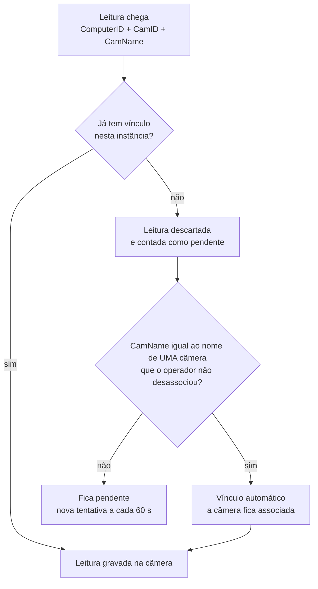

---
tags:
  - doc
  - analitico
  - neural-labs
  - lpr
aliases:
  - "Analítico - Associação e vínculo de câmeras com a Neural Labs"
  - "Associação e vínculo Neural Labs"
  - "Neural Labs - Identificação das câmeras"
  - "Identificação das câmeras da Neural Labs"
  - "Vínculo Neural Labs por endereço"
  - "Neural Labs - Vínculo de câmeras"
atualizado: 2026-10-06
---

# Analítico - Neural Labs - Vínculo de câmeras

Como o Attlas sabe qual câmera sua é cada câmera da Neural Labs, e quais câmeras a Neural Labs
processa. Regras em `docs/modules/analitico.md` seção 3.9 e `CROSS-170`. Explicação com exemplo para
usuário em [[Analítico - Neural Labs - Explicação - Como cada leitura chega na câmera certa]]. Índice em [[Analítico - Neural Labs]].

## Duas perguntas por câmera

| | Associação | Vínculo |
| --- | --- | --- |
| Pergunta | A Neural Labs processa esta câmera? | Qual câmera da Neural Labs é esta câmera do Attlas? |
| Automático | Associada quando o vínculo existe | Pelo nome, quando a leitura chega |
| Manual | Página da instância: adicionar associa, remover desassocia | Pela lista do equipamento ou pela API |
| Onde mora | `ms-cameras`, `CameraServerAnalytic` (só a decisão manual) | `ms-video-analytics`, `ExternalCameraMap`, por instância |

**É o dado que associa**: a câmera passa a ser da Neural Labs quando a primeira leitura dela gera o
vínculo. O automático da associação não é gravado; é resolvido na leitura
(`AnalyticTypeCatalog.SERVER.NEURAL_LABS` com `assumedWhenMapped: true`, `ServerAnalyticAssignmentResolver`).
O embarcado não entra na regra: câmera com embarcado que a Neural Labs também lê fica com as duas
coberturas.

## Como a Neural Labs identifica uma câmera

Em todo canal do fabricante a câmera é o par `ComputerID` + `CamID`, com o nome só como rótulo.

| Canal | Identifica por | Traz endereço ou série? |
| --- | --- | --- |
| XML de leitura completo | `ComputerID`, `CamID`, `CamName`, `LocationID`, `LaneID` | Não |
| XML curto | `CamID`, `LocationID` | Não, nem o `ComputerID` |
| Trigger 73 | Máscara das câmeras ativas | Não |
| API Web da Neural Platform | `cameraId`, `computerId`, `cameraName`, localidade | Não |
| Heartbeat do Orchestrator | `ComputerId`, `Id`, `Name`, estado | Não |
| Cadastro da câmera no NEURAL SERVER | ID, nome, localização, tipo | **Sim: a URL do stream, com o IP da câmera** |

- `ComputerID` é escolhido pelo operador na instalação e ligado à licença; a unicidade entre servidores é
  só recomendada. O Attlas separa servidores pela instância (o IP de origem); servidores atrás do mesmo
  NAT chegam com o mesmo IP e aí precisam de `ComputerID` diferente.
- `CamID` é único dentro do servidor e pequeno (as câmeras são endereçadas por máscara de bits).
- O manual público limita cada servidor a 16 câmeras: as cerca de 800 da instalação seriam dezenas de
  servidores, cada um uma instância no Attlas.
- A Neural Labs e o Attlas leem a mesma câmera física pelo mesmo endereço de rede, então o IP da URL é
  um elo determinístico. O IP é único entre as câmeras ativas de um Sistema no Attlas
  (`Camera_active_ip_unique`), e a série lida da câmera confere.

## Os três jeitos de vincular

1. **Pela lista do equipamento**, o caminho para a instalação inteira: cada linha traz `ComputerID`,
   `CamID` e o número de série ou o IP da câmera no Attlas. Série sem diferença de maiúscula, IP único
   entre as ativas; com as duas chaves, as duas precisam apontar para a mesma câmera. Linha sem câmera,
   com mais de uma ou em desacordo volta num relatório com o motivo. Vincula antes da primeira leitura.
   Só pela API (`POST .../camera-mappings/import`).
2. **Automático pelo nome**, ligado por padrão em cada instância (`NeuralInstance.autoLinkEnabled`):
   leitura de câmera sem vínculo cujo `CamName` é igual ao nome de exatamente uma câmera do Attlas que o
   operador não desassociou.
3. **Manual**, na página da instância (adicionar associa e o nome vincula na próxima leitura) ou pela
   API.

Todo vínculo guarda a origem (`MANUAL` ou `AUTOMATIC`; o da lista conta como manual). O vínculo guarda a
câmera do Attlas, não o IP nem a série: mudar o IP depois não o afeta, e substituir a câmera no Attlas
leva o vínculo para a nova. Um par aponta para uma câmera, e uma câmera recebe um par por instância
(`@@unique` nos dois sentidos).

## O vínculo automático pelo nome

- Compara sem maiúscula e sem espaço nas pontas; acento e espaço interno contam.
- Nome repetido em duas câmeras do Attlas não vincula. IP e ordem numérica nunca decidem aqui.
- A primeira leitura sem vínculo é descartada; o vínculo vale a partir da seguinte.
- Câmera removida pelo operador nunca volta pelo nome nem pela lista, até ser adicionada de novo.
- O socket nunca espera essa consulta: `NeuralCameraAutoLinker`, uma tentativa por câmera externa a cada
  `NEURAL_LPR_AUTO_LINK_RETRY_INTERVAL_MS` (60 s), métrica `neural_lpr_auto_link_attempts_total{outcome}`.

O risco do nome: se a "Portaria Norte" da Neural Labs for outra câmera física que a do Attlas, o vínculo
nasce errado e os dados vão para a câmera errada sem aviso. Por isso a lista do equipamento vem antes.

## Na tela

Analítico > Instâncias > instância Neural Labs: estado (online com leitura recente, "sem relato" antes
da primeira, offline se desabilitada), endereço de origem, última leitura; as câmeras vinculadas com o
par `ComputerID` e `CamID` ao lado do IP, como cada vínculo nasceu e como cada câmera vem lendo; e as
câmeras externas aguardando vínculo, com o par, o último nome, quantas leituras mandou e quando foi
vista. "Editar vínculos" adiciona (associa) e remove (desassocia e desfaz o vínculo; as leituras já
recebidas ficam com a câmera).

Divergências que a tela mostra: **associada sem vínculo** (a leitura chegaria sem câmera) e
**vinculada sem associação**. Com a integração fora do ar, a tela avisa e não aponta divergência.

## Rotas

| Rota | Para quê |
| --- | --- |
| `GET /api/cameras/analytics/neural-labs/cameras` | Página e lista; o `ms-cameras` junta o `ms-video-analytics` |
| `PUT`/`DELETE /api/cameras/{cameraId}/server-analytics/NEURAL_LABS/manual` | Associar, desassociar, voltar ao automático |
| `PUT /api/cameras/analytics/neural-labs/instances/{id}/camera-mappings` | Vínculo manual de câmera externa |
| `POST /api/cameras/analytics/neural-labs/instances/{id}/camera-mappings/import` | Vínculo pela lista do equipamento |
| `DELETE /api/cameras/analytics/neural-labs/instances/{id}/camera-mappings/{cameraId}` | Desfazer o vínculo |
| `POST /api/cameras/analytics/neural-labs/instances` | Cadastrar a instância (painel "Adicionar analítico") |
| `PATCH /api/cameras/analytics/neural-labs/instances/{id}` | Ligar ou desligar o automático (`autoLinkEnabled`) |
| `GET /api/internal/cameras/neural-labs/auto-link-candidates?camName=` | Candidatas do automático (interna) |

## Pendências

- **A lista do equipamento não aceita a URL do stream** como coluna: hoje só série ou IP. A URL é o que
  o cadastro do NEURAL SERVER tem.
- **Ler o cadastro direto do banco da Neural Labs**, com usuário SQL somente leitura, resolvendo cada
  câmera pelo IP da URL. É o padrão do plugin oficial do Milestone. Depende de a Neural Labs informar a
  tabela e liberar o acesso.
- **Câmera lida por NVR**: o IP da URL seria o do gravador, e o canal separa as câmeras. Confirmar com a
  instalação.

## O que perguntar à Neural Labs

1. Nome da tabela de câmeras no banco de configuração e das colunas de ID, nome, localização, tipo e URL;
   o mesmo para computadores e localidades.
2. Se existe banco central com as câmeras de todos os servidores.
3. Usuário SQL somente leitura e acesso de rede, ou a exportação da lista com `ComputerID`, `CamID`, nome
   e URL.
4. Quantos servidores são, se cada um tem `ComputerID` próprio e o limite de câmeras por servidor na
   versão instalada.
5. O que o campo `GUID` do XML carrega e se pode levar o id da câmera do Attlas.
6. Se as câmeras são lidas direto ou por NVR.
