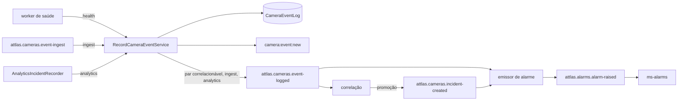

---
tags:
  - doc
  - cameras
  - eventos
  - ms-cameras
aliases:
  - "Eventos, incidentes e alarmes - Fluxos"
atualizado: 2026-10-07
banner: "alarm alert notification"
---

# Câmeras - Eventos, incidentes e alarmes - Fluxos

Volta para [[Câmeras - Eventos, incidentes e alarmes]].

## Resumo

Regras, contratos e o porquê de cada etapa estão em
[[Câmeras - Eventos, incidentes e alarmes - Arquitetura e estratégias]]; os valores, em
[[Câmeras - Eventos, incidentes e alarmes - Requisitos e SLA]].

| Fluxo | Gatilho | Resultado |
| --- | --- | --- |
| [[#1. Evento de saúde até o alarme]] | O worker de saúde detecta uma transição ou recebe evento do equipamento | Linha em `CameraEventLog` e, se o par é correlacionável, publicação em `event-logged` |
| [[#2. Evento externo]] | Mensagem em `attlas.cameras.event-ingest` | Linha gravada e publicada, ou descartada com log |
| [[#3. Incidente do analítico embarcado]] | Quadro do analítico com incidente | Linha `ANALYTICS_INCIDENT` publicada e, nos três tipos mapeados, alarme |
| [[#4. Correlação]] | Mensagem em `event-logged` com par correlacionável | Evento ligado a um incidente; na promoção, `incident-created` |
| [[#5. Limpeza periódica de incidentes]] | Cron a cada minuto | Incidentes resolvidos ou descartados |
| [[#6. Emissão de alarme]] | Mensagem em `incident-created` ou `event-logged` | Alarme em `attlas.alarms.alarm-raised` |
| [[#7. Consulta na tela de Eventos]] | Operador abre a lista, o detalhe ou um card | Página, KPIs, detalhe, timeline ou recorrência |
| [[#8. Observação]] | Operador escreve no card de observações | Observação gravada, auditada e avisada à sala de incidentes |
| [[#9. Report de ocorrência]] | Operador confirma o modal "Reportar ocorrência" | Incidente manual `DETECTED` ligado ao evento |
| [[#10. Tratamento do incidente do analítico]] | Operador muda o status de um ou de vários incidentes | Nova linha ou transição em `CameraEventTreatment` |
| [[#11. Exportação da fila]] | Operador exporta a lista em XLS ou PDF | Arquivo em fluxo na resposta HTTP |
| [[#12. Leitura de incidentes]] | Chamada às rotas de `CameraIncident` | Página ou detalhe de incidente; nenhuma tela usa hoje |

## 1. Evento de saúde até o alarme

**Gatilho.** O worker de saúde ([[Câmeras - Saúde e monitoramento - Fluxos]]) detecta uma transição de
conexão ou recebe um evento do equipamento.

**Passos.**

1. O worker chama `recorder.record(message, { source: 'health' })` uma vez por linha `Camera` do equipamento.
2. O ponto de escrita valida o fuso de `occurredAt`, persiste e publica `CameraEventLogCreatedEvent` no
   EventBus, que vira `camera:event:new` na sala `camera:<id>` e invalida o bloco de eventos do dashboard.
3. Se o par `(eventType, causeCode)` não está em `CORRELATABLE`, o fluxo termina aqui.
4. Se está, publica em `attlas.cameras.event-logged` com chave `cameraId`.
5. O tópico entrega a mensagem à correlação (fluxo 4) e ao emissor de alarme (fluxo 6).

**Resultado.** Linha em `CameraEventLog` visível na tela e, para par correlacionável, mensagem no tópico.

**Erros.** `occurredAt` sem fuso falha com `INVALID_TIMEZONE`. Falha de gravação é logada pelo worker e nunca
interrompe o monitoramento. Falha de publicação não desfaz a gravação.

## 2. Evento externo

**Gatilho.** Um produtor publica `ICameraEventIngestMessage` em `attlas.cameras.event-ingest`. Não há
produtor desse tópico no repositório hoje.

**Passos.**

1. O `CameraEventIngestListener` descarta com `warn` a mensagem sem `cameraId` ou `eventType`, com payload
   acima de 4 KiB ou não serializável.
2. O ponto de escrita confere que a câmera existe e valida o fuso.
3. Se o `correlationId` já foi gravado para a câmera, devolve a linha existente sem gravar.
4. Persiste, emite `camera:event:new` e publica em `event-logged`.

**Resultado.** Linha nova em `CameraEventLog` e mensagem em `event-logged`.

**Erros.** Câmera desconhecida e `InvalidInputException` são descartadas com `warn`. Qualquer outro erro é
logado como `error` e a mensagem não é reprocessada; nada vai para fila-morta.

## 3. Incidente do analítico embarcado

**Gatilho.** O `AnalyticsIncidentRecorder` (`analytics-realtime/`) recebe um quadro do analítico com incidente.

**Passos.**

1. O gravador colapsa repetições da mesma câmera, região e tipo dentro de 30 s.
2. Grava `ANALYTICS_INCIDENT` com `severity` `WARN`, sem `causeCode`, e o tipo em `payload.incidentType`.
3. O ponto de escrita persiste, emite `camera:event:new`, avisa a sala `incidents:<systemId>` e publica em
   `event-logged`.
4. O emissor de alarme (fluxo 6) alarma `CONGESTION`, `WRONG_WAY` e `STOPPED_FLOW`; os outros tipos não alarmam.

**Resultado.** Incidente na fila do [[Analítico]] e, para os três tipos mapeados, alarme no domínio `analytics`.

**Erros.** O incidente do analítico nunca entra na correlação, porque não tem `causeCode`.

## 4. Correlação

**Gatilho.** Mensagem em `attlas.cameras.event-logged`.

**Passos.**

1. Se o par não é correlacionável ou o evento já está ligado a um incidente, termina.
2. Monta `correlationKey = eventType:causeCode` e procura incidente aberto da chave dentro das janelas de 60 s
   e 120 s.
3. Achou: liga o evento numa transação, recontando eventos e câmeras. Se o incidente está `TENTATIVE` e chegou
   a 2 câmeras ou 3 eventos, promove para `DETECTED` por `updateMany` condicional.
4. Quem promoveu publica `attlas.cameras.incident-created` e invalida o bloco de incidentes do dashboard.
5. Não achou: cria `TENTATIVE` com o evento, sem publicar.

**Resultado.** Evento ligado a um incidente; na promoção, uma mensagem em `incident-created`.

**Erros.** Payload inválido é descartado com log. Dois eventos simultâneos da mesma chave podem criar dois
`TENTATIVE`.

## 5. Limpeza periódica de incidentes

**Gatilho.** `@Cron` a cada 60 s, em todas as réplicas; só a que obtém `pg_try_advisory_xact_lock` executa.

**Passos.**

| Operação | Condição | Efeito |
| --- | --- | --- |
| `autoCloseExpiredDetected` | `DETECTED` sem evento novo há 30 min | Vira `RESOLVED` |
| `dropExpiredTentative` | `TENTATIVE` sem atividade há 120 s | Vira `DROPPED` |
| `autoResolveByRecovery` | `DETECTED` com 80% das câmeras em `HEALTH_ONLINE` depois de `detectedAt` | Vira `RESOLVED` |

**Resultado.** Incidentes antigos fecham sozinhos.

**Erros.** Réplica que não obtém o lock pula o ciclo.

## 6. Emissão de alarme

**Gatilho.** Mensagem em `attlas.cameras.incident-created` ou em `attlas.cameras.event-logged`.

**Passos, incidente promovido.**

1. Descarta incidente sem câmeras afetadas.
2. `mapToAlarm` com `fromCluster: true`; se devolve `null`, não emite.
3. `alarmId = deriveAlarmId('INCIDENT', incidentId)`, câmera primária primeiro.
4. Publica em `attlas.alarms.alarm-raised` com chave `incidentId`.

**Passos, evento isolado.**

1. `ANALYTICS_INCIDENT` de tipo mapeado: publica no domínio `analytics`, com a severidade do catálogo; sem
   mapeamento, termina.
2. Outros eventos: se `isAlarmableEvent` é falso ou o evento já está ligado a incidente, termina.
3. `mapToAlarm` com `fromCluster: false` e `alarmId = deriveAlarmId('EVENT', eventLogId)`.
4. Publica com chave na câmera.

**Resultado.** O `ms-alarms` consome `alarm-raised`, deduplica pelo `alarmId` e classifica pelo `causeCode`
no catálogo do domínio.

**Erros.** `DomainException` e erro Prisma de dado são engolidos com log; qualquer outro erro é relançado e o
Kafka reentrega.

## 7. Consulta na tela de Eventos

**Gatilho.** O operador abre `/cameras/events` no `web-attlas`, aplica filtro, pagina ou abre um evento.

**Passos.**

1. **Lista e KPIs**: `GET /cameras/events` e `GET /cameras/events/stats` com os mesmos filtros. A topologia é
   carregada uma vez por request. Filtros da lista: `search`; `severity` e `category` em CSV; `incidentType`,
   só com `category=ANALYTICS`; `period` (`24h`, `7d`, `30d`, `90d`, `all` ou `range`, padrão `30d`); `area` e
   `subarea`; `origin` (`MANUAL` com `operatorId`, `SYSTEM` sem); `state` (conexão da câmera); `status`;
   `analytic`; `cameraId`. `sortBy` aceita `detectedAt` e `severity`, e `pageSize` vai até 100. Os KPIs não
   aceitam `24h` e comparam sempre os últimos 30 dias com os 30 anteriores.
2. **Detalhe**: `GET /cameras/events/:eventId` (rede) ou `GET /cameras/:id/events/:eventId` (câmera), com
   `triggeredActions`, `linkedIncident` e `treatmentAssignedTo`; a rota por câmera traz também
   `connectionStatus`.
3. **Timeline**: `GET /cameras/events/:eventId/timeline`. Com incidente ligado, devolve todos os eventos dos
   incidentes em ordem ascendente, possivelmente de várias câmeras. Sem incidente, devolve a mesma câmera em
   30 min para cada lado, até 50 linhas.
4. **Recorrência**: `GET /cameras/events/:eventId/recurrence?period=1h|24h|7d|30d`, só da câmera de origem,
   numa janela que termina no `occurredAt` do evento.
5. **Log da câmera**: `GET /cameras/:id/events`, com `eventType`, `severity`, `category`, `operatorId`, `from` e
   `to` sobre `createdAt`, busca e `sort`; `limit` padrão 20, máximo 100.

| Tela ou componente (`apps/web-attlas/src/app/modules/cameras-events/`) | Rota | Spec |
| --- | --- | --- |
| Página da lista com KPIs | Lista e KPIs | UF-002, UF-003 |
| Atalho de severidade nos cards | KPIs, filtro compartilhado com a tabela | UF-004 |
| Tabela da rede e "Ocultar colunas" | Lista | UF-005, UF-006, UF-007 |
| Busca da barra de ferramentas | Lista, `search` | UF-008 |
| Painel de filtros | Lista | UF-009 |
| Cache que mostra o último resultado enquanto revalida (`TtlLruCache` no `CameraEventsService`) | Nenhuma própria | UF-010 |
| Drawer de detalhe, abas Geral e Histórico | Detalhe e timeline | UF-011, UF-012 |
| Página interna do evento (rota `:id`) | Detalhe | UF-013 |
| Card "Histórico do Evento" | Timeline | UF-014 |
| Card "Recorrência do Evento" | Recorrência | UF-016 |
| Card "Últimos eventos do dispositivo" | Log da câmera | UF-017 |
| Card "Observações do evento" | Observações | UF-018 |
| Modal "Reportar ocorrência" | Report | UF-019 |
| Aba de log de eventos no detalhe da câmera | Log da câmera, com busca | UF-032 |

**Resultado.** A tela mostra a página, os KPIs e o detalhe. Lista e KPIs não recebem push: revalidam por ação
do operador (filtro, paginação, nova tentativa), sem polling. O `camera:event:new` atualiza em tempo real só o
log por câmera. A busca da aba de log consulta depois da pausa de digitação, mantém a página anterior na tela
com um indicador de carga e nunca desabilita o campo.

**Erros.** Evento de outra câmera ou de outro tenant responde 404, sem revelar que existe. `search` acima de
120 caracteres responde 400. Queda do `ms-traffic-model` deixa área e subárea vazias.

## 8. Observação

**Gatilho.** `POST /cameras/events/:eventId/observations` com `{ text, parentObservationId? }`.

**Passos.**

1. Exige `analytics.incidents:treat`.
2. Autor (`authorId`, `authorName`) vem do JWT, nunca do corpo.
3. Grava a observação; resposta de resposta é recusada.
4. Publica auditoria sem o texto e avisa a sala `incidents:<systemId>` com `camera:incidents:changed`.

**Resultado.** Observação na thread de dois níveis do card "Observações do evento".

**Erros.** Texto acima de 280 caracteres responde 400. Resposta a uma resposta responde 400
`PARENT_IS_REPLY`, porque a leitura só busca o primeiro nível e um nível de respostas.

## 9. Report de ocorrência

**Gatilho.** `POST /cameras/events/:eventId/report` com `{ name, description }`, pelo modal "Reportar ocorrência".

**Passos.**

1. Exige `analytics.incidents:treat` e localiza o evento na câmera do sistema.
2. `createReportedIncident` abre `CameraIncident` `DETECTED`, com `correlationKey` nulo, `reportedBy` do ator e
   o evento ligado.
3. A prioridade vem da `severity` do evento, nunca do corpo.

**Resultado.** Incidente manual ligado ao evento. Ele não passa pela correlação nem gera alarme, e fica fora da
trilha de auditoria.

**Erros.** Evento inexistente ou de outro tenant responde 404. `name` acima de 200 caracteres ou
`description` acima de 2000 respondem 400. Um segundo report do mesmo evento abre outro incidente.

## 10. Tratamento do incidente do analítico

**Gatilho.** `PATCH /cameras/events/:eventId/treatment-status` ou, em lote,
`PATCH /cameras/events/treatment-status` com até 100 ids.

**Passos.**

1. Exige `analytics.incidents:treat`; token sem `subject` responde 401.
2. Confere que o evento é `ANALYTICS`.
3. A primeira transição cria a linha e grava `assignedTo` com o ator; as seguintes só gravam se o status atual é
   o esperado.
4. Publica auditoria em `attlas.audit.cameras` (só `fromStatus` e `toStatus`), a notificação
   `cameras.incident.treatmentChanged` e `camera:incidents:changed`.
5. No lote, cada id segue os passos 2 a 4 sem transação em volta, e a resposta 200 traz o resultado por id.

**Resultado.** Status novo do incidente na fila do [[Analítico]].

**Erros.** Evento que não é `ANALYTICS` responde 409 `EventNotAnalyticsException`. Transição fora do ciclo ou
corrida perdida responde 409 `INVALID_STATE_TRANSITION`.

## 11. Exportação da fila

**Gatilho.** `GET /cameras/events/export?format=xls|pdf` com os filtros da lista.

**Passos.**

1. Lê a primeira página para obter o total.
2. Se o total passa de 20 000, recusa antes de abrir o stream.
3. Lê a criticidade configurada do sistema.
4. Escreve o arquivo direto na resposta, lendo o resto em lotes conforme o renderizador consome, com a
   criticidade do tipo no lugar da severidade do log.

**Resultado.** Arquivo XLS ou PDF da fila filtrada.

**Erros.** Acima do teto, 409 `EXPORT_LIMIT_EXCEEDED`. Com mais de 100 incidentes no filtro, o arquivo sai
cortado em 100 linhas (pendência em
[[Câmeras - Eventos, incidentes e alarmes - Pendências]]).

## 12. Leitura de incidentes

**Gatilho.** `GET /cameras/incidents` ou `GET /cameras/incidents/:id`. Nenhuma tela do `web-attlas` chama
essas duas rotas hoje.

**Passos.**

1. **Lista**: sem `from` e `to`, cobre os últimos 7 dias; esconde `TENTATIVE` e `DROPPED`; filtra por
   `severity`, `type`, `status` e `cameraId`, com `type` aplicado como sufixo de `correlationKey`;
   `affectedCameraIds` e `eventCount` são agregados à parte.
2. **Detalhe**: devolve o incidente com a timeline ascendente de até 200 eventos, `timelineTruncated`,
   `reportedBy`, `assignedTo` e `workOrderId`.

**Resultado.** Página ou detalhe de `CameraIncident`.

**Erros.** Incidente em status interno (`TENTATIVE`, `DROPPED`) responde 404 no detalhe.
