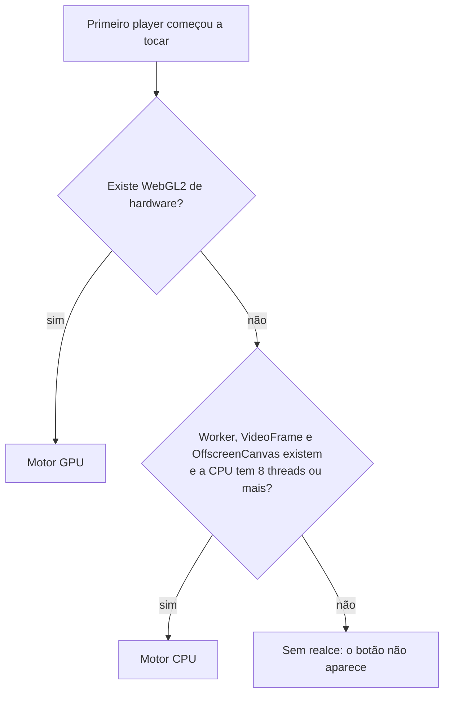

---
tags:
  - doc
  - ms-cameras
  - streaming
  - web-attlas
  - realce-de-imagem
aliases:
  - "Realce de imagem no cliente - Arquitetura e estratégias"
  - "Realce de imagem no cliente"
  - "Otimização de imagem no player"
  - "Pesquisa - realce de imagem no cliente"
  - "Pesquisa - melhoria de imagem e upscale"
  - "Streaming - Realce de imagem no cliente"
atualizado: 2026-10-02
---

# Câmeras - Streaming - Realce de imagem no cliente

Volta para [[Câmeras - Streaming]].

Esta nota explica o realce de imagem do player de câmera em ordem fixa: primeiro o resumo, depois como a
estação é classificada, depois cada tipo de hardware com as tecnologias que ele usa, depois cada técnica de
imagem. No fim estão o que ficou de fora, o estado da PR e a lista de documentação oficial.

![[Câmeras - Streaming - Realce de imagem no cliente - Antes e depois.png]]

*Quadro real da câmera da rua, em 720p. Da esquerda para a direita: original; só redução de artefato e
nitidez; com tom e cor. No terceiro, contraste da luma 19% maior e saturação média 38% maior, com o
brilho médio praticamente igual.*

## 1. Resumo

| Pergunta | Resposta |
| --- | --- |
| O que é | Um filtro que melhora a imagem **na tela do operador**: limpa artefato de compressão, corrige contraste e cor, amplia para o tamanho do quadro na tela e dá nitidez |
| Onde roda | Sempre no navegador da estação. Nunca no servidor, nunca na câmera |
| O que muda na rede | Nada. O vídeo que sai da câmera, passa pelo MediaMTX e chega ao navegador é o mesmo, com ou sem realce |
| Em que hardware | GPU de verdade (motor GPU) ou, sem GPU, CPU com pelo menos 8 threads (motor CPU). Sem nenhum dos dois, o botão não aparece |
| Onde está o código | Só na PR #4280, em draft. **Nada disto está na develop** |
| Mexe em cor ou saturação? | **Sim.** O passe de tom e cor estica o contraste à faixa que a cena usa e dá saturação com vibrance (seção 5.2), nos dois motores |
| O que roda na sua estação só CPU | Em 720p, o tom e cor. Redução de artefato e nitidez custam 25 ms cada e não cabem nos 8 ms por quadro (seção 4.2) |

> [!important] Regra: realce de imagem é sempre client-side
> Todo realce, upscale, nitidez ou limpeza de imagem de câmera roda no navegador da estação do operador. Tem
> de funcionar com GPU e também só com CPU. A estação de referência é um Intel Core 7 150U com o WebGL de
> hardware desligado.

> [!warning] Nada disto está na develop
> O código vive na PR #4280 (branch `cameras/feat/NO-CARD-client-video-enhancement`), em draft e com
> conflito com a develop, e **não deve ser mergeada**. Na develop não existem a pasta
> `apps/web-attlas/src/app/core/shared/video-enhancement/`, a spec
> `UF-044-camera-player-client-image-enhancement` nem o RNF-CAM-22.

## 2. Por que no cliente e não no servidor ou na câmera

- **No servidor**, cada stream teria de ser decodificado, filtrado e recodificado. O custo cresce junto com a
  frota de câmeras, soma latência e gasta banda. Também quebraria o passthrough do MediaMTX, que hoje só
  repassa o vídeo.
- **Na câmera** é onde a imagem ganha informação de verdade (WDR, bitrate do perfil principal, substream do
  tamanho certo). Isso é configuração de equipamento, não realce do player.
- **Risco forense.** Super-resolução por rede neural inventa detalhe que parece real, por exemplo uma placa
  nítida com a letra errada. Filtro clássico, com limite explícito, só redistribui o que já está na imagem.
  Por isso a PR usa só filtros clássicos.
- **Ordem dos passes**, a mesma de TVs e players de vídeo: limpar na resolução original, ampliar, e dar
  nitidez por último.

## 3. Como a estação é classificada

A classificação acontece **uma vez por aba do navegador**, quando o primeiro player começa a tocar
(`BrowserEnhancementCapabilityProbeAdapter.detect()`). O resultado é um destes três:

| Resultado | Condição exata no código | Quantos players ao mesmo tempo |
| --- | --- | --- |
| **GPU** | `WebGL2RenderingContext` existe, `getContext('webgl2', { failIfMajorPerformanceCaveat: true })` devolve contexto, e o nome do renderizador **não** é de software (ver seção 4.3) | 4 |
| **CPU** | não há GPU de hardware, existem `Worker`, `VideoFrame`, `OffscreenCanvas` e `transferControlToOffscreen`, e `navigator.hardwareConcurrency` é 8 ou mais | 1 |
| **NONE** | nenhum dos dois | 0 |

Duas consequências que valem lembrar:

- **Não há troca no meio do caminho.** Se o motor GPU falhar durante a sessão, aquele player fica sem
  realce. Ele não tenta a CPU.
- **O motor só é carregado quando alguém liga o realce**, por `import()` dinâmico. Quem nunca aperta o botão
  não paga o download do código.

## 4. Por tipo de hardware

Cada tipo segue o mesmo modelo: quando é usado, quais tecnologias usa, o que faz com a imagem e os limites.

### 4.1 Estação com GPU de hardware (motor GPU)

**Quando é usado.** O navegador oferece WebGL2 acelerado por placa de vídeo, integrada ou dedicada.

**Tecnologias**

| Tecnologia | O que é | Papel aqui | Documentação oficial |
| --- | --- | --- | --- |
| WebGL2 | API do navegador para desenhar com a GPU | Roda os três filtros como shaders | [Especificação WebGL 2.0](https://registry.khronos.org/webgl/specs/latest/2.0/) · [MDN WebGL2RenderingContext](https://developer.mozilla.org/en-US/docs/Web/API/WebGL2RenderingContext) |
| GLSL ES 3.00 | Linguagem dos programas que rodam na GPU (shaders) | Cada filtro é um fragment shader | [Especificação GLSL ES 3.00 (PDF)](https://registry.khronos.org/OpenGL/specs/es/3.0/GLSL_ES_Specification_3.00.pdf) |
| `failIfMajorPerformanceCaveat` | Opção do `getContext` que recusa um contexto lento demais | Primeiro filtro contra WebGL sem GPU real | [Especificação WebGL 1.0, atributos de contexto](https://registry.khronos.org/webgl/specs/latest/1.0/) · [MDN getContext](https://developer.mozilla.org/en-US/docs/Web/API/HTMLCanvasElement/getContext) |
| `WEBGL_debug_renderer_info` | Extensão que diz o nome do renderizador | Segundo filtro: recusa renderizador de software pelo nome | [Khronos](https://registry.khronos.org/webgl/extensions/WEBGL_debug_renderer_info/) · [MDN](https://developer.mozilla.org/en-US/docs/Web/API/WEBGL_debug_renderer_info) |
| `WEBGL_lose_context` e `webglcontextlost` | Liberar um contexto e saber quando o navegador derrubou um | Descarta o contexto de teste; contexto perdido desliga o realce do player | [Khronos](https://registry.khronos.org/webgl/extensions/WEBGL_lose_context/) · [MDN webglcontextlost](https://developer.mozilla.org/en-US/docs/Web/API/HTMLCanvasElement/webglcontextlost_event) |
| `texImage2D` e `texSubImage2D` | Enviar uma imagem para a GPU como textura | Cada quadro do `<video>` vira textura | [MDN texImage2D](https://developer.mozilla.org/en-US/docs/Web/API/WebGLRenderingContext/texImage2D) · [MDN texSubImage2D](https://developer.mozilla.org/en-US/docs/Web/API/WebGLRenderingContext/texSubImage2D) |
| Canvas 2D `getImageData` | Ler os pixels de um canvas comum | A cada 4 quadros, uma cópia de 64x36 do quadro é lida para medir a janela de tom | [MDN getImageData](https://developer.mozilla.org/en-US/docs/Web/API/CanvasRenderingContext2D/getImageData) · [HTML, canvas](https://html.spec.whatwg.org/multipage/canvas.html) |

**O que faz com a imagem**, em ordem: redução de artefato, tom e cor, ampliação e nitidez (detalhe de
cada uma na seção 5). Em modo leve, pula a redução de artefato.

**Como funciona por dentro**

1. Um `<canvas>` por player, por cima do `<video>`, na thread principal.
2. O quadro vai para a GPU como textura RGBA. No primeiro quadro, e quando o tamanho muda, por `texImage2D`;
   nos outros, por `texSubImage2D`.
3. Os passes alternam entre dois framebuffers, e o último desenha direto no canvas.

**Limites**

- 4 players com realce ao mesmo tempo, cada um com seu contexto WebGL. O Chromium derruba o contexto mais
  antigo acima de 16 na aba.
- O tempo medido é o tempo de JavaScript em volta do envio e do desenho, não o tempo real de execução na
  GPU. O código não usa timer query.

Código: `infrastructure/gpu/webgl2-enhancement-renderer.adapter.ts`, com `webgl2-shader-program.ts`,
`webgl2-render-target.ts` e os shaders em `constants/enhancement-shaders.constants.ts`.

### 4.2 Estação sem GPU, só com CPU (motor CPU)

**Quando é usado.** Não há WebGL2 de hardware, mas o navegador tem as APIs abaixo e a CPU tem pelo menos 8
threads. A estação Dell de referência cai aqui (12 threads).

**Tecnologias**

| Tecnologia | O que é | Papel aqui | Documentação oficial |
| --- | --- | --- | --- |
| Web Worker | Código JavaScript rodando em outra thread | Os filtros rodam fora da thread da tela, sem travar a interface | [HTML, Workers](https://html.spec.whatwg.org/multipage/workers.html) · [MDN, objetos transferíveis](https://developer.mozilla.org/en-US/docs/Web/API/Web_Workers_API/Transferable_objects) · [Angular, web workers](https://angular.dev/ecosystem/web-workers) |
| WebCodecs `VideoFrame` | Objeto que representa um quadro de vídeo cru | `new VideoFrame(video)` captura o quadro e é transferido ao worker sem cópia; `copyTo` lê os pixels | [W3C WebCodecs](https://www.w3.org/TR/webcodecs/) · [MDN VideoFrame](https://developer.mozilla.org/en-US/docs/Web/API/VideoFrame) · [MDN copyTo](https://developer.mozilla.org/en-US/docs/Web/API/VideoFrame/copyTo) |
| `OffscreenCanvas` | Canvas que pode ser desenhado fora da thread principal | O canvas do player é entregue ao worker, que desenha nele direto | [HTML, canvas](https://html.spec.whatwg.org/multipage/canvas.html) · [MDN transferControlToOffscreen](https://developer.mozilla.org/en-US/docs/Web/API/HTMLCanvasElement/transferControlToOffscreen) · [MDN OffscreenCanvasRenderingContext2D](https://developer.mozilla.org/en-US/docs/Web/API/OffscreenCanvasRenderingContext2D) |
| `navigator.hardwareConcurrency` | Quantas threads lógicas a CPU tem | Corte de 8 threads para ligar o motor CPU | [HTML](https://html.spec.whatwg.org/multipage/workers.html#dom-navigator-hardwareconcurrency) · [MDN](https://developer.mozilla.org/en-US/docs/Web/API/Navigator/hardwareConcurrency) |

**O que faz com a imagem**:

- **Completo**: redução de artefato e nitidez **na luma** (o brilho de cada pixel), mais tom e cor.
- **Leve**: só tom e cor.
- **Não amplia**: o compositor do navegador estica o quadro como sempre fez.

O tom é corrigido na luma por uma tabela de 256 entradas, e a cor nos planos de Cb e Cr (ou no plano UV
intercalado do NV12) por uma tabela de 65.536 pares montada uma vez. Uma consulta de tabela por amostra é o
que deixa o tom e cor barato.

**Como funciona por dentro**

1. Na thread principal, `new VideoFrame(video)` captura o quadro e o transfere ao worker.
2. No worker, `frame.copyTo` copia os pixels para um buffer reaproveitado. Os filtros rodam sobre o plano
   de luma e o tom e cor também sobre os planos de cor (formatos I420, I420A, I422, I444 e NV12).
3. Um `VideoFrame` novo é montado com o buffer filtrado e desenhado no `OffscreenCanvas`.

**Limites**

- 1 player com realce por vez.
- **Custo medido** em 720p nesta estação (Intel Core 7 150U, 12 threads), com o código já aquecido:

  | Passe | Custo por quadro |
  | --- | --- |
  | Redução de artefato | 24 ms |
  | Nitidez | 25 ms |
  | Tom e cor | 4,4 ms |
  | Orçamento do realce na CPU a 25 fps | 8 ms |

  Por isso o nível leve da CPU é só tom e cor: é o único passe que cabe sozinho. Redução e nitidez entram
  quando o stream é menor ou a CPU tem folga.
- Stream de até 921.600 pixels, que é 1280x720. Acima disso fica em espera. O motivo: percorrer um quadro
  1080p em JavaScript custa de 10 a 20 ms num desktop, perto dos 40 ms que um quadro dura a 25 fps.
- Quadro não devolvido pelo worker em 1 s desliga o motor daquele player.

Código: `infrastructure/cpu/worker-enhancement-renderer.adapter.ts`, `video-enhancement.worker.ts` e
`yuv-enhancement-pipeline.ts`.

### 4.3 Estação com WebGL de software (SwiftShader e parecidos)

**Quando acontece.** O navegador oferece WebGL2, mas desenhado pela CPU fingindo ser GPU. É o caso do
SwiftShader no Chrome, do llvmpipe e do softpipe no Linux e do WARP no Windows.

**O que a PR faz: recusa de propósito.** WebGL de software roda na CPU emulando uma GPU; a PR prefere o motor
CPU próprio, feito para esse caso. A recusa tem duas camadas:

1. `failIfMajorPerformanceCaveat: true`, que já faz o navegador recusar boa parte desses contextos.
2. O nome do renderizador passa pela expressão
   `/swiftshader|llvmpipe|softpipe|lavapipe|software|basic render|warp/i`, que inclui a palavra genérica
   `software`.

Recusado o WebGL, a estação vai para o motor CPU, se tiver as APIs e as 8 threads.

| Tecnologia | Documentação oficial |
| --- | --- |
| SwiftShader no Chromium | [Chromium, SwiftShader](https://chromium.googlesource.com/chromium/src/+/HEAD/docs/gpu/swiftshader.md) · [repositório SwiftShader](https://swiftshader.googlesource.com/SwiftShader) |

O Chromium marcou como descontinuado o fallback automático do WebGL para SwiftShader. Em qualquer caso, a
PR não conta com ele.

### 4.4 Estação fraca (sem GPU e com menos de 8 threads)

Nenhum motor. O botão **Realçar imagem** não aparece, e isso nunca vira erro para o operador.

### 4.5 Comum aos dois motores

| Tecnologia | O que é | Papel aqui | Documentação oficial |
| --- | --- | --- | --- |
| `requestVideoFrameCallback` | Aviso a cada quadro novo do `<video>` | O laço de realce processa um quadro por aviso, um por vez | [WICG](https://wicg.github.io/video-rvfc/) · [MDN](https://developer.mozilla.org/en-US/docs/Web/API/HTMLVideoElement/requestVideoFrameCallback) |
| `getVideoPlaybackQuality` | Contador de quadros descartados pelo navegador | Se o navegador começa a descartar quadros, o realce baixa de nível | [W3C](https://w3c.github.io/media-playback-quality/) · [MDN](https://developer.mozilla.org/en-US/docs/Web/API/HTMLVideoElement/getVideoPlaybackQuality) |
| Compute Pressure (`PressureObserver`) | Aviso do navegador de que a CPU está sob pressão | `serious` limita ao modo leve, `critical` desliga | [W3C](https://www.w3.org/TR/compute-pressure/) · [MDN](https://developer.mozilla.org/en-US/docs/Web/API/Compute_Pressure_API) · [Chrome](https://developer.chrome.com/docs/web-platform/compute-pressure) |
| `ResizeObserver` e `devicePixelRatio` | Tamanho real do quadro do player na tela, em pixels físicos | Decide se amplia, se fica em espera, e o tamanho do canvas | [W3C ResizeObserver](https://www.w3.org/TR/resize-observer/) · [MDN ResizeObserver](https://developer.mozilla.org/en-US/docs/Web/API/ResizeObserver) · [MDN devicePixelRatio](https://developer.mozilla.org/en-US/docs/Web/API/Window/devicePixelRatio) |
| `import()` dinâmico | Carregar código só quando preciso | O motor só baixa quando alguém liga o realce | [MDN](https://developer.mozilla.org/en-US/docs/Web/JavaScript/Reference/Operators/import) |
| Signals do Angular | Estado reativo do Angular | Estado do botão, do nível e da capacidade detectada | [Angular](https://angular.dev/guide/signals) |

## 5. As técnicas de imagem

São quatro, sempre nesta ordem: limpar, corrigir tom e cor, ampliar, dar nitidez. Cada uma no mesmo
modelo.

### 5.1 Redução de artefato

| | |
| --- | --- |
| **O que faz** | Alisa o "chuvisco" de compressão e o contorno fantasma em área lisa, sem borrar a borda dos objetos |
| **Algoritmo** | Filtro sigma de Lee 3x3: cada pixel vira a média só dos vizinhos com brilho parecido com o dele (diferença de até 0,035 numa escala de 0 a 1). Vizinho muito diferente é borda, e borda não entra na média |
| **Onde roda** | GPU: em RGB, decidindo pelo brilho (luma BT.709), na resolução do stream. CPU: só na luma, limite 9 numa escala de 0 a 255, sem tocar a borda de 1 pixel da imagem |
| **Quando** | Só no modo completo |
| **Referência** | [Lee, 1983, filtro sigma (DOI)](https://doi.org/10.1016/0734-189X(83)90047-6) |

### 5.2 Tom e cor

| | |
| --- | --- |
| **O que faz** | Devolve o contraste que a câmera perde com névoa, contraluz ou exposição baixa, e devolve a cor apagada, sem estourar as cores que já são fortes |
| **Janela de tom** | O histograma do brilho mostra a faixa que a cena usa, deixando de fora 0,5% dos pixels mais escuros e 0,5% dos mais claros. A janela nunca estica a faixa mais de 1,5 vez, porque cena escura ou chapada esticada além disso só aumenta o ruído. É medida a cada 4 quadros e muda devagar (cada medida move 20% da diferença), para a imagem não pulsar quando um farol cruza a cena |
| **Curva de tom** | O brilho é esticado da janela para a faixa inteira e dobrado por uma curva S leve (`smoothstep` com peso 0,2). A curva é monotônica: nenhum nível de brilho troca de lugar com outro |
| **Cor** | Cada cor se afasta do cinza por um ganho de `1,12 x (1 + 0,35 x (1 - m))`, em que `m` é a saturação da própria cor, de 0 a 1. Cor apagada ganha até 1,51 vez; cor já forte ganha 1,12 vez. Cb e Cr sobem pelo mesmo fator, então o matiz não muda, e a cor que sairia da faixa válida volta na mesma direção, sem corte por canal |
| **Onde roda** | CPU: tabelas sobre Y, Cb e Cr do quadro YUV. GPU: um shader sobre RGB, com o mesmo cálculo |
| **Quando** | Nos níveis completo e leve, nos dois motores |
| **Código** | `domain/utils/measure-tone-window.util.ts`, `build-tone-lut.util.ts`, `build-chroma-lut.util.ts`, `domain/tone-window-tracker.ts` e `TONE_AND_COLOR_FRAGMENT_SHADER` |

### 5.3 Ampliação (upscale)

| | |
| --- | --- |
| **O que faz** | Leva o stream ao tamanho real do quadro na tela, para o navegador não esticar com o filtro simples dele |
| **Algoritmo** | Catmull-Rom bicúbico, calculado com 9 leituras bilineares, com trava anti-halo: o resultado nunca sai da faixa entre o pixel mais escuro e o mais claro dos 4 vizinhos, o que impede o contorno claro em volta de bordas |
| **Onde roda** | Só na GPU. A CPU nunca amplia |
| **Quando** | Só se a tela for pelo menos 10% maior que o stream. Fator máximo de 2x, e saída de no máximo 2560x1440 **em pixels totais** (não por eixo). Acima disso o navegador escala sozinho |
| **Referência** | [manual do mpv, opção `scale-antiring`](https://mpv.io/manual/stable/), que inspirou a trava |

### 5.4 Nitidez

| | |
| --- | --- |
| **O que faz** | Aumenta o contraste nas bordas, sem estourar o branco ou o preto e reforçando menos o ruído |
| **Algoritmo** | RCAS, a nitidez do AMD FidelityFX FSR 1 (licença MIT), em cruz de 5 leituras. A força vem de `sharpness`: 0,5 no modo completo e 0,25 no leve |
| **Onde roda** | GPU: por canal de cor, na resolução de saída, como último passe. CPU: só na luma |
| **Quando** | Sempre que o realce está ativo |
| **Por que não o CAS** | O CAS, a outra nitidez da AMD, espera luz linear; em vídeo comum (gamma) ele exagera |
| **Referência** | [FidelityFX FSR no GitHub](https://github.com/GPUOpen-Effects/FidelityFX-FSR) · [AMD GPUOpen, FSR](https://gpuopen.com/fidelityfx-superresolution/) · [FidelityFX CAS](https://github.com/GPUOpen-Effects/FidelityFX-CAS) |

### 5.5 Quais passes rodam em cada caso

| Motor e nível | Redução de artefato | Tom e cor | Ampliação | Nitidez |
| --- | --- | --- | --- | --- |
| GPU, completo | sim | sim | sim | sim |
| GPU, leve | não | sim | sim | sim |
| CPU, completo | sim | sim | não | sim |
| CPU, leve | não | sim | não | não |

**Espera** (nenhum passe, o vídeo aparece como veio): quando o quadro na tela é metade do stream ou menor,
quando o motor é CPU e o stream passa de 1280x720, ou quando ainda não chegou quadro. Num mosaico 4x4 em
1080p cada célula tem cerca de 480x270, e a própria redução de tamanho já filtra bloco e ruído.

## 6. O que não está implementado, e por quê

| Ajuste | Está na PR? | Por quê |
| --- | --- | --- |
| Balanço de branco | não | O passe de tom e cor não corrige a cor da luz da cena; não está na spec |
| Brilho e gama manuais | não | O contraste vem da medida da cena, não de um controle do operador |
| Super-resolução por rede neural | não, proibida | Inventa detalhe que parece real (risco forense) |
| Inverse tone mapping | não, proibido | Inventa faixa de brilho que a câmera não gravou |
| Redução de ruído temporal | não, proibida | Mistura quadros e arrasta veículo em movimento |
| Grão sintético | não, proibido | Adiciona ruído que não existe |
| Deband e dither | não | Pendência sem decisão (seção 10) |

A proibição vem da seção 11 da spec da PR (UF-044).

## 7. Tecnologias mapeadas e que a PR não usa

| Tecnologia | Para que serviria | Por que não está | Documentação oficial |
| --- | --- | --- | --- |
| WebGPU | Sucessor do WebGL, com compute shader e medição real de tempo de GPU | Não aparece na PR nem nas pendências; os três filtros rodam em WebGL2 | [W3C WebGPU](https://www.w3.org/TR/webgpu/) · [MDN WebGPU](https://developer.mozilla.org/en-US/docs/Web/API/WebGPU_API) |
| WebAssembly SIMD | Filtros da CPU em código nativo vetorizado | Pendência: poderia liberar 1080p no motor CPU | [WebAssembly, recursos](https://webassembly.org/features/) · [proposta SIMD](https://github.com/WebAssembly/simd) |
| `MediaStreamTrackProcessor` | Ler os quadros direto da faixa WebRTC, sem passar pelo `<video>` | Pendência; hoje o quadro sai do `<video>` | [W3C mediacapture-transform](https://w3c.github.io/mediacapture-transform/) · [MDN](https://developer.mozilla.org/en-US/docs/Web/API/MediaStreamTrackProcessor) |
| CSS `filter` | Brilho, contraste e saturação prontos do navegador | O passe de tom e cor mede a cena; o filtro de CSS aplica um valor fixo e também não amplia nem dá nitidez | [MDN CSS filter](https://developer.mozilla.org/en-US/docs/Web/CSS/filter) |
| ONNX Runtime Web, TensorFlow.js | Rodar rede neural no navegador | Super-resolução neural é proibida (seção 6) | [ONNX Runtime Web](https://onnxruntime.ai/docs/tutorials/web/) · [TensorFlow.js](https://www.tensorflow.org/js) |

## 8. Como o realce se liga, baixa e desliga sozinho

O governador (`FrameBudgetGovernor`) olha janelas de 30 quadros e escolhe entre três níveis: **completo**,
**leve** e **desligado**.

| Situação | O que acontece |
| --- | --- |
| O processamento (p90) passa de 8% do intervalo entre quadros na GPU, ou de 20% na CPU | Desce um nível. A 25 fps isso é 3,2 ms na GPU e 8 ms na CPU |
| Menos de 95% dos quadros saem realçados | Desce um nível |
| O navegador descarta mais de 1 quadro na janela | Desce um nível |
| Folga (processamento até metade do limite e nenhum descarte) por `5 x (falhas + 1)` janelas seguidas | Sobe um nível |
| Compute Pressure `serious` | No máximo o nível leve |
| Compute Pressure `critical` | Desliga |

**Depois de desligar**, tenta de novo sozinho, sempre voltando no nível leve. O tempo de espera é
`min(300 s, 10 s x 3^(falhas - 1))`, e **toda descida conta como falha**, inclusive de completo para leve.
Na prática, partindo do completo: 30 s, 90 s, 270 s e depois 300 s (5 min) em diante.

## 9. O que o operador vê

- Botão **Realçar imagem** (ícone de varinha) na barra de controles de qualquer player ao vivo. É o primeiro
  a ir para o menu de mais opções quando a barra estreita.
- Com realce ativo, o selo ao vivo mostra "· Realce".
- Quando o realce se desliga sozinho, o tooltip diz "Realce pausado para preservar o desempenho".
- Sem vaga (4 players na GPU, 1 na CPU) ou sem motor naquele momento, o botão volta a desligado e aparece um
  aviso.
- O botão começa desligado sempre que o player abre. Nada é guardado no navegador nem no servidor.
- **Evidência**: captura de tela, analítico, ANPR e exportação saem sempre do `<video>` original. O canvas
  realçado é só exibição por cima.

## 10. Estado da PR e pendências

- **PR #4280**, "feat: realce de imagem no player de câmera, só na estação, com GPU ou só com CPU", em draft
  desde 22/09/2026, aprovada em review, com conflito com a develop e sem CI rodado. A decisão é não mergear.
- **Falta para considerar validada**: a suíte do `web-attlas` verde e a validação A/B abaixo, numa estação
  com GPU e numa só com CPU.
- **Validação A/B**, mesmo mosaico com realce ligado e desligado. Passa se não sobem `framesDropped`,
  `freezeCount` e o tempo médio de decode (`totalDecodeTime` sobre `framesDecoded`), se o `presentedFrames`
  não abre lacuna, se não aparece Long Animation Frame acima de 50 ms e se o `inboundBytes` do MediaMTX fica
  igual. Qualidade offline: VMAF NEG e CAMBI contra gravação de bitrate mais alto, e o erro de OCR em recortes
  de placa nunca pode subir. Referências: [W3C WebRTC Stats](https://w3c.github.io/webrtc-stats/) ·
  [MDN RTCInboundRtpStreamStats](https://developer.mozilla.org/en-US/docs/Web/API/RTCInboundRtpStreamStats) ·
  [W3C Long Animation Frames](https://w3c.github.io/long-animation-frames/) ·
  [Chrome, Long Animation Frames](https://developer.chrome.com/docs/web-platform/long-animation-frames).
- **Pendências sem decisão**: filtros da CPU em WebAssembly SIMD; `MediaStreamTrackProcessor` no WebRTC;
  limiar da redução de artefato proporcional ao QP recebido; deband e dither; um contexto WebGL único para o
  mosaico; medir na máquina alvo o custo da ampliação, da nitidez e do `VideoFrame` em 1080p, que não está
  publicado.
- **Ideia registrada, sem código**: usar o realce também na imagem e no vídeo de incidente guardados no
  servidor. Hoje a sessão exige um `<video>` tocando com `requestVideoFrameCallback`.

## 11. Glossário

| Termo | Significado |
| --- | --- |
| Luma | O brilho de cada pixel, sem a cor. É onde o olho percebe detalhe e nitidez |
| BT.709 | Padrão de vídeo HD que define como calcular a luma a partir de RGB (0,2126 R + 0,7152 G + 0,0722 B) |
| Shader | Pequeno programa que roda na GPU, uma vez por pixel |
| Framebuffer | Imagem intermediária na GPU, onde um passe escreve e o próximo lê |
| Thread principal | A thread que desenha a interface; trabalho pesado nela trava a tela |
| p90 e p50 | O valor abaixo do qual ficam 90% e 50% das medidas da janela |
| Compositor | A parte do navegador que monta a página na tela e estica o vídeo quando não há realce |
| Artefato de compressão | Bloco, chuvisco e contorno fantasma que a compressão do vídeo cria |
| Cb e Cr | Os dois canais de cor do vídeo (diferença para azul e para vermelho); com a luma, formam o YUV |
| Faixa limitada | Convenção do vídeo em que o brilho vai de 16 a 235 e a cor de 16 a 240, em vez de 0 a 255 |
| Histograma | Contagem de quantos pixels têm cada nível de brilho |
| LUT (tabela) | Resposta pronta para cada valor de entrada: aplicar é uma consulta, não uma conta |
| Vibrance | Saturação que favorece as cores apagadas e mexe pouco nas já fortes |
