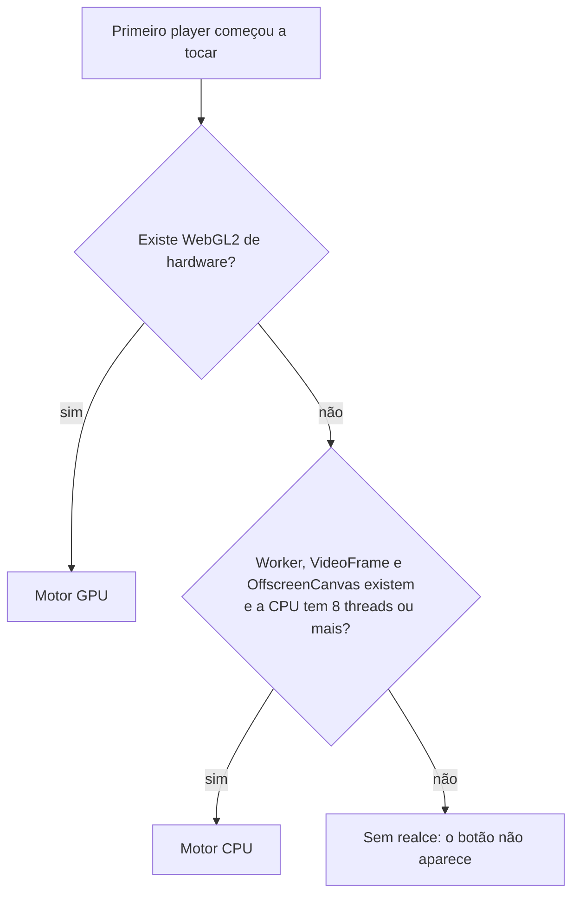
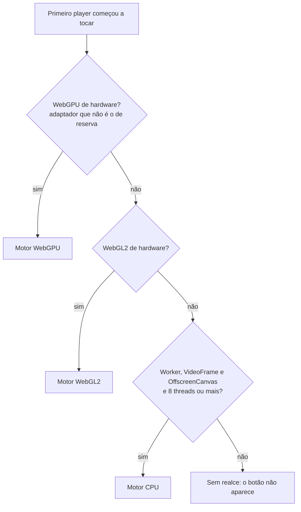

---
tags:
  - doc
  - ms-cameras
  - streaming
  - web-attlas
  - realce-de-imagem
aliases:
  - "Realce de imagem no cliente - Arquitetura e estratégias"
  - "Realce de imagem no cliente"
  - "Otimização de imagem no player"
  - "Pesquisa - realce de imagem no cliente"
  - "Pesquisa - melhoria de imagem e upscale"
  - "Streaming - Realce de imagem no cliente"
atualizado: 2026-10-05
---

# Câmeras - Streaming - Realce de imagem no cliente

Volta para [[Câmeras - Streaming]]. O catálogo completo de tecnologias e técnicas, cada uma no mesmo modelo e
com a situação dela, está em [[Câmeras - Streaming - Realce de imagem no cliente - Catálogo de técnicas]].

Esta nota explica o realce de imagem do player de câmera em ordem fixa. As seções 1 a 10 descrevem o código da
PR: o resumo, como a estação é classificada, cada tipo de hardware com as tecnologias que ele usa, cada técnica
de imagem, o que ficou de fora, o governador, o que o operador vê e o estado da PR. As seções 11 a 15 trazem o
desenho decidido que ainda está em implementação, o resumo do catálogo, o desempenho e a aceleração por
hardware, a recomendação priorizada e a documentação oficial.

![[Câmeras - Streaming - Realce de imagem no cliente - Antes e depois.png]]

*Quadro real da câmera da rua, em 720p. Da esquerda para a direita: original; só redução de artefato e
nitidez; com tom e cor. No terceiro, contraste da luma 19% maior e saturação média 38% maior, com o
brilho médio praticamente igual.*

## 1. Resumo

| Pergunta | Resposta |
| --- | --- |
| O que é | Um filtro que melhora a imagem **na tela do operador**: limpa artefato de compressão, corrige contraste e cor, amplia para o tamanho do quadro na tela e dá nitidez |
| Onde roda | Sempre no navegador da estação. Nunca no servidor, nunca na câmera |
| O que muda na rede | Nada. O vídeo que sai da câmera, passa pelo MediaMTX e chega ao navegador é o mesmo, com ou sem realce |
| Em que hardware | GPU de verdade (motor GPU) ou, sem GPU, CPU com pelo menos 8 threads (motor CPU). Sem nenhum dos dois, o botão não aparece |
| Onde está o código | Só na PR #4280, em draft. **Nada disto está na develop** |
| Mexe em cor ou saturação? | **Sim.** O passe de tom e cor estica o contraste à faixa que a cena usa e dá saturação com vibrance (seção 5.2), nos dois motores |
| O que roda na sua estação só CPU | Em 720p, o tom e cor. Redução de artefato e nitidez custam 25 ms cada e não cabem nos 8 ms por quadro (seção 4.2) |
| O que já está decidido e ainda não está no código | Motores em cadeia (WebGPU, WebGL2, CPU); fidelidade automática (redução de artefato, FSR 1 EASU e RCAS) sem botão; tom e cor num botão de melhoria salvo no navegador; nada se desliga sozinho (seção 11) |
| O que fazer a seguir | 12 itens em ordem, com ganho, custo e risco (seção 14) |

> [!important] Regra: realce de imagem é sempre client-side
> Todo realce, upscale, nitidez ou limpeza de imagem de câmera roda no navegador da estação do operador. Tem
> de funcionar com GPU e também só com CPU. A estação de referência é um Intel Core 7 150U com o WebGL de
> hardware desligado.

> [!warning] Nada disto está na develop
> O código vive na PR #4280 (branch `cameras/feat/NO-CARD-client-video-enhancement`), pronta para revisão,
> sem conflito com a develop e com Lint e Build verdes. Merge só com ordem do dono. Na develop não existem a pasta
> `apps/web-attlas/src/app/core/shared/video-enhancement/`, a spec
> `UF-044-camera-player-client-image-enhancement` nem o RNF-CAM-22.

## 2. Por que no cliente e não no servidor ou na câmera

- **No servidor**, cada stream teria de ser decodificado, filtrado e recodificado. O custo cresce junto com a
  frota de câmeras, soma latência e gasta banda. Também quebraria o passthrough do MediaMTX, que hoje só
  repassa o vídeo.
- **Na câmera** é onde a imagem ganha informação de verdade (WDR, bitrate do perfil principal, substream do
  tamanho certo). Isso é configuração de equipamento, não realce do player. Os ajustes nativos estão em
  [[Câmeras - Streaming - Qualidade de imagem na câmera]].
- **Risco forense.** Super-resolução por rede neural inventa detalhe que parece real, por exemplo uma placa
  nítida com a letra errada. Filtro clássico, com limite explícito, só redistribui o que já está na imagem.
  Por isso a PR usa só filtros clássicos.
- **Ordem dos passes**, a mesma de TVs e players de vídeo: limpar na resolução original, ampliar, e dar
  nitidez por último.

> [!note] Implementado na PR #4280, fora da develop
> A fidelidade (redução de artefato, EASU e RCAS) passa a ser automática e sem botão (seção 11). Ela continua
> feita só de filtros determinísticos, que não acrescentam informação, e a evidência continua saindo do `<video>`
> original. O que muda para quem olha é que, com motor de hardware, a imagem na tela é sempre tratada.
> Recomendação para o dono decidir: manter um selo discreto quando a fidelidade está ativa, porque o ENFSI pede
> que toda operação adaptativa seja descrita junto da imagem original (seção 6).

## 3. Como a estação é classificada

A classificação acontece **uma vez por aba do navegador**, quando o primeiro player começa a tocar
(`BrowserEnhancementCapabilityProbeAdapter.detect()`). O resultado é um destes três:



| Resultado | Condição exata no código | Quantos players ao mesmo tempo |
| --- | --- | --- |
| **GPU** | `WebGL2RenderingContext` existe, `getContext('webgl2', { failIfMajorPerformanceCaveat: true })` devolve contexto, e o nome do renderizador **não** é de software (ver seção 4.3) | 4 |
| **CPU** | não há GPU de hardware, existem `Worker`, `VideoFrame`, `OffscreenCanvas` e `transferControlToOffscreen`, e `navigator.hardwareConcurrency` é 8 ou mais | 1 |
| **NONE** | nenhum dos dois | 0 |

Duas consequências que valem lembrar:

- **Não há troca no meio do caminho.** Se o motor GPU falhar durante a sessão, aquele player fica sem
  realce. Ele não tenta a CPU.
- **O motor só é carregado quando alguém liga o realce**, por `import()` dinâmico. Quem nunca aperta o botão
  não paga o download do código.

> [!note] Implementado na PR #4280, fora da develop
> A cadeia passa a ser WebGPU de hardware, depois WebGL2 de hardware, depois CPU, depois nenhum. Motor que falha
> desce para o próximo em vez de deixar o player sem realce (seção 11).

## 4. Por tipo de hardware

Cada tipo segue o mesmo modelo: quando é usado, quais tecnologias usa, o que faz com a imagem e os limites.

### 4.1 Estação com GPU de hardware (motor GPU)

**Quando é usado.** O navegador oferece WebGL2 acelerado por placa de vídeo, integrada ou dedicada.

**Tecnologias**

| Tecnologia | O que é | Papel aqui | Documentação oficial |
| --- | --- | --- | --- |
| WebGL2 | API do navegador para desenhar com a GPU | Roda os três filtros como shaders | [Especificação WebGL 2.0](https://registry.khronos.org/webgl/specs/latest/2.0/) · [MDN WebGL2RenderingContext](https://developer.mozilla.org/en-US/docs/Web/API/WebGL2RenderingContext) |
| GLSL ES 3.00 | Linguagem dos programas que rodam na GPU (shaders) | Cada filtro é um fragment shader | [Especificação GLSL ES 3.00 (PDF)](https://registry.khronos.org/OpenGL/specs/es/3.0/GLSL_ES_Specification_3.00.pdf) |
| `failIfMajorPerformanceCaveat` | Opção do `getContext` que recusa um contexto lento demais | Primeiro filtro contra WebGL sem GPU real | [Especificação WebGL 1.0, atributos de contexto](https://registry.khronos.org/webgl/specs/latest/1.0/) · [MDN getContext](https://developer.mozilla.org/en-US/docs/Web/API/HTMLCanvasElement/getContext) |
| `WEBGL_debug_renderer_info` | Extensão que diz o nome do renderizador | Segundo filtro: recusa renderizador de software pelo nome | [Khronos](https://registry.khronos.org/webgl/extensions/WEBGL_debug_renderer_info/) · [MDN](https://developer.mozilla.org/en-US/docs/Web/API/WEBGL_debug_renderer_info) |
| `WEBGL_lose_context` e `webglcontextlost` | Liberar um contexto e saber quando o navegador derrubou um | Descarta o contexto de teste; contexto perdido desliga o realce do player | [Khronos](https://registry.khronos.org/webgl/extensions/WEBGL_lose_context/) · [MDN webglcontextlost](https://developer.mozilla.org/en-US/docs/Web/API/HTMLCanvasElement/webglcontextlost_event) |
| `texImage2D` e `texSubImage2D` | Enviar uma imagem para a GPU como textura | Cada quadro do `<video>` vira textura | [MDN texImage2D](https://developer.mozilla.org/en-US/docs/Web/API/WebGLRenderingContext/texImage2D) · [MDN texSubImage2D](https://developer.mozilla.org/en-US/docs/Web/API/WebGLRenderingContext/texSubImage2D) |
| Canvas 2D `getImageData` | Ler os pixels de um canvas comum | A cada 4 quadros, uma cópia de 64x36 do quadro é lida para medir a janela de tom | [MDN getImageData](https://developer.mozilla.org/en-US/docs/Web/API/CanvasRenderingContext2D/getImageData) · [HTML, canvas](https://html.spec.whatwg.org/multipage/canvas.html) |

**O que faz com a imagem**, em ordem: redução de artefato, tom e cor, ampliação e nitidez (detalhe de
cada uma na seção 5). Em modo leve, pula a redução de artefato.

**Como funciona por dentro**

1. Um `<canvas>` por player, por cima do `<video>`, na thread principal.
2. O quadro vai para a GPU como textura RGBA. No primeiro quadro, e quando o tamanho muda, por `texImage2D`;
   nos outros, por `texSubImage2D`.
3. Os passes alternam entre dois framebuffers, e o último desenha direto no canvas.

**Limites**

- 4 players com realce ao mesmo tempo, cada um com seu contexto WebGL. O Chromium derruba o contexto mais
  antigo acima de 16 na aba.
- O tempo medido é o tempo de JavaScript em volta do envio e do desenho, não o tempo real de execução na
  GPU. O código não usa timer query.

Código: `infrastructure/gpu/webgl2-enhancement-renderer.adapter.ts`, com `webgl2-shader-program.ts`,
`webgl2-render-target.ts` e os shaders em `constants/enhancement-shaders.constants.ts`.

### 4.2 Estação sem GPU, só com CPU (motor CPU)

**Quando é usado.** Não há WebGL2 de hardware, mas o navegador tem as APIs abaixo e a CPU tem pelo menos 8
threads. A estação Dell de referência cai aqui (12 threads).

**Tecnologias**

| Tecnologia | O que é | Papel aqui | Documentação oficial |
| --- | --- | --- | --- |
| Web Worker | Código JavaScript rodando em outra thread | Os filtros rodam fora da thread da tela, sem travar a interface | [HTML, Workers](https://html.spec.whatwg.org/multipage/workers.html) · [MDN, objetos transferíveis](https://developer.mozilla.org/en-US/docs/Web/API/Web_Workers_API/Transferable_objects) · [Angular, web workers](https://angular.dev/ecosystem/web-workers) |
| WebCodecs `VideoFrame` | Objeto que representa um quadro de vídeo cru | `new VideoFrame(video)` captura o quadro e é transferido ao worker sem cópia; `copyTo` lê os pixels | [W3C WebCodecs](https://www.w3.org/TR/webcodecs/) · [MDN VideoFrame](https://developer.mozilla.org/en-US/docs/Web/API/VideoFrame) · [MDN copyTo](https://developer.mozilla.org/en-US/docs/Web/API/VideoFrame/copyTo) |
| `OffscreenCanvas` | Canvas que pode ser desenhado fora da thread principal | O canvas do player é entregue ao worker, que desenha nele direto | [HTML, canvas](https://html.spec.whatwg.org/multipage/canvas.html) · [MDN transferControlToOffscreen](https://developer.mozilla.org/en-US/docs/Web/API/HTMLCanvasElement/transferControlToOffscreen) · [MDN OffscreenCanvasRenderingContext2D](https://developer.mozilla.org/en-US/docs/Web/API/OffscreenCanvasRenderingContext2D) |
| `navigator.hardwareConcurrency` | Quantas threads lógicas a CPU tem | Corte de 8 threads para ligar o motor CPU | [HTML](https://html.spec.whatwg.org/multipage/workers.html#dom-navigator-hardwareconcurrency) · [MDN](https://developer.mozilla.org/en-US/docs/Web/API/Navigator/hardwareConcurrency) |

**O que faz com a imagem**:

- **Completo**: redução de artefato e nitidez **na luma** (o brilho de cada pixel), mais tom e cor.
- **Leve**: só tom e cor.
- **Não amplia**: o compositor do navegador estica o quadro como sempre fez.

O tom é corrigido na luma por uma tabela de 256 entradas, e a cor nos planos de Cb e Cr (ou no plano UV
intercalado do NV12) por uma tabela de 65.536 pares montada uma vez. Uma consulta de tabela por amostra é o
que deixa o tom e cor barato.

**Como funciona por dentro**

1. Na thread principal, `new VideoFrame(video)` captura o quadro e o transfere ao worker.
2. No worker, `frame.copyTo` copia os pixels para um buffer reaproveitado. Os filtros rodam sobre o plano
   de luma e o tom e cor também sobre os planos de cor (formatos I420, I420A, I422, I444 e NV12).
3. Um `VideoFrame` novo é montado com o buffer filtrado e desenhado no `OffscreenCanvas`.

**Limites**

- 1 player com realce por vez.
- **Custo medido** em 720p nesta estação (Intel Core 7 150U, 12 threads), com o código já aquecido:

  | Passe | Custo por quadro |
  | --- | --- |
  | Redução de artefato | 24 ms |
  | Nitidez | 25 ms |
  | Tom e cor | 4,4 ms |
  | Orçamento do realce na CPU a 25 fps | 8 ms |

  Por isso o nível leve da CPU é só tom e cor: é o único passe que cabe sozinho. Redução e nitidez entram
  quando o stream é menor ou a CPU tem folga.
- Stream de até 921.600 pixels, que é 1280x720. Acima disso fica em espera. O motivo: percorrer um quadro
  1080p em JavaScript custa de 10 a 20 ms num desktop, perto dos 40 ms que um quadro dura a 25 fps.
- Quadro não devolvido pelo worker em 1 s desliga o motor daquele player.

Código: `infrastructure/cpu/worker-enhancement-renderer.adapter.ts`, `video-enhancement.worker.ts` e
`yuv-enhancement-pipeline.ts`.

### 4.3 Estação com WebGL de software (SwiftShader e parecidos)

**Quando acontece.** O navegador oferece WebGL2, mas desenhado pela CPU fingindo ser GPU. É o caso do
SwiftShader no Chrome, do llvmpipe e do softpipe no Linux e do WARP no Windows.

**O que a PR faz: recusa de propósito.** WebGL de software roda na CPU emulando uma GPU; a PR prefere o motor
CPU próprio, feito para esse caso. A recusa tem duas camadas:

1. `failIfMajorPerformanceCaveat: true`, que já faz o navegador recusar boa parte desses contextos.
2. O nome do renderizador passa pela expressão
   `/swiftshader|llvmpipe|softpipe|lavapipe|software|basic render|warp/i`, que inclui a palavra genérica
   `software`.

Recusado o WebGL, a estação vai para o motor CPU, se tiver as APIs e as 8 threads.

| Tecnologia | Documentação oficial |
| --- | --- |
| SwiftShader no Chromium | [Chromium, SwiftShader](https://chromium.googlesource.com/chromium/src/+/HEAD/docs/gpu/swiftshader.md) · [repositório SwiftShader](https://swiftshader.googlesource.com/SwiftShader) |

O Chromium marcou como descontinuado o fallback automático do WebGL para SwiftShader. Em qualquer caso, a
PR não conta com ele.

### 4.4 Estação fraca (sem GPU e com menos de 8 threads)

Nenhum motor. O botão **Realçar imagem** não aparece, e isso nunca vira erro para o operador.

### 4.5 Comum aos dois motores

| Tecnologia | O que é | Papel aqui | Documentação oficial |
| --- | --- | --- | --- |
| `requestVideoFrameCallback` | Aviso a cada quadro novo do `<video>` | O laço de realce processa um quadro por aviso, um por vez | [WICG](https://wicg.github.io/video-rvfc/) · [MDN](https://developer.mozilla.org/en-US/docs/Web/API/HTMLVideoElement/requestVideoFrameCallback) |
| `getVideoPlaybackQuality` | Contador de quadros descartados pelo navegador | Se o navegador começa a descartar quadros, o realce baixa de nível | [W3C](https://w3c.github.io/media-playback-quality/) · [MDN](https://developer.mozilla.org/en-US/docs/Web/API/HTMLVideoElement/getVideoPlaybackQuality) |
| Compute Pressure (`PressureObserver`) | Aviso do navegador de que a CPU está sob pressão | `serious` limita ao modo leve, `critical` desliga | [W3C](https://www.w3.org/TR/compute-pressure/) · [MDN](https://developer.mozilla.org/en-US/docs/Web/API/Compute_Pressure_API) · [Chrome](https://developer.chrome.com/docs/web-platform/compute-pressure) |
| `ResizeObserver` e `devicePixelRatio` | Tamanho real do quadro do player na tela, em pixels físicos | Decide se amplia, se fica em espera, e o tamanho do canvas | [W3C ResizeObserver](https://www.w3.org/TR/resize-observer/) · [MDN ResizeObserver](https://developer.mozilla.org/en-US/docs/Web/API/ResizeObserver) · [MDN devicePixelRatio](https://developer.mozilla.org/en-US/docs/Web/API/Window/devicePixelRatio) |
| `import()` dinâmico | Carregar código só quando preciso | O motor só baixa quando alguém liga o realce | [MDN](https://developer.mozilla.org/en-US/docs/Web/JavaScript/Reference/Operators/import) |
| Signals do Angular | Estado reativo do Angular | Estado do botão, do nível e da capacidade detectada | [Angular](https://angular.dev/guide/signals) |

## 5. As técnicas de imagem

São quatro, sempre nesta ordem: limpar, corrigir tom e cor, ampliar, dar nitidez. Cada uma no mesmo
modelo.

### 5.1 Redução de artefato

| | |
| --- | --- |
| **O que faz** | Alisa o "chuvisco" de compressão e o contorno fantasma em área lisa, sem borrar a borda dos objetos |
| **Algoritmo** | Filtro sigma de Lee 3x3: cada pixel vira a média só dos vizinhos com brilho parecido com o dele (diferença de até 0,035 numa escala de 0 a 1). Vizinho muito diferente é borda, e borda não entra na média |
| **Onde roda** | GPU: em RGB, decidindo pelo brilho (luma BT.709), na resolução do stream. CPU: só na luma, limite 9 numa escala de 0 a 255, sem tocar a borda de 1 pixel da imagem |
| **Quando** | Só no modo completo |
| **Referência** | [Lee, 1983, filtro sigma (DOI)](https://doi.org/10.1016/0734-189X(83)90047-6) |

### 5.2 Tom e cor

| | |
| --- | --- |
| **O que faz** | Devolve o contraste que a câmera perde com névoa, contraluz ou exposição baixa, e devolve a cor apagada, sem estourar as cores que já são fortes |
| **Janela de tom** | O histograma do brilho mostra a faixa que a cena usa, deixando de fora 0,5% dos pixels mais escuros e 0,5% dos mais claros. A janela nunca estica a faixa mais de 1,5 vez, porque cena escura ou chapada esticada além disso só aumenta o ruído. É medida a cada 4 quadros e muda devagar (cada medida move 20% da diferença), para a imagem não pulsar quando um farol cruza a cena |
| **Curva de tom** | O brilho é esticado da janela para a faixa inteira e dobrado por uma curva S leve (`smoothstep` com peso 0,2). A curva é monotônica: nenhum nível de brilho troca de lugar com outro |
| **Cor** | Cada cor se afasta do cinza por um ganho de `1,12 x (1 + 0,35 x (1 - m))`, em que `m` é a saturação da própria cor, de 0 a 1. Cor apagada ganha até 1,51 vez; cor já forte ganha 1,12 vez. Cb e Cr sobem pelo mesmo fator, então o matiz não muda, e a cor que sairia da faixa válida volta na mesma direção, sem corte por canal |
| **Onde roda** | CPU: tabelas sobre Y, Cb e Cr do quadro YUV. GPU: um shader sobre RGB, com o mesmo cálculo |
| **Quando** | Nos níveis completo e leve, nos dois motores |
| **Código** | `domain/utils/measure-tone-window.util.ts`, `build-tone-lut.util.ts`, `build-chroma-lut.util.ts`, `domain/tone-window-tracker.ts` e `TONE_AND_COLOR_FRAGMENT_SHADER` |

### 5.3 Ampliação (upscale)

| | |
| --- | --- |
| **O que faz** | Leva o stream ao tamanho real do quadro na tela, para o navegador não esticar com o filtro simples dele |
| **Algoritmo** | Catmull-Rom bicúbico, calculado com 9 leituras bilineares, com trava anti-halo: o resultado nunca sai da faixa entre o pixel mais escuro e o mais claro dos 4 vizinhos, o que impede o contorno claro em volta de bordas |
| **Onde roda** | Só na GPU. A CPU nunca amplia |
| **Quando** | Só se a tela for pelo menos 10% maior que o stream. Fator máximo de 2x, e saída de no máximo 2560x1440 **em pixels totais** (não por eixo). Acima disso o navegador escala sozinho |
| **Referência** | [manual do mpv, opção `scale-antiring`](https://mpv.io/manual/stable/), que inspirou a trava |

> [!note] Implementado na PR #4280, fora da develop
> A ampliação passa a ser o EASU do FSR 1 da AMD, nos motores WebGPU e WebGL2 (seção 11). O Catmull-Rom acima é o
> que está no código da PR.

### 5.4 Nitidez

| | |
| --- | --- |
| **O que faz** | Aumenta o contraste nas bordas, sem estourar o branco ou o preto e reforçando menos o ruído |
| **Algoritmo** | RCAS, a nitidez do AMD FidelityFX FSR 1 (licença MIT), em cruz de 5 leituras. A força vem de `sharpness`: 0,5 no modo completo e 0,25 no leve |
| **Onde roda** | GPU: por canal de cor, na resolução de saída, como último passe. CPU: só na luma |
| **Quando** | Sempre que o realce está ativo |
| **Por que não o CAS** | O CAS, a outra nitidez da AMD, espera luz linear; em vídeo comum (gamma) ele exagera |
| **Referência** | [FidelityFX FSR no GitHub](https://github.com/GPUOpen-Effects/FidelityFX-FSR) · [AMD GPUOpen, FSR](https://gpuopen.com/fidelityfx-superresolution/) · [FidelityFX CAS](https://github.com/GPUOpen-Effects/FidelityFX-CAS) |

### 5.5 Quais passes rodam em cada caso

| Motor e nível | Redução de artefato | Tom e cor | Ampliação | Nitidez |
| --- | --- | --- | --- | --- |
| GPU, completo | sim | sim | sim | sim |
| GPU, leve | não | sim | sim | sim |
| CPU, completo | sim | sim | não | sim |
| CPU, leve | não | sim | não | não |

**Espera** (nenhum passe, o vídeo aparece como veio): quando o quadro na tela é metade do stream ou menor,
quando o motor é CPU e o stream passa de 1280x720, ou quando ainda não chegou quadro. Num mosaico 4x4 em
1080p cada célula tem cerca de 480x270, e a própria redução de tamanho já filtra bloco e ruído.

## 6. O que não está implementado, e por quê

| Ajuste | Está na PR? | Por quê |
| --- | --- | --- |
| Balanço de branco | não | O passe de tom e cor não corrige a cor da luz da cena; não está na spec. Recomendado com teto de ganho, para o dono decidir ([[Câmeras - Streaming - Realce de imagem no cliente - Catálogo de técnicas\|catálogo]], seção 5.7) |
| Brilho e gama manuais | não | O contraste vem da medida da cena, não de um controle do operador |
| Deband e dither | não | Recomendado com pontilhado de meio nível e sem grão, para o dono decidir (catálogo, seção 5.4) |
| Super-resolução por rede neural | não, proibida | A rede prevê detalhe a partir de imagens de treino, e numa placa isso troca B por 8 e S por 5 ([arXiv](https://arxiv.org/html/2408.15103)); a própria Microsoft desaconselha super-resolução de vídeo para prova legal ou forense ([Microsoft Learn](https://learn.microsoft.com/en-us/windows/ai/apis/video-super-resolution)), e um tribunal recusou vídeo realçado por IA ([Greenberg Traurig](https://www.gtlaw.com/en/insights/2024/5/washington-court-rejects-novel-use-of-ai-enhanced-video-in-trial)) |
| Reconstrução por banco de padrões | não, proibida | Cola no quadro detalhe aprendido de outras imagens, que não veio da câmera ([Freeman, Jones e Pasztor, 2002 (DOI)](https://doi.org/10.1109/38.988747)) |
| Inverse tone mapping | não, proibido | Inventa brilho em realce e sombra que o sensor não registrou; é o que o RTX Video HDR faz ao converter SDR em HDR ([NVIDIA, RTX Video FAQ](https://nvidia.custhelp.com/app/answers/detail/a_id/5448/~/rtx-video-faq)) |
| Redução de ruído temporal | não, proibida | Mistura quadros e deixa rastro atrás do veículo em movimento (catálogo, seção 6.5) |
| Grão sintético | não, proibido | Acrescenta textura aleatória que a câmera não gravou e que cobre detalhe fino; o grão do AV1 é recriado no decodificador para imitar o filme, não para mostrar a cena ([Netflix](https://netflixtechblog.com/av1-scale-film-grain-synthesis-the-awakening-ee09cfdff40b)) |
| Interpolação de quadros | não | Cria um quadro que mostra o veículo numa posição e num instante que a câmera nunca gravou (catálogo, seção 6.4). A spec não a cita pelo nome; recomendação ao dono: incluir nas proibições |

A proibição vem da seção 11 da spec da PR (UF-044), e o princípio da seção 10 dela é o mesmo para todas: o
realce redistribui a informação que o quadro já tem e não acrescenta nenhuma. O manual de boas práticas do ENFSI
pede que toda operação adaptativa seja apresentada junto da imagem original, com a descrição do que foi feito
([ENFSI](https://enfsi.eu/wp-content/uploads/2017/06/Best-Practice-Manual-for-Forensic-Image-and-Video-Enhancement.pdf)).

## 7. Tecnologias mapeadas e que a PR não usa

| Tecnologia | Para que serviria | Por que não está | Documentação oficial |
| --- | --- | --- | --- |
| WebGPU | Sucessor do WebGL, com compute shader e medição real de tempo de GPU | Decidido como primeiro motor (seção 11), ainda sem código; na PR os passes rodam em WebGL2 | [W3C WebGPU](https://www.w3.org/TR/webgpu/) · [MDN WebGPU](https://developer.mozilla.org/en-US/docs/Web/API/WebGPU_API) |
| WebAssembly SIMD | Filtros da CPU em código nativo vetorizado | Pendência: poderia liberar 1080p no motor CPU | [WebAssembly, recursos](https://webassembly.org/features/) · [proposta SIMD](https://github.com/WebAssembly/simd) |
| `MediaStreamTrackProcessor` | Ler os quadros direto da faixa WebRTC, sem passar pelo `<video>` | Pendência; hoje o quadro sai do `<video>` | [W3C mediacapture-transform](https://w3c.github.io/mediacapture-transform/) · [MDN](https://developer.mozilla.org/en-US/docs/Web/API/MediaStreamTrackProcessor) |
| CSS `filter` | Brilho, contraste e saturação prontos do navegador | O passe de tom e cor mede a cena; o filtro de CSS aplica um valor fixo e também não amplia nem dá nitidez | [MDN CSS filter](https://developer.mozilla.org/en-US/docs/Web/CSS/filter) |
| ONNX Runtime Web, TensorFlow.js, WebNN | Rodar rede neural no navegador, inclusive na NPU | Super-resolução neural é proibida (seção 6). Esta estação não tem NPU, e o Chrome no Linux leva a WebNN só à CPU (catálogo, seção 4.11) | [ONNX Runtime Web](https://onnxruntime.ai/docs/tutorials/web/) · [TensorFlow.js](https://www.tensorflow.org/js) · [W3C WebNN](https://www.w3.org/TR/webnn/) |

## 8. Como o realce se liga, baixa e desliga sozinho

O governador (`FrameBudgetGovernor`) olha janelas de 30 quadros e escolhe entre três níveis: **completo**,
**leve** e **desligado**.

| Situação | O que acontece |
| --- | --- |
| O processamento (p90) passa de 8% do intervalo entre quadros na GPU, ou de 20% na CPU | Desce um nível. A 25 fps isso é 3,2 ms na GPU e 8 ms na CPU |
| Menos de 95% dos quadros saem realçados | Desce um nível |
| O navegador descarta mais de 1 quadro na janela | Desce um nível |
| Folga (processamento até metade do limite e nenhum descarte) por `5 x (falhas + 1)` janelas seguidas | Sobe um nível |
| Compute Pressure `serious` | No máximo o nível leve |
| Compute Pressure `critical` | Desliga |

**Depois de desligar**, tenta de novo sozinho, sempre voltando no nível leve. O tempo de espera é
`min(300 s, 10 s x 3^(falhas - 1))`, e **toda descida conta como falha**, inclusive de completo para leve.
Na prática, partindo do completo: 30 s, 90 s, 270 s e depois 300 s (5 min) em diante.

> [!note] Implementado na PR #4280, fora da develop
> Nada se desliga sozinho: o governador só troca o nível, e o nível leve tira primeiro a redução de artefato
> (seção 11).

## 9. O que o operador vê

- Botão **Realçar imagem** (ícone de varinha) na barra de controles de qualquer player ao vivo. É o primeiro
  a ir para o menu de mais opções quando a barra estreita.
- Com realce ativo, o selo ao vivo mostra "· Realce".
- Quando o realce se desliga sozinho, o tooltip diz "Realce pausado para preservar o desempenho".
- Sem vaga (4 players na GPU, 1 na CPU) ou sem motor naquele momento, o botão volta a desligado e aparece um
  aviso.
- O botão começa desligado sempre que o player abre. Nada é guardado no navegador nem no servidor.
- **Evidência**: captura de tela, analítico, ANPR e exportação saem sempre do `<video>` original. O canvas
  realçado é só exibição por cima.

> [!note] Implementado na PR #4280, fora da develop
> Com motor de hardware, a fidelidade (redução de artefato, ampliação e nitidez) é automática em todo player ao
> vivo e não tem botão. O operador vê só um botão pequeno de melhoria, que liga o tom e cor, existe na GPU e na
> CPU e fica salvo no navegador. Nada se desliga sozinho: o governador só troca o nível, e contexto perdido recria
> ou desce de motor. Player além das vagas mostra o vídeo nativo, sem erro e sem aviso. A evidência continua
> saindo do `<video>` original (seção 11).

## 10. Estado da PR e pendências

- **PR #4280**, "feat: realce de imagem no player de câmera, só na estação, com GPU ou só com CPU", em draft
  desde 22/09/2026, aprovada em review, com conflito com a develop e sem CI rodado. A decisão é não mergear.
- **Falta para considerar validada**: a suíte do `web-attlas` verde e a validação A/B abaixo, numa estação
  com GPU e numa só com CPU.
- **Validação A/B**, mesmo mosaico com realce ligado e desligado. Passa se não sobem `framesDropped`,
  `freezeCount` e o tempo médio de decode (`totalDecodeTime` sobre `framesDecoded`), se o `presentedFrames`
  não abre lacuna, se não aparece Long Animation Frame acima de 50 ms e se o `inboundBytes` do MediaMTX fica
  igual. Qualidade offline: VMAF NEG e CAMBI contra gravação de bitrate mais alto, e o erro de OCR em recortes
  de placa nunca pode subir. Referências: [W3C WebRTC Stats](https://w3c.github.io/webrtc-stats/) ·
  [MDN RTCInboundRtpStreamStats](https://developer.mozilla.org/en-US/docs/Web/API/RTCInboundRtpStreamStats) ·
  [W3C Long Animation Frames](https://w3c.github.io/long-animation-frames/) ·
  [Chrome, Long Animation Frames](https://developer.chrome.com/docs/web-platform/long-animation-frames).
- **Pendências sem decisão**: filtros da CPU em WebAssembly SIMD; `MediaStreamTrackProcessor` no WebRTC;
  limiar da redução de artefato proporcional ao QP recebido; deband e dither; um contexto WebGL único para o
  mosaico; medir na máquina alvo o custo da ampliação, da nitidez e do `VideoFrame` em 1080p, que não está
  publicado. A ordem sugerida para essas pendências, junto das técnicas novas, está na seção 14.
- **Ideia registrada, sem código**: usar o realce também na imagem e no vídeo de incidente guardados no
  servidor. Hoje a sessão exige um `<video>` tocando com `requestVideoFrameCallback`.

## 11. Desenho implementado na PR #4280

> [!note] Implementado na PR #4280, fora da develop
> Esta seção descreve o que a PR #4280 faz hoje. Onde as seções 3 a 9 descrevem o motor antigo da PR (Catmull-Rom,
> botão único, governador que desliga), vale esta seção.

**Pontas suaves no tom.** O esticamento da janela de tom não corta seco: acima de 0,9 e abaixo de 0,08 um ombro e
um pé de Hermite cúbico monotônico devolvem o excesso para dentro da faixa (`softToneStretch`, `TONE_SHOULDER_KNEE`,
`TONE_TOE_KNEE`). Nenhum nível que a câmera não estourou vira branco no realce, então brilho de sol em vidro e
cromado guarda a gradação. Os sete shaders WGSL e os cinco GLSL compilam na GPU Intel `gen-12lp`.

**Canvas sincronizado com o compositor.** Os motores CPU e WebGL2 desenham sem o modo `desynchronized`, que piscava
preto no Chrome com composição por software.

**Na câmera não se resolve reflexo de vidro.** O reflexo do céu em para-brisa só sai com filtro polarizador óptico;
Defog com sol estoura realce e esmaga sombra, e a recuperação de realces da P1475-LE não mudou nada mensurável.
Detalhe em [[Câmeras - Streaming - Qualidade de imagem na câmera]].

### 11.1 Cadeia de motores

Tudo continua rodando no cliente, nunca no servidor nem na câmera. A estação passa a ser classificada nesta
ordem:



| Motor | Como reconhece hardware de verdade |
| --- | --- |
| WebGPU | `navigator.gpu.requestAdapter()` devolve um adaptador, e `adapter.info` diz quem ele é (`vendor`, `architecture`). O adaptador de reserva por software (`isFallbackAdapter`, que nesta estação aparece como `google` e `swiftshader`) é recusado. Com as flags da seção 13.3, esta estação responde `vendor: 'intel'` e `architecture: 'gen-12lp'` |
| WebGL2 | O nome do renderizador (`WEBGL_debug_renderer_info`) não é de software, como hoje (seção 4.3) |
| CPU | As mesmas condições de hoje (seção 3) |

### 11.2 O que muda em relação ao código da PR

O realce se divide em duas partes, com regras diferentes:

| Parte | Passes | Como liga | Onde roda |
| --- | --- | --- | --- |
| **Fidelidade** | Redução de artefato, ampliação pelo EASU do FSR 1 e nitidez RCAS | Automática em todo player ao vivo, sem botão, sempre que existe motor de hardware (WebGPU ou WebGL2 de hardware) | GPU. No motor CPU, só o que couber no orçamento; na estação de referência (Core 7 150U, 720p), nenhum passe de fidelidade cabe, então nenhum roda |
| **Melhoria** | Só tom e cor: contraste e saturação | Botão pequeno de melhoria, ligado pelo operador e salvo no navegador | GPU e CPU (4,4 ms em 720p na CPU, dentro dos 8 ms) |

| Ponto | Na PR | Desenho decidido |
| --- | --- | --- |
| Motores | WebGL2, CPU e nenhum | WebGPU, WebGL2, CPU e nenhum |
| Identificação do hardware | Nome do renderizador WebGL | `adapter.info` do WebGPU ou nome do renderizador WebGL |
| Botão | Um botão **Realçar imagem** liga todos os passes | Sem botão para a fidelidade, que é automática. Um botão pequeno de melhoria liga só o tom e cor |
| Ampliação | Catmull-Rom com trava anti-halo, no WebGL2 | EASU do FSR 1 (AMD, licença MIT), nos motores WebGPU e WebGL2, em qualquer GPU: Intel, AMD ou NVIDIA |
| Nitidez | RCAS | RCAS, sem mudança |
| Governador sob carga | Desce até desligar e tenta de novo com recuo | Só troca o nível. O nível leve tira primeiro a redução de artefato. Nada se desliga sozinho |
| Contexto perdido | Aquele player fica sem realce | Recria o contexto ou desce para o próximo motor |
| Player além das vagas | O botão volta a desligado, com aviso | Mostra o vídeo nativo, sem erro |
| Escolha do operador | Começa desligada sempre que o player abre | A melhoria (tom e cor) persiste no navegador da estação |
| Evidência | Sai do `<video>` original | Sai do `<video>` original, sem mudança |

### 11.3 Consequências do desenho

- **Níveis da fidelidade.** Completo: redução de artefato, ampliação e nitidez. Leve: ampliação e nitidez, sem a
  redução de artefato. O tom e cor não entra nesses níveis: depende só do botão de melhoria.
- **Todo sinal de carga só troca o nível.** A pressão `critical` da Compute Pressure, que hoje desliga (seção 8),
  passa a limitar ao nível leve. É consequência da regra; conferir no código quando a implementação terminar.
- **Se nem o nível leve couber, o tratamento passa a custar quadro.** A validação A/B da seção 10 é o que mostra
  se isso acontece numa estação real.
- **Na estação só CPU, a fidelidade não roda hoje.** Redução de artefato e nitidez custam 24 e 25 ms em 720p. O
  item 7 da seção 14 (WebAssembly SIMD com o quadro dividido entre workers) é o que poderia trazer parte dela para
  dentro dos 8 ms.
- **O EASU pede entrada limpa.** A AMD quer o quadro sem banding e sem ruído alto antes da ampliação. No nível
  completo, a redução de artefato cumpre esse papel; no leve, o EASU recebe o quadro como veio
  ([[Câmeras - Streaming - Realce de imagem no cliente - Catálogo de técnicas|catálogo]], seção 4.1).

## 12. Tecnologias de fabricante e catálogo de técnicas

Cada tecnologia e cada técnica, no mesmo modelo e com a situação dela, estão em
[[Câmeras - Streaming - Realce de imagem no cliente - Catálogo de técnicas]]. As conclusões:

- **Fabricante.** Para vídeo de câmera no navegador, só servem as tecnologias espaciais, de um quadro só: o FSR 1
  (decidido), o NIS e o GSR. FSR 2, 3 e 4, XeSS, MetalFX e Arm ASR precisam de vetor de movimento e profundidade
  de jogo, ou não existem para o navegador.
- **Super-resolução do driver.** A da NVIDIA, a da Intel e a do Edge rodam sobre o `<video>`, só no Windows. Pelo
  desenho do Chromium, o canvas realçado não a recebe e o `<video>` original, quando visível, recebe.
  Recomendação para o dono: desligada nas estações de operação.
- **NPU.** O Core 7 150U não tem NPU, o Chrome no Linux leva a WebNN só à CPU, e o upscale do artigo da Intel é
  rede adversária generativa: proibido na imagem ao vivo.
- **FSR 1 na CPU.** O RCAS já roda na luma. O EASU não cabe nos 8 ms nem com WebAssembly SIMD e 4 workers.
- **Técnicas clássicas.** As que cabem e não inventam detalhe estão na seção 14: limiar guiado pelo QP, deband
  com pontilhado, faixa e matriz de cor, balanço de branco com teto, contraste local e dehaze condicional.
- **Quadros.** Melhoria de quadros segura é mostrar cada quadro real uma vez, na hora certa. Interpolação e
  redução de ruído temporal inventam ou misturam quadros.

## 13. Desempenho e aceleração por hardware

Os tempos de GPU abaixo são estimativa na Iris Xe da estação, com o método do catálogo, seção 3.

### 13.1 Onde o tempo vai e como cortar

1. **Entrada do quadro na GPU.** No WebGL2, `texImage2D` e `texSubImage2D` copiam o quadro do `<video>` para uma
   textura. No WebGPU, `importExternalTexture` usa o quadro sem cópia. A textura de um `<video>` expira assim que
   é usada num bind group, ou ao fim da tarefa de JavaScript; a de um `VideoFrame` dura até o quadro ser fechado.
   O `copyExternalImageToTexture` faz cópia e só vale quando a textura precisa durar mais que isso.
2. **Leitura de volta para a CPU.** Na PR, a janela de tom lê 64x36 pixels por um canvas 2D a cada 4 quadros. Ler
   da GPU para a CPU obriga a GPU a terminar o que estava fazendo e a mandar o dado de volta; a MDN chama isso de
   "finish mais ida e volta". No WebGPU, o histograma e a janela de tom cabem num compute shader, sem sair da GPU,
   ou se leem com `mapAsync`, que não trava. No WebGL2, a saída é ler por buffer de pixels com `fenceSync`, de
   forma assíncrona.
3. **Número de passes.** Cada passe lê e escreve uma imagem inteira. Só de memória, o piso é de 0,12 a 0,18 ms em
   720p e de 0,28 a 0,42 ms em 1080p. Dá para fundir a redução de artefato com o tom e cor num passe na resolução
   do stream, e o EASU com o RCAS num compute shader que guarda o bloco e a borda de 1 pixel na memória do grupo.
4. **Resolução.** Já é o desenho e continua: limpar e corrigir na resolução do stream, ampliar uma vez e dar
   nitidez por último.
5. **Precisão.** O `shader-f16` do WebGPU (Chrome 120) permite meia precisão. O FSR 1 e o NIS têm caminho oficial
   em meia precisão.
6. **Medida de tempo.** O governador mede o tempo de JavaScript em volta do desenho, não o da GPU (seção 4.1). O
   `timestamp-query` do WebGPU mede cada passe na GPU. No Chrome o valor vem arredondado a 100 µs, a menos que a
   flag de recursos de desenvolvedor esteja ligada; 100 µs bastam para um orçamento de 3,2 ms.
7. **Contextos.** No WebGL, cada player tem um contexto, e acima de 16 na página o Chromium derruba o mais antigo
   ("Too many active WebGL contexts"). No WebGPU, um único `GPUDevice` configura quantos canvas forem precisos.
   Um device para todos os players tira o motivo técnico do teto de 4; o orçamento continua valendo. Device
   perdido derruba todos de uma vez, então a recuperação recria o device e reata os canvas.
8. **Compute ou fragment.** Fragment shader serve para filtro por pixel que lê vizinhos pelo cache de textura:
   sigma de Lee, tom e cor, Catmull-Rom. Compute shader serve para histograma com atômicos, para filtro que
   reaproveita leitura entre pixels vizinhos (EASU, NIS) e para passes fundidos. O NIS só existe em compute. Não
   achei guia oficial do W3C nem do Chrome sobre essa escolha; é o padrão dos SDKs da AMD e da NVIDIA.
9. **CPU com WebAssembly SIMD.** SIMD de 128 bits, ligado por padrão desde o Chrome 91. Para os filtros da luma,
   estimativa de 2 a 4 vezes mais rápido que o JavaScript atual.
10. **CPU com várias threads.** WebAssembly com threads exige isolamento de origem no app inteiro
    (`Cross-Origin-Opener-Policy: same-origin` e `Cross-Origin-Embedder-Policy: require-corp`), o que obriga todo
    recurso de terceiro, como os tiles do mapa, a responder com CORP ou CORS. A saída sem esse custo é dividir o
    quadro entre 2 a 4 workers comuns, com buffers transferidos.
11. **`MediaStreamTrackProcessor`.** Entrega os quadros do WebRTC como `VideoFrame`, direto da faixa, sem passar
    pelo `<video>`. A spec expõe só em worker dedicado; o Chrome expõe também na janela, fora da spec; o Safari 18
    tem; o Firefox não. Prioridade baixa: o `<video>` continua necessário para a evidência, e duas fontes de quadro
    podem sair de passo.
12. **Compute Pressure.** Chrome 125, só a fonte `cpu`. O sinal só chega ao documento com foco do sistema, em
    picture-in-picture ou capturando mídia. Num videowall sem foco, quem decide é o governador.
13. **Long Animation Frames.** Chrome 123: quadro de animação acima de 50 ms. É a régua da validação A/B
    (seção 10).

### 13.2 Estado do WebGPU no Chrome Linux

- O Chrome 144 começou a ligar o WebGPU no Linux por padrão, primeiro em GPU Intel Gen12 ou mais nova, com AMD e
  NVIDIA no plano. Nessa arquitetura, o WebGPU usa Vulkan e o resto do Chromium fica no OpenGL. A tabela do grupo
  do WebGPU registra Intel Gen12 ou mais nova a partir do 144 e NVIDIA (driver 535.183.01 ou mais novo) no Wayland
  a partir do 147. As outras GPUs dependem de flag.
- A página de dicas do Chrome ainda chama o Linux de experimental e manda ligar `#enable-unsafe-webgpu` e
  `#enable-vulkan`. Ela é mais antiga que o anúncio do 144.
- **Nesta estação o padrão não vale**, mesmo sendo Gen12 (Iris Xe, `gen-12lp`, Mesa ANV, Chrome 150): sem flag,
  não há adaptador WebGPU e o WebGL2 é de software. A causa não está confirmada. Como as versões recentes do
  Chrome não caem mais sozinhas no SwiftShader para WebGL (seção 4.3), vale conferir em `chrome://gpu` a linha de
  comando com que o Chrome está sendo aberto.
- Com `--enable-unsafe-webgpu` sozinho, aparece só o adaptador de reserva por software (`google`, `swiftshader`).
  Com as quatro flags da seção 13.3, aparecem WebGL2 de hardware (ANGLE sobre Vulkan) e WebGPU de hardware
  (`intel`, `gen-12lp`).
- O `adapter.info` é síncrono desde o Chrome 127. O `isFallbackAdapter` foi para dentro do `GPUAdapterInfo` no
  Chrome 136, e o atributo antigo, no `GPUAdapter`, foi descontinuado no 138. É por ele que o motor WebGPU recusa
  o adaptador de software.

### 13.3 Como ligar a aceleração por hardware numa estação Linux com Intel

1. **Conferir o básico.** Em `chrome://settings/system`, "Usar aceleração de gráficos quando disponível" ligado.
   Em estação gerenciada, a política `HardwareAccelerationModeEnabled` não pode estar em falso. Essa política só
   desliga a aceleração; não liga nada.
2. **Ligar as flags.** As quatro abaixo são as que funcionaram nesta estação. No GNOME com Wayland, somar
   `--ozone-platform=x11`: no Wayland o Vulkan da composição falha a cada quadro de vídeo (`SharedImageManager::ProduceSkia ... CompoundImageBacking`).

   | Flag de linha de comando | Entrada em `chrome://flags` | O que faz |
   | --- | --- | --- |
   | `--use-angle=vulkan` | não confirmada | Faz o ANGLE, a camada que leva o WebGL até a GPU, usar Vulkan em vez de OpenGL. Nesta estação, o caminho por OpenGL não inicializa |
   | `--enable-features=Vulkan` | `#enable-vulkan` | Liga o Vulkan na pilha de GPU do Chrome |
   | `--enable-unsafe-webgpu` | `#enable-unsafe-webgpu` | Desliga a lista de bloqueio de adaptadores do WebGPU, e o Chrome passa a expor o WebGPU em configuração que ele ainda não validou. Sozinha, nesta estação, só entrega o adaptador de software |
   | `--ignore-gpu-blocklist` | `#ignore-gpu-blocklist` | Ignora a lista de GPUs que o Chrome manda para software |

   Se o processo de GPU travar com o Vulkan ligado, a correção relatada no grupo do WebGPU é somar
   `VulkanFromANGLE` e `DefaultANGLEVulkan` ao `--enable-features`. A receita do grupo para GPU fora do padrão
   também força `--ozone-platform=x11`. Nesta estação nenhum dos dois foi preciso.
3. **Decode de vídeo por hardware (VA-API).** Sem ele, o H.264 é decodificado na CPU e disputa com o motor CPU, e
   o player fica em H.264, porque o Chrome só decodifica H.265 com hardware. A documentação do Chromium liga o
   decode com a feature `AcceleratedVideoDecodeLinuxZeroCopyGL` e, no caminho Vulkan, soma `VaapiIgnoreDriverChecks`
   às três features do Vulkan. O nome muda entre versões: segundo o ArchWiki, era `VaapiVideoDecodeLinuxGL` até o
   Chromium 130 e passou a `AcceleratedVideoDecodeLinuxGL` no 131. A própria documentação diz que VA-API no Linux
   não tem suporte oficial. **Não testado nesta estação.**
4. **Juntar tudo numa linha.** O Chrome só lê o último `--enable-features` da linha de comando, então as features
   vão todas separadas por vírgula num só. Exemplo, a conferir na versão em uso:

   ```bash
   google-chrome \
     --use-angle=vulkan \
     --enable-features=Vulkan,VulkanFromANGLE,DefaultANGLEVulkan,AcceleratedVideoDecodeLinuxZeroCopyGL,VaapiIgnoreDriverChecks \
     --enable-unsafe-webgpu \
     --ignore-gpu-blocklist
   ```

5. **Deixar fixo.** Três jeitos: pelo `chrome://flags`, que grava no perfil e vale para as flags que têm entrada
   lá; pela linha `Exec=` de um atalho `.desktop` (em `~/.local/share/applications/` para um usuário, ou uma cópia
   do `google-chrome.desktop` do sistema); ou por um script que abre o Chrome. O `chrome-flags.conf` é convenção do
   pacote do Arch, não do Chrome oficial. A política gerenciada do Chrome no Linux fica em
   `/etc/opt/chrome/policies/managed/`.
6. **Conferir.** Em `chrome://gpu`: "WebGL: Hardware accelerated", "WebGPU: Hardware accelerated" e
   "Video Decode: Hardware accelerated", e, para codecs, "Video Acceleration Information". No sistema, `vainfo`
   lista os perfis de decode da GPU. No app: `adapter.info` com `vendor: 'intel'` e `isFallbackAdapter` falso, e o
   renderizador WebGL com "ANGLE" e "Vulkan" no nome. O `chrome://media-internals` mostra qual decodificador o
   player usou.

> [!caution] Flags que tiram trava
> `--enable-unsafe-webgpu` e `--ignore-gpu-blocklist` desligam proteções que o Chrome mantém para driver não
> validado. O risco é travar o processo de GPU ou desenhar errado. Valem para estação controlada, com o modelo de
> máquina e o driver conferidos, e não para qualquer máquina.

## 14. Recomendação priorizada

Ordem sugerida para a próxima rodada, para o dono decidir. Ganho, custo e risco em três níveis: baixo, médio e
alto. O detalhe de cada item está no
[[Câmeras - Streaming - Realce de imagem no cliente - Catálogo de técnicas|catálogo]].

| # | O que | Ganho | Custo | Risco | Detalhe |
| --- | --- | --- | --- | --- | --- |
| 1 | Configurar as estações: aceleração por hardware ligada (WebGPU, WebGL2 e decode VA-API) e super-resolução do driver desligada nas estações Windows | Alto: tira a estação do motor CPU e libera WebGPU, EASU e H.265 | Baixo: configuração, sem código | Médio: flags que tiram trava do Chrome | seção 13.3; catálogo 4.4 a 4.6 |
| 2 | Histograma e janela de tom na GPU, sem leitura de volta | Médio: acaba a sincronização entre GPU e CPU a cada 4 quadros | Baixo | Baixo | seção 13.1, item 2 |
| 3 | Um `GPUDevice` para todos os players, e o governador medindo a GPU com `timestamp-query` | Alto em mosaico e videowall; o governador passa a medir o tempo certo | Médio | Médio: device perdido derruba todos os players | seção 13.1, itens 6 e 7 |
| 4 | Menos passes e meia precisão: limpeza com tom e cor num passe, EASU com RCAS num compute, `shader-f16` | Médio: menos banda de memória, que limita a GPU integrada | Médio | Baixo | seção 13.1, itens 3, 5 e 8 |
| 5 | Faixa e matriz de cor corretas por câmera, com valor manual que vence a detecção | Alto onde acontece: é cor errada, não falta de realce | Baixo | Baixo a médio: detecção errada piora câmera certa | catálogo 5.5 |
| 6 | Limiar da limpeza guiado pelo QP do WebRTC | Médio | Baixo | Baixo | catálogo 5.3 |
| 7 | Motor CPU em WebAssembly SIMD, com o quadro dividido entre workers, para o sigma de Lee e o RCAS. O EASU fica fora da CPU | Alto na estação só CPU: parte da fidelidade automática, que hoje não cabe, pode passar a caber perto dos 8 ms | Médio a alto | Baixo | catálogo 4.12 |
| 8 | Deband com pontilhado de meio nível, sem grão, e tom calculado em ponto flutuante | Médio em céu, asfalto e cena noturna | Baixo | Médio: limiar alto apaga detalhe, e o pontilhado fica ao lado da proibição de grão | catálogo 5.4 |
| 9 | Balanço de branco automático com teto de ganho e mudança lenta | Médio | Baixo | Médio: mexe na cor de semáforo e de veículo | catálogo 5.7 |
| 10 | Movimento regular: monitor da estação em frequência múltipla do fps da frota, e alvo do buffer de jitter só na câmera que engasga | Médio | Baixo | Baixo na imagem; atraso maior no PTZ | catálogo 6.2 e 6.3 |
| 11 | Contraste local (CLAHE leve na luma), só no WebGPU | Médio a alto em contraluz e sombra | Médio | Médio: ruído e cintilação | catálogo 5.9 |
| 12 | Dehaze condicional por dark channel prior, só com névoa medida e de dia | Alto em neblina, nulo no resto | Alto | Alto: carro branco, céu e noite | catálogo 5.10 |

**Por que nesta ordem.**

- O item 1 vem antes de tudo: sem aceleração ligada, a estação Linux de referência fica no motor CPU e o resto
  não chega a valer.
- Os itens 2 a 4 são a base de desempenho do motor WebGPU que está sendo implementado. São baratos e não mudam a
  imagem.
- Os itens 5 e 6 corrigem e calibram sem acrescentar nada à imagem.
- O item 7 é o único que melhora a estação sem GPU.
- Os itens 8 e 9 mexem em textura e cor, e por isso pedem decisão do dono.
- O item 10 é configuração.
- Os itens 11 e 12 são os mais caros e os de maior risco de artefato.

**Fora da lista, de propósito.**

- Upscale na NPU pela WebNN: a estação não tem NPU, o Chrome no Linux não chega a NPU nenhuma, e é rede neural
  (catálogo 4.11).
- EASU na CPU: de 17 a 55 ms por quadro mesmo com WebAssembly SIMD e 4 workers (catálogo 4.12).
- NIS, GSR, Lanczos e EWA: fazem o papel do EASU, que já foi decidido.
- RAVU, NNEDI3, FSRCNNX, interpolação de quadros e redução de ruído temporal: proibidos.
- `MediaStreamTrackProcessor` e croma guiado pela luma: ganho pequeno para o custo de hoje.

## 15. Documentação oficial

Os links das tecnologias que a PR usa estão nas tabelas da seção 4, e os de cada técnica estão no item dela no
catálogo. Esta lista junta os das seções 11 a 14.

**Fabricantes**

- [AMD FidelityFX FSR 1 no GitHub](https://github.com/GPUOpen-Effects/FidelityFX-FSR) · [AMD GPUOpen, FSR 1](https://gpuopen.com/fidelityfx-superresolution/)
- [NVIDIA Image Scaling no GitHub](https://github.com/NVIDIAGameWorks/NVIDIAImageScaling)
- [NVIDIA, RTX Video Super Resolution](https://blogs.nvidia.com/blog/rtx-video-super-resolution) · [NVIDIA, RTX Video FAQ](https://nvidia.custhelp.com/app/answers/detail/a_id/5448/~/rtx-video-faq)
- [Microsoft Edge, Video Super Resolution](https://blogs.windows.com/msedgedev/2023/03/08/video-super-resolution-in-microsoft-edge/) · [Microsoft Learn, Video Super Resolution](https://learn.microsoft.com/en-us/windows/ai/apis/video-super-resolution)
- [Intel XeSS no GitHub](https://github.com/intel/xess)
- [Intel, AI upscaling na NPU](https://www.intel.com/content/www/us/en/developer/articles/technical/enhance-ai-upscaling-with-intel-ai-boost-npu.html) · [Intel ARK, Core 7 150U](https://www.intel.com/content/www/us/en/products/sku/236795/intel-core-7-processor-150u-12m-cache-up-to-5-40-ghz/specifications.html)
- [Chromium, swap_chain_presenter.cc](https://chromium.googlesource.com/chromium/src/+/main/ui/gl/swap_chain_presenter.cc)

**WebGPU e GPU no navegador**

- [W3C WebGPU, GPUAdapterInfo](https://www.w3.org/TR/webgpu/#gpuadapterinfo)
- [MDN importExternalTexture](https://developer.mozilla.org/en-US/docs/Web/API/GPUDevice/importExternalTexture) · [MDN copyExternalImageToTexture](https://developer.mozilla.org/en-US/docs/Web/API/GPUQueue/copyExternalImageToTexture) · [WebGPU Fundamentals, vídeo como textura externa](https://webgpufundamentals.org/webgpu/lessons/webgpu-textures-external-video.html) · [WebGPU Fundamentals, vários canvas](https://webgpufundamentals.org/webgpu/lessons/webgpu-multiple-canvases.html)
- Chrome, novidades do WebGPU: [113](https://developer.chrome.com/blog/new-in-webgpu-113) · [120](https://developer.chrome.com/blog/new-in-webgpu-120) · [127](https://developer.chrome.com/blog/new-in-webgpu-127) · [138](https://developer.chrome.com/blog/new-in-webgpu-138) · [144](https://developer.chrome.com/blog/new-in-webgpu-144)
- [Chrome, recursos de desenvolvedor do WebGPU](https://developer.chrome.com/docs/web-platform/webgpu/developer-features) · [Chrome, dicas de WebGPU](https://developer.chrome.com/docs/web-platform/webgpu/troubleshooting-tips)
- [gpuweb, estado das implementações](https://github.com/gpuweb/gpuweb/wiki/Implementation-Status) · [gpuweb, issue 5022 (Vulkan no Linux)](https://github.com/gpuweb/gpuweb/issues/5022)
- [MDN, boas práticas de WebGL](https://developer.mozilla.org/en-US/docs/Web/API/WebGL_API/WebGL_best_practices) · [Chromium, limite de contextos WebGL](https://issues.chromium.org/issues/40543269)

**Linux e aceleração por hardware**

- [Chromium, VA-API](https://chromium.googlesource.com/chromium/src/+/main/docs/gpu/vaapi.md)
- [blink-dev, fim do fallback automático para SwiftShader](https://groups.google.com/a/chromium.org/g/blink-dev/c/yhFguWS_3pM)
- [Chromium, políticas no Linux](https://www.chromium.org/administrators/linux-quick-start/) · [Chrome Enterprise, HardwareAccelerationModeEnabled](https://chromeenterprise.google/policies/#HardwareAccelerationModeEnabled)

**CPU**

- [V8, WebAssembly SIMD](https://v8.dev/features/simd) · [web.dev, COOP e COEP](https://web.dev/articles/coop-coep) · [TensorFlow.js, WebAssembly com SIMD e threads](https://blog.tensorflow.org/2020/09/supercharging-tensorflowjs-webassembly.html)
- [webrtcHacks, processamento de quadro na web](https://webrtchacks.com/video-frame-processing-on-the-web-webassembly-webgpu-webgl-webcodecs-webnn-and-webtransport/)
- [Chrome, insertable streams](https://developer.chrome.com/docs/capabilities/web-apis/mediastreamtrack-insertable-media-processing)

**Quadros**

- [web.dev, requestVideoFrameCallback](https://web.dev/articles/requestvideoframecallback-rvfc)
- [W3C webrtc-extensions, jitterBufferTarget](https://w3c.github.io/webrtc-extensions/#dom-rtcrtpreceiver-jitterbuffertarget) · [MDN jitterBufferTarget](https://developer.mozilla.org/en-US/docs/Web/API/RTCRtpReceiver/jitterBufferTarget) · [Chrome Platform Status, jitterBufferTarget](https://chromestatus.com/feature/5930772496384000)
- [mpv, sincronização com a tela](https://github.com/mpv-player/mpv/wiki/Display-synchronization)

**WebNN**

- [W3C WebNN](https://www.w3.org/TR/webnn/) · [WebNN, back-ends por sistema](https://webnn.io/en/api-reference/browser-compatibility/api) · [Microsoft Learn, WebNN](https://learn.microsoft.com/en-us/windows/ai/directml/webnn-overview) · [blink-dev, origin trial da WebNN](https://groups.google.com/a/chromium.org/g/blink-dev/c/5CWKSChYo98/m/xMw0U5NkAAAJ)

**Prova e risco forense**

- [ENFSI, realce forense de imagem e vídeo](https://enfsi.eu/wp-content/uploads/2017/06/Best-Practice-Manual-for-Forensic-Image-and-Video-Enhancement.pdf) · [SWGDE, análise forense de vídeo](https://www.swgde.org/documents/published-complete-listing/18-v-001-best-practices-for-digital-forensic-video-analysis/)
- [Greenberg Traurig, vídeo realçado por IA recusado em juízo](https://www.gtlaw.com/en/insights/2024/5/washington-court-rejects-novel-use-of-ai-enhanced-video-in-trial) · [super-resolução de placa e troca de caracteres](https://arxiv.org/html/2408.15103)
- [Freeman, Jones e Pasztor, super-resolução por exemplos (DOI)](https://doi.org/10.1109/38.988747) · [detecção de interpolação de quadros](https://arxiv.org/abs/2103.13674)

## 16. Glossário

| Termo | Significado |
| --- | --- |
| Luma | O brilho de cada pixel, sem a cor. É onde o olho percebe detalhe e nitidez |
| BT.709 | Padrão de vídeo HD que define como calcular a luma a partir de RGB (0,2126 R + 0,7152 G + 0,0722 B) |
| Shader | Pequeno programa que roda na GPU, uma vez por pixel |
| Framebuffer | Imagem intermediária na GPU, onde um passe escreve e o próximo lê |
| Thread principal | A thread que desenha a interface; trabalho pesado nela trava a tela |
| p90 e p50 | O valor abaixo do qual ficam 90% e 50% das medidas da janela |
| Compositor | A parte do navegador que monta a página na tela e estica o vídeo quando não há realce |
| Artefato de compressão | Bloco, chuvisco e contorno fantasma que a compressão do vídeo cria |
| Cb e Cr | Os dois canais de cor do vídeo (diferença para azul e para vermelho); com a luma, formam o YUV |
| Faixa limitada | Convenção do vídeo em que o brilho vai de 16 a 235 e a cor de 16 a 240, em vez de 0 a 255 |
| Histograma | Contagem de quantos pixels têm cada nível de brilho |
| LUT (tabela) | Resposta pronta para cada valor de entrada: aplicar é uma consulta, não uma conta |
| Vibrance | Saturação que favorece as cores apagadas e mexe pouco nas já fortes |
| Faixa cheia | Convenção em que brilho e cor vão de 0 a 255; muita câmera IP manda assim |
| WebGPU | API do navegador que sucede o WebGL, com compute shader e medida de tempo na GPU |
| Adaptador | A GPU que o WebGPU encontrou. O de reserva (fallback) é de software |
| Compute shader | Programa da GPU que calcula sobre dados em vez de desenhar pixel, com memória dividida entre threads vizinhas |
| EASU | A ampliação do FSR 1 da AMD, que segue a direção da borda |
| Fidelidade e melhoria | No desenho decidido: fidelidade é limpeza, ampliação e nitidez, automáticas; melhoria é o tom e cor, no botão |
| QP | Parâmetro de quantização do codec: quanto maior, mais o quadro foi comprimido |
| Banding | Faixas visíveis num degradê, por falta de níveis de brilho |
| Pontilhado (dither) | Ruído mínimo, abaixo de um nível de brilho, que esconde a falta de níveis |
| NPU | Processador dedicado a rede neural |
| WebNN | API do navegador para rodar rede neural na CPU, na GPU ou na NPU |
| VA-API | Interface do Linux para decodificar vídeo na GPU |
| Flag | Opção do Chrome que liga ou desliga um recurso fora do padrão |
