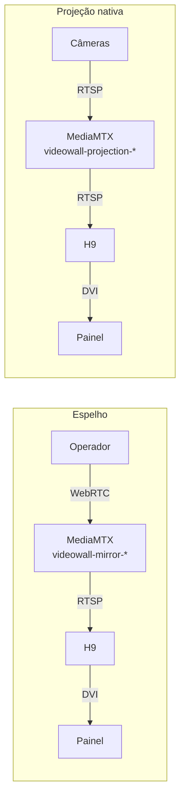

---
tags:
  - doc
  - cameras
  - videowall
  - novastar
  - validação
aliases:
  - "Câmeras - Videowall - Como o videowall funciona de ponta a ponta"
  - "Videowall - Funcionamento ponta a ponta"
  - "Videowall - Validação IPC e mosaico"
atualizado: 2026-10-08
---

# Câmeras - Videowall - Como o videowall funciona de ponta a ponta

Volta para [[Câmeras - Videowall]].

## Resumo

| Pergunta | Resposta |
| --- | --- |
| O mosaico do Attlas vai direto para o painel? | Sim. `layer/create` aceita source e window no mesmo payload; a camada nasce ligada e posicionada. Validado em 01/10/2026 contra o H9 de Quito |
| Dá pra criar mais de uma "conexão digital"? | Sim. O H9 aceita N fontes IPC e N camadas no mesmo slot. O limite é o throughput de decodificação do card IP |
| 4 computadores enviando ao mesmo H9, quem ganha? | O último a escrever. A Open API não tem sessão nem dono. O Attlas se protege com write-lock Redis e ocupação exclusiva, mas não controla clientes externos |
| 4 mosaicos lado a lado no painel | Viável por espelho ampliado (4 fontes, 4 camadas). Inviável por projeção nativa de 160 câmeras (ultrapassa o card) |

Arquitetura e rotas: [[Câmeras - Videowall - Arquitetura e estratégias]]. Fluxos passo a passo:
[[Câmeras - Videowall - Fluxos]]. Requisitos contratuais: [[Câmeras - Videowall - Requisitos e SLA]].

## Vocabulário H9 vs. Attlas

| Na interface do H9 | O que é | Na Open API |
| --- | --- | --- |
| Conexão digital | Fonte de vídeo RTSP registrada no processador (= fonte IPC no Attlas) | `ipc/IPCSourceCreate` |
| Camada (Layer) | Retângulo no painel que exibe uma fonte, com posição e tamanho em pixels | `layer/create` |
| Tela (Screen) | Canvas de saída que mapeia os monitores físicos | `screen/readList` |
| Slot | Card de entrada no chassi; o de rede é o `H_2xRJ45 IP` | `ipc/IPCSlotList` |
| Template de mosaico | Layout pré-definido de câmeras no processador | `ipc/IPCMontageTemplateCreate` |

"Conexão digital" na interface do H9 e "fonte IPC" no Attlas são a mesma coisa.

## Caminho do vídeo nos dois modos

O painel tem dois modos de exibição, descritos em [[Câmeras - Videowall - Fluxos]]. O caminho do vídeo
em cada um:

**Espelho.** Operador → captura da aba por WebRTC → MediaMTX (`videowall-mirror-*`) → H9 puxa por
RTSP → uma camada em tela cheia. Uma fonte por tela publicada, reaproveitada entre tomadas.

**Projeção nativa.** Cena ativada com `target: VIDEOWALL` → MediaMTX (`videowall-projection-*`, um
path por câmera) → H9 puxa por RTSP → uma camada por célula da cena, posicionada pela geometria do
layout. Funciona sem operador. É o modo do plano de resposta e da exibição programada.

Em nenhum dos dois modos credencial de câmera vai ao equipamento. O H9 puxa do MediaMTX, e o MediaMTX
puxa da câmera.

## O mosaico vai direto para o painel

Sim. `layer/create` aceita `source` e `window` no mesmo corpo. A camada nasce já ligada à fonte IPC e
já posicionada no retângulo pedido. Não existe passo de arrastar na interface do H9.

Comentário em `novastar-layer.operator.ts:17-21` que registra o comportamento observado:

> *"A layer opened straight on its IPC stream, the route the Quito H9 took on 01/10/2026; opening it
> empty and binding later with layer/writeSource answered 0 and left it empty."*

Criar a camada vazia e ligar depois não funciona: `layer/writeSource` respondeu 0 e deixou a camada
sem fonte. O caminho que funciona é abrir direto no stream, com `sourceId`, `channelId` e `streamId` no
campo `source` do `layer/create`.

### Estado das capacidades

Todas as 17 capacidades estão `CONFIRMED` desde o PR #5584 de 01/10/2026. O portão de capacidade não
bloqueia nenhuma delas.

| Grupo | Capacidades |
| --- | --- |
| Tela | `screen.list`, `screen.detail`, `screen.brightness`, `screen.showId` |
| Dispositivo | `device.info` |
| Fontes IPC | `ipc.create`, `ipc.update`, `ipc.delete`, `ipc.list`, `ipc.channelList`, `ipc.slotList` |
| Camadas | `layer.add`, `layer.delete`, `layer.list`, `layer.setInfo`, `layer.changeSource`, `layer.streamRule` |

## Múltiplas fontes IPC no mesmo processador

O H9 aceita N fontes IPC e N camadas na mesma screen. A projeção nativa do Attlas já cria uma por
câmera da cena; o espelho já cria uma por tela publicada. Não existe limite de "uma conexão digital".

O limite real é o throughput do card de rede IP (`H_2xRJ45 IP`). `decodeCapacity` no `IPCSourceList`
reporta 2 (= 2 MP por fonte). Mais câmeras em resolução baixa cabem; menos em resolução alta. O número
exato de fontes simultâneas não foi testado contra o H9 real.

Se o H9 tiver mais de uma screen (monitores em mais de uma face), cada screen recebe camadas
independentes com seu `screenId`. O Attlas endereça a primeira por padrão, ou a de
`VIDEOWALL_NOVASTAR_SCREEN_ID`.

## Competição entre computadores

A Open API do H9 não tem conceito de sessão, dono ou lock. Qualquer cliente que saiba o IP e o `pId`
escreve, e o resultado é o do último que escreveu.

| Cenário | Desfecho |
| --- | --- |
| Várias réplicas do Attlas, mesmo `ms-cameras` | Write-lock Redis e ocupação exclusiva impedem colisão; um ocupante por vez |
| 1 Attlas + N externos (VPU Manager, ViPlex, outro) | O Attlas não sabe dos externos; quem escrever por último ganha |
| Só externos ao mesmo tempo | Resultado imprevisível: camadas misturadas |

Nenhum cenário danifica o equipamento. O pior caso são camadas empilhadas ou trocadas.

### Camadas do Attlas vs. camadas externas

O Attlas identifica as próprias camadas pelo prefixo do nome e só toca as dele:

| Prefixo | Significado |
| --- | --- |
| `attlas-mirror-<id>` | Camada de tela espelhada |
| `attlas-vw-r<linha>c<coluna>` | Camada de projeção nativa |
| `attlas-cam-<id>` | Fonte IPC de câmera projetada |

Camada sem prefixo `attlas-` é ignorada na reconciliação. O Attlas não apaga nem move o que não criou.
Se um externo criar camada sobreposta, as duas aparecem empilhadas no painel (a de z-order maior fica
na frente).

### Precedência interna do Attlas

Plano de resposta > operador > programação horária. Detalhes em
[[Câmeras - Videowall - Requisitos e SLA#Precedência na parede]].

## Cenário: 4 mosaicos lado a lado no painel

Quatro computadores, cada um com 40 câmeras, todos exibindo ao mesmo tempo.

### Espelhar as 4 telas — viável

4 fontes IPC (uma por computador com captura de tela) e 4 camadas (uma por quadrante do painel). Cada
stream é ~5-10 Mbps em 1080p H.264; total ~20-40 Mbps, dentro da capacidade do card IP.

Quem cria as 4 camadas posicionadas monta a composição. Hoje o Attlas espelha uma consola por vez;
espelhar 4 exigiria estender o modo espelho ou criar as camadas pela interface do H9.

### 160 câmeras em projeção nativa — inviável

160 fontes IPC e 160 camadas ultrapassa o throughput de decodificação do `H_2xRJ45 IP`.

### Misto — possível, não validado

O Attlas projeta nativamente 40 câmeras (¼ do painel) e os 3 PCs externos espelham suas telas (¾ do
painel). Total: 43 fontes IPC. Pode funcionar se o card suportar; precisa de teste empírico.

## Mosaico nativo do H9 (não usado pelo Attlas)

A Open API tem `IPC Mosaic Source Templates` (`ipc/IPCMontageTemplateCreate` +
`ipc/IPCMontageTemplateApply`): composição de mosaico que vive no processador, com linhas, colunas e
posição por stream, aplicável numa chamada.

O Attlas não usa porque a composição viveria no equipamento como segundo modelo de layout (o outro é a
cena do VMS), RF-VW-13 está fora do escopo por desenho, e a API nunca foi chamada contra o H9 real.

O modelo atual (camada por camada) é mais verboso mas reconciliável: o Attlas lê `layer/detailList`,
compara com o que quer e só escreve o que falta ou mudou.

## Pendências de validação contra o H9 real

A VPN para o H9 de Quito (10.200.0.51) não estava ativa durante esta validação.

| O que foi usado | Confiança |
| --- | --- |
| Código do Attlas (catálogo, adaptadores, testes de integração) | Alta |
| Open API do fabricante (openapi.novastar.tech) | Alta |
| Teste contra o H9 em 01/10/2026 (PR #5584) | Alta |
| Especificação do chassi | Média |
| APIs de Mosaic Template | Baixa — nunca chamadas |

> [!warning] Pendente para quando o H9 estiver acessível
> - Quantas fontes IPC simultâneas o card `H_2xRJ45 IP` aguenta antes de recusar.
> - O H9 de Quito tem 1 ou mais screens (`screen/readList`).
> - O que acontece com as camadas do Attlas quando alguém aplica um preset pela interface nativa.
> - Smoke test: ativar cena 2×2 com `target: VIDEOWALL` e confirmar no painel.

## Validação por testes (08/10/2026)

VPN para o H9 de Quito indisponível. Testes executados contra o servidor falso do H9
(`fake-novastar-h9-server.ts`), que reproduz o comportamento da Open API.

| Suite | Resultado | O que prova |
| --- | --- | --- |
| `novastar-capability-catalog.spec` | 20/20 | As 17 capacidades estão no catálogo com path e status `CONFIRMED` |
| `novastar-open-api.client.spec` | 14/15 | Cliente monta envelope, assina, despacha, mapeia erros. 1 falha: shape de exceção do portão desatualizada |
| `novastar-request-codec.spec` | 16/16 | Assinatura MD5+Base64 e envelope compatíveis com a referência do fabricante |
| `novastar-signature.spec` | 6/6 | Assinatura idêntica ao exemplo da doc do fabricante |
| `novastar-body-cipher.spec` | 8/8 | Cifra DES do corpo compatível com o modo `CIPHERED` |
| `novastar-capability-gate.spec` | 5/7 | Portão recusa `PRESUMED` e libera `CONFIRMED`. 2 falhas: shape de `NotImplementedException` desatualizada |
| Testes de integração (todos) | Não compilam | Erro de schema Prisma na branch (`offlineSince` ausente em `CameraOperationalSnapshot`); não é do videowall |
| Unit specs de mirror/projection port | Não compilam | Assinatura do construtor mudou; specs desatualizados |

**Conclusão dos testes.** 64/65 unit tests passam. As 3 falhas são de shape de exceção e assinatura de
construtor, não de lógica do videowall. Os testes de integração estão bloqueados por um erro de schema
Prisma desta branch que não tem relação com o videowall.
