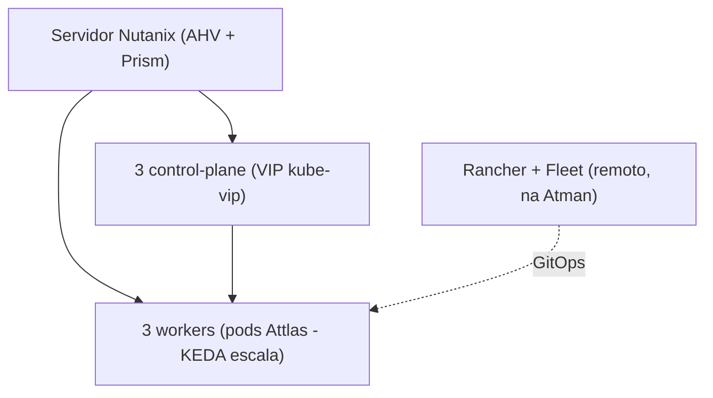

# Infraestrutura Attlas - Produção (servidor do cliente)

> Resumo: o cliente provê um servidor físico Nutanix; o Nutanix cria 6 VMs fixas; as VMs formam um cluster RKE2 HA (3 control-plane + 3 workers) gerido pelo Rancher; a escala automática é de pods, via KEDA (não de VMs); a aplicação é distribuída por GitOps (Rancher Fleet) alimentado pela CI do GitHub Actions.

- Versão: 3.0 - Data: 26/06/2026
- Companion: [[01-VISAO-GERAL]] (plataforma, validada no lab), [[02-DIMENSIONAMENTO]] (testes de carga e hardware), [[04-CI-CD]] (distribuição), [[arquitetura]] (diagrama). Configuração das VMs: seção "Configuração das VMs (produção - Quito)" do [[Guia operacional (infra)]].

## 1. Configuração das VMs

A Atman entrega a configuração do cluster de **produção** (hardware forte), que são 6 VMs fixas: **hardware total do cluster = 60 vCPU / 120 GB / ~3 TB SSD** (ver [[02-DIMENSIONAMENTO]] seção 5). O servidor de teste roda a mesma topologia num cluster menor, por ser prova de conceito. O servidor físico que hospeda estas VMs (o Nutanix, incluindo a reserva do próprio AHV/CVM) é dimensionado e adquirido pelo cliente. O que fixamos aqui é a VM; o hardware físico embaixo dela é responsabilidade do cliente.

| Papel                       | Qtd    | vCPU (cada) | RAM (cada) | SSD    |
| --------------------------- | ------ | ----------- | ---------- | ------ |
| Control-plane (server)      | 3      | 4           | 8 GB       | 100 GB |
| Worker (agent)              | 3      | 16          | 32 GB      | 200 GB |
| Pool de dados (Nutanix CSI) | 1 pool | -           | -          | ~2 TB  |

- Soma: **60 vCPU / 120 GB / ~3 TB SSD** (~0,9 TB nos discos de SO das VMs + ~2 TB no pool de dados). O host do cliente tem que comportar isso mais a reserva do próprio Nutanix; esse dimensionamento do host é do cliente.
- SSD: os discos das VMs são pequenos (control-plane 100 GB, worker 200 GB: só SO/imagens/efêmero). O dado dos serviços com estado **não fica no disco do worker**, e sim num **pool de dados via Nutanix CSI** - 1 volume por banco, instância única sem réplica (db-audit o maior). Estimativa ~2 TB (attlas 25 = ~700 GB hoje), expansível; backup é do cliente. Detalhe: ver [[02-DIMENSIONAMENTO]] seção 5.
- Recurso por microsserviço (reserva e teto de cada réplica): ver [[02-DIMENSIONAMENTO]] seção 7.
- CPU das VMs em modo passthrough (host) para o KEDA ter métrica de CPU precisa.
- SO: Ubuntu Server 24.04 LTS. Kubernetes: RKE2 v1.35.5.
- Worker de 16 vCPU é o sizing de produção (o lab rodou 8 vCPU sem carga real de cidade). Medições e cálculo: ver [[02-DIMENSIONAMENTO]].

## 2. Topologia (RKE2 HA)

- 3 control-plane formam quórum etcd; um VIP (kube-vip) é o endpoint estável do API server.
- Control-plane com taint `CriticalAddonsOnly` - o workload da aplicação roda nos 3 workers.
- VMs fixas: não há autoscaler de nó. Adicionar worker é operação manual no Prism (rara, por planejamento de capacidade).

Por que exatamente 3 control-plane + 3 workers (o menor desenho sem ponto único de falha): ver [[02-DIMENSIONAMENTO]] §6.

## 3. Stack de produção

| Componente              | Papel                                                                                 |
| ----------------------- | ------------------------------------------------------------------------------------- |
| **Nutanix AHV + Prism** | hypervisor: cria e opera as VMs (única camada nova ante o lab, que usa KVM + `virsh`) |
| **RKE2**                | Kubernetes nas VMs                                                                    |
| **Rancher + Fleet**     | painel único e distribuição GitOps (rodam remoto, na Atman)                           |
| **Helm**                | instala e atualiza a aplicação                                                        |
| **KEDA**                | escala de pods (CPU + lag de Kafka)                                                   |
| **kube-vip**            | VIP do API server (HA)                                                                |
| **ingress-nginx**       | entrada HTTP/HTTPS                                                                    |
| **cert-manager**        | TLS automático                                                                        |
| **Nutanix CSI**         | storage persistente (PV) para os serviços com estado                                  |

Tudo acima de RKE2 é idêntico ao lab; a única troca é a virtualização (KVM no lab, Nutanix no cliente).

## 4. Escala

Modelo idêntico ao da plataforma, detalhado em [[01-VISAO-GERAL]] §4: a escala automática é só de **pods** (KEDA, por CPU e/ou lag de Kafka), as **VMs são fixas** (3+3, sem autoscaler de nó) e os **bancos não escalam** (single-instance + PV). Recorte de produção (**hardware dedicado**): o `max` de réplica de cada serviço é um **limite duro**, e a soma de `max x teto de CPU` mais a reserva dos serviços com estado é dimensionada para caber no cluster com o regime dentro de 2 workers (N+1). Tabela e regra em [[02-DIMENSIONAMENTO]] seção 7.

## 5. Armazenamento

- PV via **Nutanix CSI** (storage de rede; o volume segue o pod ao trocar de nó).
- Bancos, Kafka e Redis são stateful: single-instance + PV, com identidade estável (StatefulSet onde aplicável).
- SSD com expansão habilitada. O crescimento é puxado pelo banco de auditoria e pelo Kafka (fluxo contínuo de eventos), não pelo número de réplicas.

## 6. Rede e acesso

- Sub-rede dedicada ao cluster. Endereços: 6 por DHCP (1 por VM) + 1 fixo fora do DHCP (VIP do API server) + 1 para a aplicação web.
- 1 interface de rede por VM.
- **Gestão**: VPN WireGuard entre a rede da Atman e a do cliente. **Usuários**: aplicação web por HTTPS (ingress).

## 7. Distribuição (GitOps)

Imagens imutáveis pela CI (GitHub Actions). Cada cluster fixa versão e serviços em Git; o Rancher Fleet reconcilia (`helm upgrade`). Sem deploy manual no cluster. Detalhe: [[04-CI-CD]].

## 8. Requisitos de código para escalar com segurança

Escalar multiplica processos: um serviço que roda bem com 1 réplica pode quebrar com 2+. O que precisa estar tratado antes de subir réplicas:

| Problema                     | Causa           | Solução                                    |
| ---------------------------- | --------------- | ------------------------------------------ |
| WebSocket perde mensagem     | réplicas de pod | Redis adapter nos 4 gateways               |
| Conexão duplicada com device | réplicas de pod | connector com 1 réplica ou leader election |
| Cron roda N vezes            | réplicas de pod | lock no Redis (SET NX) ou CronJob do K8s   |
| Cache/estado diverge         | réplicas de pod | mover estado para o Redis                  |
| Notificação/e-mail duplicado | réplicas de pod | idempotência por `eventId`                 |
| Pool de conexões estoura     | réplicas de pod | dimensionar pool ou PgBouncer              |
| Arquivo local some           | troca de nó     | PV via Nutanix CSI                         |
| IP/porta quebra              | troca de nó     | Service DNS + ingress, nunca IP fixo       |
| Token/ordem com tempo errado | troca de nó     | NTP + ordenação por offset do Kafka        |

Princípio único: tirar o estado de dentro do pod. O que é stateful por natureza (connectors de device, banco, Kafka) recebe tratamento especial (réplica única, leader election ou StatefulSet).

## 9. Decisões

| Decisão           | Escolha                               | Motivo                                          |
| ----------------- | ------------------------------------- | ----------------------------------------------- |
| Virtualização     | Nutanix AHV                           | hardware do cliente; Prism opera as VMs         |
| Kubernetes        | RKE2                                  | mesma stack do lab                              |
| Topologia         | 3 control-plane + 3 workers (HA fixa) | quórum etcd e capacidade previsível             |
| Escala de pods    | KEDA (CPU + lag de Kafka)             | escala consumidores pelo lag, não só por CPU    |
| Escala de nó (VM) | nenhuma (capacidade fixa, manual)     | capacidade previsível vale mais que VM elástica |
| Bancos            | single-instance + PV (Nutanix CSI)    | não distribuímos banco agora                    |
| Distribuição      | GitOps (Fleet) + GitHub Actions       | imagens imutáveis, versão por cluster, rollback |
| Ingress           | ingress-nginx                         | já usado no lab, sem fricção                    |
