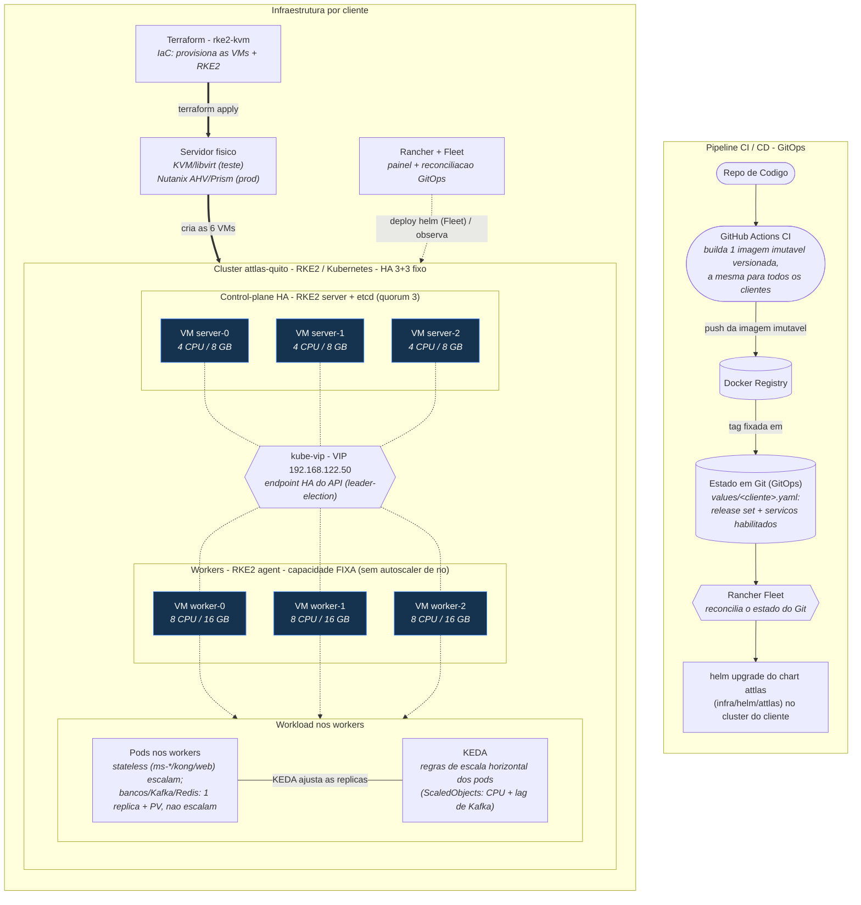

---
tags:
  - kubernetes
  - infra
  - diagrama
---

# Arquitetura (diagrama)

Diagrama completo da infraestrutura: pipeline CI/CD (GitOps) e infraestrutura por cliente (servidor -> cluster -> nos -> pods). Referenciado por [[01-VISAO-GERAL]].

> Fonte: `infra/docs/arquitetura.mmd` (branch `shared/feat/SOFTWARE-1719`). O original usa `look: handDrawn` + tema dark; aqui simplifiquei o front-matter pro mermaid nativo do Obsidian renderizar sem plugin.
