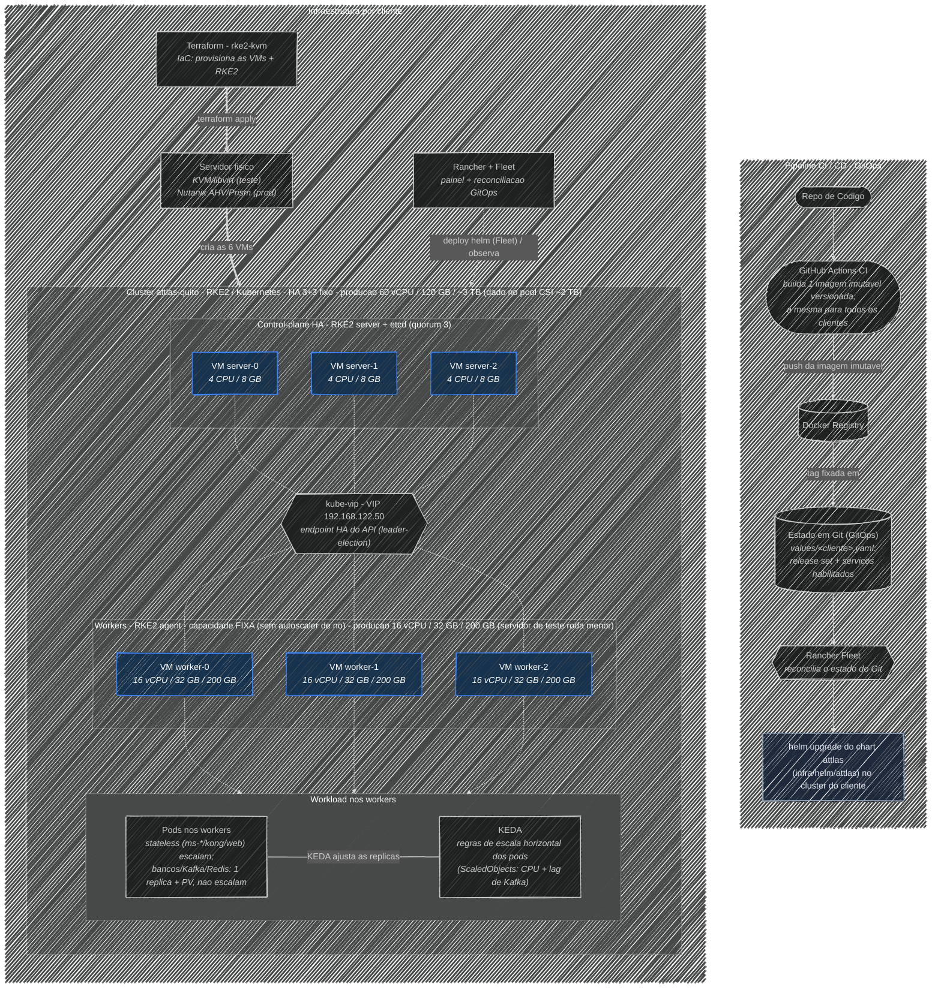

---
tags:
  - kubernetes
  - infra
  - diagrama
---

# Arquitetura da infraestrutura (Mermaid)

Diagrama em código, espelhado de `infra/docs/arquitetura.mmd`. Versão editável em quadro: [[Arquitetura.excalidraw|Excalidraw]]. Contexto: [[01-VISAO-GERAL]], [[03-PRODUCAO]], [[04-CI-CD]].

> Fonte: `infra/docs/arquitetura.mmd`. O `look: handDrawn` exige mermaid recente; se não renderizar, remova o bloco `config:` do topo. Worker de produção = 16 vCPU / 32 GB / 200 GB (o servidor de teste roda a mesma topologia num cluster menor).
