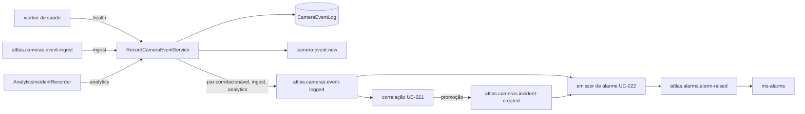

---
tags:
  - doc
  - ms-cameras
  - eventos
atualizado: 2026-10-01
---

# Eventos, incidentes e alarmes - Arquitetura e estratégias

Índice: [[Eventos, incidentes e alarmes]]. Catálogo de eventos e mapa de causa:
[[Eventos, incidentes e alarmes - Catálogo e criticidade]]. Visual:
[[Diagrama - MOD-007 eventos de câmera.excalidraw|diagrama]].

## Mapa de código (`apps/ms-cameras/src/events/`)

| Pasta | Conteúdo |
| --- | --- |
| `recording/` | Seam `RecordCameraEventService` (porta `ICameraEventRecorder`), `CameraEventIngestListener`, repositório de `CameraEventLog` |
| `publishing/camera-events.publisher.ts` | `event-logged`, `incident-created`, `alarm-raised` e os ecos de comando de plano |
| `_shared/` | Derivações de leitura: categoria, código, origem, status, prioridade, `triggerCount`, topologia (`area`/`subarea`), ações disparadas |
| `reading/` | Log por câmera (UC-017/018), log da rede (UC-032), KPIs (UC-040), timeline (UC-041), recorrência (UC-042), métricas de incidente (UC-063) |
| `consumers/correlate-events/` | Correlação e housekeeping (UC-021) |
| `consumers/emit-alarm/` | Emissor de alarme, ramos A e B (UC-022) |
| `consumers/execution-plans-ptz-command/`, `execution-plans-videowall-command/` | Comandos de plano de resposta para PTZ (PROJ-015, [[PTZ e presets]]) e videowall (PROJ-020, [[VMS]]), módulos próprios |
| `incidents/` | Leitura de `CameraIncident` (UC-023/024), mapeamentos e exportação XLS/PDF (UC-080) |
| `observations/` | Observações e report de ocorrência (UC-044) |
| `treatment/` | Tratamento do incidente de analítico (UC-062, lote UC-074) |
| `realtime/` | `camera:event:new`, invalidação do dashboard e a sala `incidents:<systemId>` (UC-226) |
| `events.constants.ts` | `CorrelationConfig`, `AlarmEmitConfig`, `CameraEventLogConfig`, `CameraEventPeriodConfig`, `CameraEventTimelineConfig`, `CameraEventRecurrenceConfig` |

Wiring: `events/events.module.ts`.

## Seam de registro (MOD-010)

`recording/record-camera-event.service.ts` é o único ponto de escrita de evento. Em sequência, sem
transação: revalida a câmera, exige `occurredAt` ISO-8601 com `Z` ou offset (senão `InvalidInputException`
`INVALID_TIMEZONE`; sem `occurredAt`, grava a hora do processo), deduplica por `correlationId`, insere
(`severity` default `INFO`), deriva a categoria em read-time, publica `CameraEventLogCreatedEvent` no
EventBus e, quando a origem pede, `publishEventLogged` em best-effort.

| Efeito | `ingest` | `health` | `analytics` |
| --- | --- | --- | --- |
| Revalida a câmera | Sim | Não (o worker só monitora câmera existente) | Não (vem de binding já filtrado) |
| Valida o fuso de `occurredAt` | Sim | Sim | Sim |
| Dedup por `correlationId` | Sim | Não (o worker não envia) | Não (o recorder do analítico já colapsa) |
| Persiste e emite `camera:event:new` | Sim | Sim | Sim |
| Publica `event-logged` | Sim | Só se o par `(eventType, causeCode)` está em `CORRELATABLE` | Sim |

- **`health`**: o worker de saúde ([[Saúde e monitoramento]]) grava `HEALTH_ONLINE`, `HEALTH_OFFLINE`,
  `HEALTH_EVENT` e `CONNECTIVITY_CHANGED`, com `causeCode` do catálogo de marca, `PROBE_TIMEOUT` ou
  `PUSH_DISCONNECT`. O critério de publicação lê o catálogo da correlação em vez de manter outra lista;
  evento de saúde sem causa, ou com par fora do catálogo, fica fora do tópico (é o ruído de sondagem).
- **`ingest`**: `CameraEventIngestListener` consome `attlas.cameras.event-ingest`. Descarta com `warn` o
  que vier sem `cameraId`/`eventType`, com payload acima de 4 KiB ou não serializável, câmera desconhecida e
  `InvalidInputException`; qualquer outro erro vira `error` e retorno, **sem relançar**, para o consumidor
  nunca entrar em laço. Não há produtor desse tópico no repo.
- **`analytics`**: o `AnalyticsIncidentRecorder` (PROJ-022, `analytics-realtime/`) grava `ANALYTICS_INCIDENT`
  com `severity: 'WARN'`, sem `causeCode` e o tipo em `payload.incidentType`, deduplicado por
  `(câmera, região, tipo)` numa janela de 30 s (`ANALYTICS_INCIDENT_DEDUP_WINDOW_MS`). O que o frame traz e
  como o tipo é lido está em [[Analítico - Arquitetura e estratégias]].

## Leitura da rede (tela de Eventos)

Handlers em `reading/`, todos escopados por `systemId` e com o mesmo `where` (`camera-events-where.builder.ts`).
A topologia do tenant (ms-traffic-model, com o bearer repassado) é carregada uma vez por request e resolve
`area`/`subarea` nos dois sentidos; queda do ms-traffic-model degrada os rótulos para vazio sem derrubar a
rota.

- **Lista (UC-032)**: filtros `search`, `severity` e `category` (CSV), `incidentType` (só com
  `category=ANALYTICS`), `period` (`24h`, `7d`, `30d`, `90d`, `all`, `range`; default `30d`), `area`/`subarea`,
  `origin` (`MANUAL` com `operatorId`, `SYSTEM` sem), `state` (conexão da câmera), `status`, `analytic` e
  `cameraId`. `status` segue `deriveCameraEventStatus`: tratamento do operador, depois o incidente ligado,
  senão `OPEN`. `sortBy` aceita `detectedAt` e `severity`. `pageSize` até 100. Cada item ganha `eventCode`,
  `triggerCount`, `area`, `subarea`, `origin`, `status` e, quando há, `analyticId`, `analyticType` e
  `assignedTo`.
- **Detalhe (UC-032 e UC-018)**: mesmas derivações mais `triggeredActions`, `linkedIncident {id, status}` e
  `treatmentAssignedTo`; a rota por câmera também traz `connectionStatus`. Evento de outra câmera ou tenant é
  404 sem vazar existência.
- **KPIs (UC-040)**: quatro tiles por severidade sobre o mesmo universo; comparação fixa dos últimos 30 dias
  contra os 30 anteriores, independente do período. A rota não aceita `24h`.
- **Timeline (UC-041)**: a cadeia do incidente do evento (todos os `CameraEventLog` ligados aos incidentes
  dele por `CameraIncidentEvent`, possivelmente de várias câmeras). Sem incidente, fallback de contexto: mesma
  câmera, 30 min para cada lado, até 50 linhas.
- **Recorrência (UC-042)**: série com `total` e `categoryCount` só da câmera de origem, numa janela que
  termina no `occurredAt` do evento; presets `1h` (60 de 1 min), `24h` (24 de 1 h), `7d` e `30d` (dias).
- **`triggeredActions`**: só `{ type: 'INCIDENT', code }`; `ALARM` não é persistido e `SERVICE_ORDER` não
  tem módulo.

## Fila de incidentes do analítico

A fila da tela de Incidentes do [[Analítico]] é a lista acima com `category=ANALYTICS`, e todo o lado
servidor mora aqui.

- **Agregados (UC-063)**: com `category` exatamente `ANALYTICS`, a página traz `incidentTypeCounts`,
  `statusCounts` e `cameraCounts` (com coordenadas e quebra por tipo), sobre o conjunto filtrado inteiro.
- **Métricas (UC-063)**: `GET /cameras/incidents/metrics` com totais, tempos médios de reconhecimento e
  fechamento (aproximados por `createdAt`/`updatedAt` do tratamento), séries e cortes por tipo, status,
  câmera, analítico e interseção.
- **Tratamento (UC-062)**: `CameraEventTreatment`, 0 ou 1 linha por evento (`eventLogId` como PK); sem
  linha vale `DETECTED`. Ciclo em `treatment/camera-event-treatment.constants.ts`: `DETECTED`,
  `ACKNOWLEDGED`, `INVESTIGATING`, `RESOLVED`, e `DROPPED` (falso positivo) de qualquer estado não final. Só
  para evento `ANALYTICS` (senão 409 `EventNotAnalyticsException`) e nunca toca `CameraIncident`. A
  primeira transição grava `assignedTo` com o ator, dono até o fim; as seguintes são compare-and-set sobre o
  status esperado (dois operadores dão um vencedor e um 409 `INVALID_STATE_TRANSITION`). Token sem `subject`
  é 401. Cada transição publica auditoria (`attlas.audit.cameras`, só `fromStatus`/`toStatus`) e a
  notificação `cameras.incident.treatmentChanged`.
- **Lote (UC-074)**: até 100 ids, mesmo ciclo e compare-and-set por item, 200 com resultado por id e sem
  transação em volta.
- **Exportação (UC-080)**: `GET /cameras/events/export?format=xls|pdf` com os filtros da lista; reexecuta a
  lista em lotes, confere o teto de 20 000 linhas antes de abrir o stream (`EXPORT_LIMIT_EXCEEDED`), escreve
  direto na resposta e mostra a criticidade configurada do tipo (UC-227) em vez da severidade do log.
- **Canal ao vivo (UC-226)**: `subscribe_incidents { systemId }` no namespace `cameras-status`, com
  filiação ao sistema, entra na sala `incidents:<systemId>`, que recebe `camera:incidents:changed` a cada
  incidente gravado, tratamento (unitário ou lote) e observação (`realtime/incident-changes.publisher.ts`).
- **Criticidade por tipo (UC-227)**: `GET`/`PUT /cameras/analytics/incident-criticality`
  (`apps/ms-cameras/src/incident-criticality/`), tabela por sistema sobre o padrão
  `DEFAULT_INCIDENT_CRITICALITY`; o `PUT` substitui a tabela inteira e exige `analytics.instances:manage`.
- **Imagem e vídeo do incidente**: `IncidentMediaController` (`analytic-incident-media/`), documentado em
  [[Analítico - Arquitetura e estratégias]].

## Correlação (UC-021)

`consumers/correlate-events/`. Consome `event-logged`, valida o payload e chama
`CorrelateEventsService.correlate`:

- **Elegibilidade**: só os 10 pares de `CORRELATABLE` (`correlation-rules.ts`), listados no
  [[Eventos, incidentes e alarmes - Catálogo e criticidade#Mapa de causa para incidente e alarme|catálogo]].
  `HEALTH_ONLINE` nunca abre cluster.
- **Chave**: `correlationKey = eventType:causeCode` (`__NULL__` sem causa).
- **Janelas**: ativa de 60 s e extensão de 120 s; `findOpenIncidentByKey` casa incidente `TENTATIVE` ou
  `DETECTED` não resolvido com `detectedAt` na janela ativa **ou** `updatedAt` na de extensão.
- **Anexar ou criar**: aberto encontrado, `attachEvent` numa transação (ligação idempotente, recontagem e
  promoção); nenhum, cria `TENTATIVE` **sem publicar** (anti-ruído).
- **Promoção para `DETECTED`**: ao chegar a 2 câmeras distintas ou 3 eventos. `updateMany` condicional em
  `status: 'TENTATIVE'`: só a transação com `count === 1` publica `incident-created` e invalida o dashboard
  (INCIDENTS).
- **Housekeeping** (`@Cron` a cada minuto, sob `pg_try_advisory_xact_lock`, uma réplica por tick):
  `autoCloseExpiredDetected` (`DETECTED` sem evento novo por 30 min vira `RESOLVED`), `dropExpiredTentative`
  (`TENTATIVE` órfão por 120 s vira `DROPPED`) e `autoResolveByRecovery` (80% das câmeras com `HEALTH_ONLINE`
  depois de `detectedAt` vira `RESOLVED`, BR-CAM-CORR-005). O descarte de 120 s não é menor que a extensão,
  para não matar um `TENTATIVE` que ainda aceita anexo.

Estados de `CameraIncident`: `TENTATIVE`, `DETECTED`, `RESOLVED`, `DROPPED`. `INVESTIGATING` existe no enum e
é visível na leitura, mas nenhum caminho leva um `CameraIncident` a ele; o `INVESTIGATING` que o operador
alcança é o do tratamento do analítico. Incidente manual nasce `DETECTED`.

## Emissão de alarme (UC-022)

`consumers/emit-alarm/`, dois `@EventPattern` no mesmo listener, que relançam erro não de domínio para o
Kafka reentregar.

- **Ramo A, `incident-created`**: cluster. Descarta incidente sem `affectedCameraIds`. `mapToAlarm` com
  `fromCluster: true`; se a severidade diverge da do incidente, loga `warn` e o mapping vence.
  `affectedEntities` com a câmera primária primeiro.
- **Ramo B, `event-logged`**: evento isolado. `isAlarmableEvent`: `severity === 'ERROR'` sempre;
  `VAPIX_TAMPERING` em qualquer severidade; `VAPIX_PTZ_ERROR` a partir de `WARN`; o resto não. Evento já
  ligado a incidente é pulado (o alarme do cluster cobre).
- **Incidente do analítico**: `ANALYTICS_INCIDENT` cujo tipo tem código no catálogo `ANALYTICS`
  (`AlarmEmitConfig.ANALYTICS_INCIDENT_CAUSE_CODES`: `CONGESTION`, `WRONG_WAY`, `STOPPED_FLOW`) sai no domínio
  `analytics`, categoria `ROAD_SAFETY` e a severidade padrão do tipo no catálogo (CROSS-175).
- **`alarmId` determinístico**: `deriveAlarmId(sourceType, sourceId)` (`@attlas/core-common`), UUID v5 de
  `EVENT:<eventLogId>` ou `INCIDENT:<incidentId>`; replay gera o mesmo id, e o `ms-alarms` deduplica pelo `alarmId` (`IngestionIdempotencyService`).
- **Escopo**: `systemId` da câmera primária; não resolvido sai sem escopo.
- **Chave de partição**: `sourceId` para `INCIDENT`, a câmera para `EVENT`.
- **Consumidor**: o `AlarmRaisedConsumer` do `ms-alarms` classifica pelo `causeCode` dentro do módulo do
  domínio (`cameras` para `CAMERA_ALARM_TYPES`, `analytics` para o catálogo do analítico); código sem entrada
  no catálogo é descartado como não mapeado.

O report manual não publica `incident-created`, então incidente reportado nunca emite alarme automático.

## Observações e report (UC-044)

- **Observação**: `CameraEventObservation` (`text` até 280, `authorId`/`authorName` do JWT, nunca do body).
  Thread de dois níveis: reply de reply é 400 `PARENT_IS_REPLY`, porque a leitura só busca top-level e um
  nível de replies. A criação publica auditoria sem o texto e avisa a sala de incidentes.
- **Report** (`POST /cameras/events/:eventId/report`, modal "Reportar ocorrência"): `createReportedIncident`
  abre `CameraIncident` `DETECTED`, `correlationKey: null`, `reportedBy` do ator, ligado ao evento. `name` e
  `description` são obrigatórios, com tetos de 200 e 2000 em `CameraEventReportValidation`
  (`libs/contracts/src/lib/camera/camera-event-report.validation.ts`), a mesma classe do `maxlength` do
  modal. Prioridade derivada da `severity` do evento (tabela em
  [[Eventos, incidentes e alarmes - Requisitos e SLA]]). Fica fora da trilha de auditoria de propósito.

Escritas de observação, report e tratamento exigem `analytics.incidents:treat`.

## Idempotência

| Camada | Mecanismo | Garantia |
| --- | --- | --- |
| Registro `ingest` | `findByCorrelationId(cameraId, correlationId)` | Best-effort; corrida na primeira entrega concorrente |
| Registro `analytics` | Mapa em memória por `(câmera, região, tipo)`, 30 s | Por processo; restart pode gerar uma linha a mais |
| Correlação | `eventAlreadyLinked` e `@@unique([incidentId, eventLogId])` | Forte no anexo; corrida na criação de dois `TENTATIVE` da mesma chave |
| Alarme | `deriveAlarmId` e idempotência de ingestão do `ms-alarms` por `alarmId` | Forte |
| Tratamento | PK `eventLogId` e compare-and-set | Forte, um vencedor e um 409 |
| Observação | Pai precisa ser top-level | Forte |
| Report manual | Nenhum | Ausente |

## Endpoints (prefixo `/api`)

Todos no `CamerasController` (`apps/ms-cameras/src/cameras/cameras.controller.ts`), com
`@RequireSystemDuty()` na classe e escopo por `@SystemId()`.

| Método | Rota | Retorno | UC |
| --- | --- | --- | --- |
| `GET` | `/cameras/:id/events` | Página de eventos da câmera (`eventType`, `severity`, `category`, `operatorId`, `from`/`to` sobre `createdAt`, busca, `sort`; `limit` default 20, máximo 100) | UC-017 |
| `GET` | `/cameras/:id/events/:eventId` | Detalhe por câmera, com `connectionStatus` | UC-018 |
| `GET` | `/cameras/events` | Página da rede; com `category=ANALYTICS`, também os agregados da fila | UC-032, UC-063 |
| `GET` | `/cameras/events/stats` | Quatro tiles e comparação fixa | UC-040 |
| `GET` | `/cameras/events/export` | XLS ou PDF da fila | UC-080 |
| `GET` | `/cameras/events/:eventId` | Detalhe da rede (deep-link por id) | UC-032 |
| `GET` / `POST` | `/cameras/events/:eventId/observations` | Thread e criação de observação | UC-044 |
| `POST` | `/cameras/events/:eventId/report` | Incidente manual | UC-044 |
| `PATCH` | `/cameras/events/:eventId/treatment-status` | Transição de tratamento | UC-062 |
| `PATCH` | `/cameras/events/treatment-status` | Transição em lote, até 100 | UC-074 |
| `GET` | `/cameras/events/:eventId/recurrence` | Série por buckets | UC-042 |
| `GET` | `/cameras/events/:eventId/timeline` | Cadeia do incidente ou contexto | UC-041 |
| `GET` | `/cameras/incidents` | Página de incidentes (default 7 dias; `TENTATIVE`/`DROPPED` ocultos; filtros `severity`, `type`, `status`, `cameraId`) | UC-023 |
| `GET` | `/cameras/incidents/metrics` | Agregado da fila do analítico | UC-063 |
| `GET` | `/cameras/incidents/:id` | Detalhe e timeline ascendente (até 200, `timelineTruncated`) | UC-024 |

Os segmentos literais (`incidents`, `events`, `bulk-template`, `manufacturers`) são declarados antes de
`@Get(':id')`, e dentro de cada grupo `events/stats`, `events/export` e `events/treatment-status` vêm antes de
`events/:eventId`, e `incidents/metrics` antes de `incidents/:id`; senão o `ParseUUIDPipe` os captura.

## Kafka

Constantes: `libs/contracts/src/lib/camera/cameras-topics.constant.ts`,
`libs/contracts/src/lib/alarm/alarms-topics.constant.ts` e
`libs/contracts/src/lib/execution-plans/execution-plans-topics.constant.ts`.

| Direção | Tópico | Onde | Payload |
| --- | --- | --- | --- |
| Consome | `attlas.cameras.event-ingest` | `CameraEventIngestListener`; sem produtor no repo | `ICameraEventIngestMessage` |
| Consome | `attlas.cameras.event-logged` | Correlação **e** ramo B do alarme | `ICameraEventLogEntry` |
| Consome | `attlas.cameras.incident-created` | Ramo A do alarme | `ICameraIncidentCreatedEvent` |
| Consome | `attlas.execution-plans.ptz-command` | Comando de PTZ de plano | `IPtzCommandEvent` |
| Consome | `attlas.execution-plans.videowall-command` | Comando de videowall de plano | `IVideowallCommandEvent` |
| Produz | `attlas.cameras.event-logged` | Seam (chave `cameraId`) | `ICameraEventLogEntry` |
| Produz | `attlas.cameras.incident-created` | Correlação, só na promoção | `ICameraIncidentCreatedEvent` |
| Produz | `attlas.alarms.alarm-raised` | Emissor de alarme | `IAlarmRaisedEvent` |
| Produz | `attlas.cameras.ptz-command-executed` / `-rejected` | Eco do comando de PTZ (chave `commandId`) | `IPtzCommandExecutedEvent` / `IPtzCommandRejectedEvent` |
| Produz | `attlas.cameras.videowall-command-executed` / `-rejected` | Eco do comando de videowall (chave `commandId`) | `IVideowallCommandExecutedEvent` / `IVideowallCommandRejectedEvent` |
| Produz | `attlas.audit.cameras` | Observação e tratamento (`CamerasAuditPublisher`) | Envelope de `@attlas/audit-events` |

Sem produtor Kafka (`KAFKA_BROKERS` ausente), `event-logged`, `incident-created` e `alarm-raised` são
suprimidos em silêncio, porque o que importa já persistiu; os ecos de comando de plano fazem o handler falhar
(prazo de 20 s) para o comando ser reentregue. A transição de conexão sai em `attlas.cameras.status-changed`
por outro caminho ([[Saúde e monitoramento - Arquitetura e estratégias#Tópico status-changed|status-changed]]).

## Persistência (`apps/ms-cameras/src/database/schema/`)

| Modelo | Arquivo | Papel |
| --- | --- | --- |
| `CameraEventLog` | `audit/camera_event_log.prisma` | Evento: `eventType`, `subType`, `severity`, `payload` (JSON), `correlationId`, `operatorId`, `occurredAt` (Timestamptz, sem default no banco). Sem coluna `category` |
| `CameraEventObservation` | `audit/camera_event_observation.prisma` | Observação ou reply, `text` VarChar(280), `parentObservationId` |
| `CameraEventTreatment` | `audit/camera_event_treatment.prisma` | Tratamento do incidente `ANALYTICS`: `eventLogId` PK, `status`, `assignedTo`, `updatedBy` |
| `CameraIncident` | `incident/camera_incident.prisma` | Cluster ou manual: `status`, `priority`, `correlationKey` (VarChar 64, `null` se manual), `detectedAt`/`resolvedAt`, `reportedBy`; `assignedTo`/`workOrderId` sem fluxo |
| `CameraIncidentEvent` | `incident/camera_incident_event.prisma` | Ligação N:N; `@@unique([incidentId, eventLogId])` |
| `AnalyticsIncidentCriticality` | `incident/analytics_incident_criticality.prisma` | Criticidade por tipo e sistema (UC-227) |

## Por que assim

- **Um seam para três origens**: um só lugar valida, persiste, classifica, emite e publica; as diferenças
  entre origens são flags, não caminhos paralelos.
- **Categoria derivada, não persistida**: `deriveCameraEventCategory` mapeia `(eventType, causeCode)` em
  read-time e o filtro vira predicado Prisma. A cláusula `OPERATIONAL` é NULL-safe (não usa
  `NOT(OR(positivos))`, que descartaria linha sem `causeCode`) e exclui `ANALYTICS_INCIDENT`.
- **Tratamento separado do incidente de hardware**: o operador move o `CameraEventTreatment`; o `status`
  exibido prefere o tratamento (BR-CAM-TRT-001).
- **Tipo e severidade do incidente derivados de `correlationKey`**: o filtro por `type` vira
  `endsWith(':<causeCode>')`; incidente manual cai em `UNKNOWN` no detalhe.
- **Título em pt-BR persistido como fallback**: texto estável para consumidor sem i18n; o front usa
  `translationKey`.
- **Publish best-effort, ecos de comando estritos**: falha de broker não desfaz registro, correlação nem
  alarme, que já persistiram; o comando de plano precisa do eco para fechar.

## Armadilhas conhecidas

- **A exportação para nas primeiras 100 linhas.** O handler pede lotes de
  `INCIDENTS_EXPORT_BATCH_SIZE = 500` e para quando um lote volta menor que 500, mas o
  `ListCameraEventsHandler` limita `pageSize` a `CameraEventLogConfig.MAX_LIMIT = 100`. Com mais de 100
  incidentes no filtro, o arquivo sai com 100 linhas enquanto o teto de 20 000 é conferido contra o total
  real.
- **Report duplicado abre dois incidentes.** `createReportedIncident` sempre insere, o handler não confere
  `linkedIncident`, e o botão "Reportar ocorrência"
  (`web-attlas/.../cameras-events/pages/camera-event-detail/camera-event-detail.page.html`) fica sempre
  clicável.
- **Comentário falso no DTO**: `reading/dtos/list-camera-events.dto.ts` diz que `area` "not yet enforced",
  mas o handler resolve a topologia e o `where` aplica o filtro, coberto por teste.
- **Comentário defasado no worker**: o docblock de `safeAppendEvent` diz que `health` não publica; o seam
  publica o par correlacionável.

## Pendências

- Índice parcial único em `(cameraId, correlationId)` para fechar a corrida do dedup do ingest.
- UNIQUE parcial `WHERE resolvedAt IS NULL` por `correlationKey` para fechar a corrida de criação de dois
  `TENTATIVE`.
- DLQ para o ingest e para a correlação (hoje descartam com log).
- Guarda contra report duplicado e corte do lote da exportação (armadilhas acima).
- `CorrelationConfig` passar de constante para configuração em banco.
