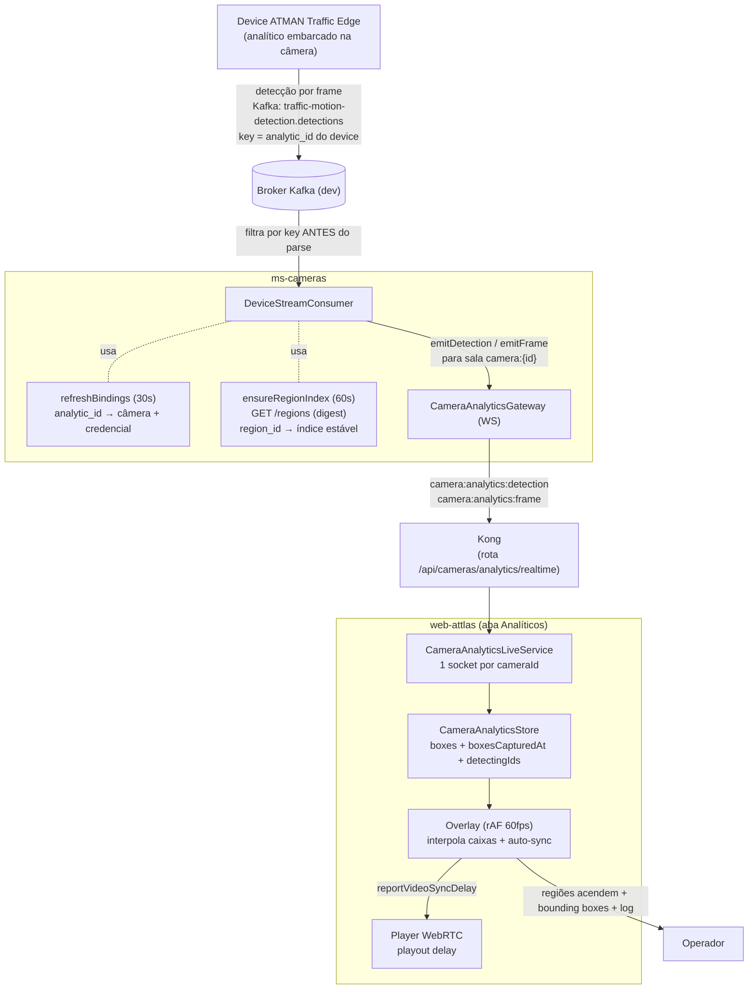

---
tags:
  - attlas
  - sprint-24
  - tech
card: SOFTWARE-2134
pr: "#790"
atualizado: 2026-07-15
---

# SOFTWARE-2134 - Decisão técnica e fluxo (analítico ao vivo)

Documento de referência do **funcionamento** da PR #790: como a detecção sai do analítico embarcado na câmera e chega no player em tempo real, e o porquê de cada escolha. Card e status em [[SOFTWARE-2134 - Analítico de vídeo ao vivo (detecção + bounding boxes)]].

## Em uma frase

O analítico embarcado (ATMAN Traffic Edge) detecta os objetos por frame e publica no Kafka; o `ms-cameras` consome esse fluxo, casa cada detecção com a câmera e a região certas, e reemite por WebSocket; o front interpola as caixas em 60fps e alinha o vídeo pra elas colarem no veículo.

## Fluxo ponta a ponta

## Decisões técnicas (o quê e o porquê)

- **Consumir o stream real do device, sem coleta nova.** O device já publica a detecção por frame no Kafka. O `ms-cameras` só consome esse tópico e reemite, em vez de criar coletor/tabela próprios. Reaproveita a mensageria que já existe.
- **Casar a região por `region_id`, nunca pela posição no frame.** O array `regions[]` do frame omite regiões vazias e varia a ordem. O índice estável vem do `/regions` do device (mapa `region_id → índice`), atualizado a cada 60s. Casar por posição pintaria a região errada.
- **Filtrar por key antes de qualquer `await`/parse.** O tópico é um firehose multi-tenant. A key da mensagem é o `analytic_id` do device; um lookup em `Map` descarta o que não é câmera nossa antes de desserializar o JSON grande. Sem isso o consumer acumularia backlog e a detecção chegaria atrasada.
- **`capturedAt` é o relógio da câmera (`frame_id`), não a hora de recebimento.** O front alinha o vídeo a esse instante. Usar a hora de chegada embaralharia o tempo com o jitter de rede e as caixas descolariam do veículo.
- **Dedup de bounding box por track id.** Um objeto em duas regiões sobrepostas apareceria duas vezes; deduplicar por id evita a caixa piscando/duplicando no `track-by-id` do front.
- **WS com path de 3 segmentos (`/api/cameras/analytics/realtime`).** Escapa do regex por-id do Kong e não colide com o `/socket.io/` do próprio SPA. Handshake por JWT, salas por `cameraId`.
- **Interpolação client-side por rAF (estilo netcode), não transição CSS nem extrapolação por velocidade.** As detecções chegam a ~6fps; o rAF (~60fps) desliza a caixa entre duas amostras reais mantendo a cabeça de reprodução um pouco atrás. Fica suave e um carro parado congela em vez de derivar (nada é extrapolado).
- **Auto-sync do vídeo medido ao vivo (playout delay).** O front mede a idade do conteúdo que as caixas mostram e atrasa o vídeo o tanto que falta pra casar, em vez de um valor fixo. Adapta a condições de broker/rede.
- **Consumer com reconexão resiliente (retry com backoff).** O broker é remoto pela internet; um timeout transitório não pode matar o consumer de vez.
- **Cores das caixas como tokens do design system + constantes** (rodada de review 15/7). Tokens `--base-analytics-*` no `theme.css`; magic numbers de tuning em arquivo de constantes; `types.ts` só com interfaces.

## Eventos e contrato (`@attlas/contracts`)

- `camera:analytics:detection` (`IAnalyticsDetectionEvent`): uma região ocupada acendeu. Carrega `cameraId`, `kind` (VIRTUAL_LOOP ou OBJECT_DETECTION), `index` da região, `objectClass`.
- `camera:analytics:frame` (`IAnalyticsFrameEvent`): lote de bounding boxes do frame. Carrega `cameraId`, `boxes[]` (`IAnalyticsDetectionBox`: id, regionIndex, objectClass, bbox, speed), `capturedAt` (relógio da câmera), `observedAt`.

## Pontos de atenção / follow-up

- **Fonte do broker por env.** Hoje o default aponta pro broker de dev (`ANALYTICS_STREAM_BROKERS`), porque o device não alcança o host local (rota one-way via tailscale). Parametrizar por ambiente é follow-up.
- **Regiões do front x device.** O front ainda alinha as regiões manualmente; carregar as regiões direto do device é a próxima costura.
- **Blink por veículo** exige laço fino provisionado no device; região do tamanho da faixa em rua movimentada fica "sempre ocupada" (comportamento real, não bug).
- **Config/provisionamento dos laços** e os `ms-virtual-loop` / `ms-dai` / `ms-acom` são frente separada (specs SDD), fora desta PR.
