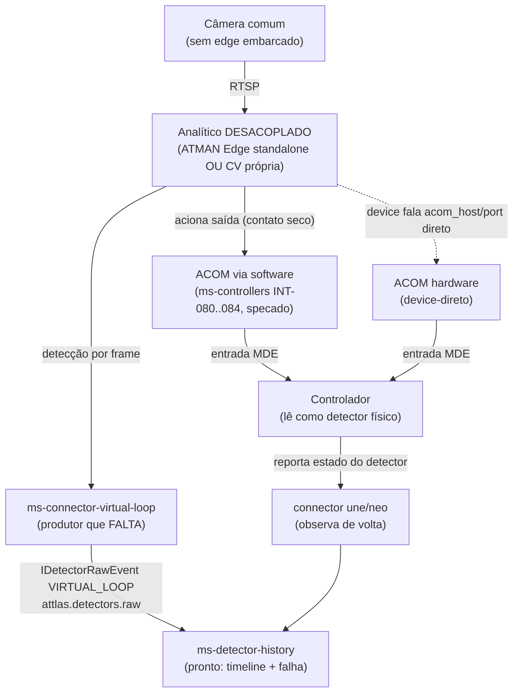

---
tags:
  - attlas
  - sprint-25
  - card
card: SOFTWARE-2200
sprint: Sprint 25 (20/7/26 - 26/7/26)
status: backlog - não é dessa semana; a quebrar em atômicas SDD
atualizado: 2026-07-17
---

# SOFTWARE-2200 - Analítico desacoplado (teste ACOM + controlador)

Contraparte do [[SOFTWARE-2134 - Analítico de vídeo ao vivo (detecção + bounding boxes)]]. O 2134 validou o analítico **embarcado na câmera** (device ATMAN Traffic Edge), mas essa fatia é **só visual**: consome o stream do device e reemite por WebSocket para o front acender regiões e desenhar caixas. Não toca `attlas.detectors.raw` nem o controlador.

O 2200 é a outra ponta: o analítico rodando **fora da câmera** (desacoplado, "no código"/na nossa infra) e, o que falta de verdade, a **detecção atuando no controlador** e passando pela **ACOM**. Ou seja, provar a rota câmera comum (sem edge embarcado) até o controlador reagir como se fosse um detector físico.

## Em uma frase

Câmera sem analítico embarcado, analítico desacoplado gera a detecção do laço, um connector traduz para o evento de detecção padrão do Attlas, e a detecção chega ao controlador por dois caminhos possíveis (contato seco via ACOM ou observação por histórico), com teste ponta a ponta batendo no sistema real.

## Onde estamos (estado verificado no código, 2026-07-15)

- **Rota embarcada (2134) é só feedback visual.** `ms-cameras/analytics-realtime` consome `traffic-motion-detection.detections` do broker do device e emite WS `camera:analytics:detection`/`frame`. `IAnalyticsDetectionEvent` diz explícito "purely for visual feedback". Não publica em `attlas.detectors.raw` nem fala com o controlador.
- **Ninguém produz `attlas.detectors.raw` em produção.** O único produtor do tópico hoje é o simulador `tools/simulators/detector/kafka-publisher.ts`. Os connectors reais (une/neo) publicam status, signal-groups, alarms e stats agregadas em `attlas.controllers.*`, nunca o raw de presença. Este é o **gap número 1**.
- **O sumidouro está pronto.** `ms-detector-history` consome `attlas.detectors.raw`, valida (`isDetectorRawEvent`), faz upsert do `MetaDetector`, persiste `DetectionRecord`, expõe `GET /detectors/:id/timeline` e gera falha em `attlas.detectors.fault`. Dá pra testar sozinho injetando um evento no tópico.
- **`ms-controllers` não ingere detecção externa.** Só consome `attlas.controllers.status-changed`. Não existe caminho automático "detecção de vídeo vira comando de controlador". As atuações software para controlador que existem (sendCommand, controle em tempo real, forçamento de plano, detector-force, etc.) são comandos de operador/plano, não ingestão de detecção.
- **ACOM tem dois lados, e o lado software está especificado mas não construído.** A placa ACOM converte o laço virtual em **contato seco** na entrada MDE do controlador (transporte, não tecnologia, por isso continua sendo `VIRTUAL_LOOP`). Além disso, `ms-controllers` já tem toda a comunicação ACOM **especificada** (MOD-014/015/016, atômicas INT-080 a 084 e UC-080 a 088): abrir socket TCP com a placa, ler estado e **setar parâmetros de saída** (`/acom/data`), com a saída amarrada a um controlador por `AcomAssociation {controllerId, slot, channel}`. Ou seja, a **mesma saída** que o software aciona é a que alimenta a entrada de detector do controlador. Nada disso está implementado.
- **Serviços da cadeia são esqueletos.** `ms-virtual-loop` (3302), `ms-connector-virtual-loop` (3303), `ms-dai` (3304) e `ms-acom` (3305) são scaffolds de ~56 a 58 linhas ("Hello API"). Reais e prontos: `ms-detector-history`, `ms-controllers`, `ms-traffic-model` e a base de analítico do `ms-cameras`.

## Rotas em jogo

Rota analítica (linha cheia à esquerda): observação e histórico. Nunca atua no controlador, só alimenta ATSPM/relatórios/falha.

Rotas de atuação (ACOM): é onde a detecção vira presença real na entrada do controlador. Por software (Attlas seta a saída da placa) ou device-direto (o próprio analítico fala com a ACOM). As duas terminam em contato seco na entrada MDE, e o Attlas relê pelo connector.

## Decisões em aberto (as que travam o escopo)

1. **Borda vs CV própria.** O "analítico desacoplado" concreto vai ser o **ATMAN Traffic Edge rodando como container standalone** consumindo RTSP (mesmo motor da borda, só que fora da câmera, reusando quase tudo do 2134) ou um **pipeline de CV próprio** em `ms-virtual-loop`? O plano de detector chama `ms-virtual-loop` de "pipeline próprio de detecção por vídeo".
2. **Atuação por ACOM software, ACOM device-direto ou só analítica.** O teste de "comunicação com ACOM e controlador" é: Attlas seta a saída da placa por TCP (INT-082), o device fala direto com a ACOM, ou por ora só validamos a rota analítica (detecção no histórico) sem atuar no controlador?
3. **Onde vive o produtor de `attlas.detectors.raw`.** Connector dedicado (`ms-connector-virtual-loop`, alinhado com une/neo) ou reaproveitar o `ms-cameras`, que já consome o stream do device?
4. **Identidade do detector virtual.** Como um laço de uma câmera/região vira `{controllerId, index}` (`IDetectorAddress`, o `deriveDetectorId` é UUID v5). Precisa cravar o binding região do device para o cadastro de detector no `ms-traffic-model` (o `IDetectorInput.type` já tem `VIRTUAL_LOOP`).
5. **Ownership da ACOM.** Comunicação ACOM está specada dentro do `ms-controllers` (INT-080 a 084), mas existe um `ms-acom` dedicado no catálogo de serviços. Definir onde fica antes de implementar.

## Requisitos para conseguir testar

Nenhum destes existe hoje, então "testar" pressupõe materializar o mínimo:

- **RF-1** Materializar o analítico desacoplado (decisão 1) consumindo o RTSP de uma câmera de teste e publicando detecção num broker alcançável.
- **RF-2** Produtor de `attlas.detectors.raw`: traduzir a detecção do laço para `IDetectorRawEvent` (`type: VIRTUAL_LOOP`, `purpose: VEHICLE`, janela RLE) com o binding região para `{controllerId, index}`.
- **RF-3** Cadastro do detector virtual no `ms-traffic-model` para o `deriveDetectorId` fechar com o detector real.
- **RF-4** Comunicação ACOM (INT-080 a 084) para o teste software para ACOM para controlador: abrir TCP, setar saída, ler estado.
- **RNF** Reusar os contratos e o padrão de connector existentes, sem `HttpException`/`Error` crus, gate completo do serviço tocado, `SPEC.md` mínimo no primeiro PR (bootstrap SDD do serviço esqueleto).

## Plano de teste (bater no sistema real, ponta a ponta)

1. **Smoke do sumidouro (isola do produtor que falta).** Publicar um `IDetectorRawEvent` de laço virtual em `attlas.detectors.raw` (usar `tools/simulators/detector/kafka-publisher.ts`) e conferir em `GET /detectors/:id/timeline` que o `DetectionRecord` foi persistido e o `MetaDetector` criado. Prova a rota de ingestão sem depender do analítico.
2. **Analítico desacoplado no ar.** Subir o analítico escolhido apontado para o RTSP de uma câmera de teste (ex: a `10.11.20.101`, que já tem edge), provisionar uma região/laço e confirmar que ele publica detecção no broker.
3. **Connector traduzindo.** Ligar o `ms-connector-virtual-loop` (clonando o padrão une/neo + reusando o consumer do `ms-cameras`) e confirmar `IDetectorRawEvent` chegando em `attlas.detectors.raw`.
4. **Veículo cruzando.** Passar um veículo pelo laço e ver o UP/DOWN no timeline do `ms-detector-history`, com contadores RLE coerentes.
5. **Caminho de falha.** Manter presença contínua além do timeout e confirmar `fault` em `attlas.detectors.fault`.
6. **Atuação ACOM por software.** Setar a saída da placa (INT-082) e observar a entrada de detector do controlador alternar, relendo pelo connector realtime. É a prova concreta de "comunicação com ACOM e controlador".
7. **Atuação ACOM device-direto (se aplicável).** Configurar o analítico para falar `acom_host/port` e validar o contato seco na entrada MDE por hardware.

## Reuso (mapa)

- **Base de integração com o analítico**: `ms-cameras/analytics-realtime` (`device-stream.consumer.ts`, `camera-regions.controller.ts`, mapeamento de região, digest HTTP). Um connector nasce daí trocando o sink WS por producer Kafka.
- **Contratos prontos**: `@attlas/contracts/detectors` (`IDetectorRawEvent`, `DetectorTechnology.VIRTUAL_LOOP`, `DETECTOR_TOPICS.RAW`, `IDetectorAddress`) e `deriveDetectorId` em `core-common`.
- **Sumidouro pronto**: `ms-detector-history` (consumer + timeline + fault).
- **Template de connector**: `ms-connector-une`/`ms-connector-neo` (producer Kafka, health, redis, config).
- **ACOM specada**: `ms-controllers/docs` MOD-014/015/016 e atômicas INT-080 a 084, UC-080 a 088.
- **Cadastro do detector**: `ms-traffic-model` (`IDetectorInput.type = VIRTUAL_LOOP`); o `ms-controllers` já modela `virtualLoop` na config de detector.

## Referências

- Rota embarcada (base do reuso): [[SOFTWARE-2134 - Decisão técnica e fluxo (analítico ao vivo)]].
- Plano do domínio de detecção: `docs/planning/detector-pipeline/` e `docs/modules/detectors.md`.
