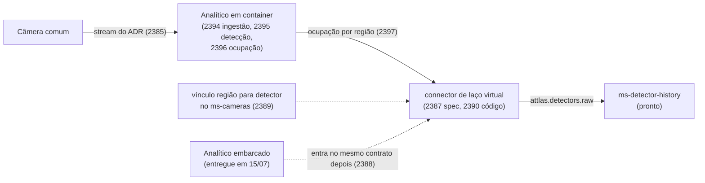

---
tags:
  - attlas
  - sprint-27
  - moc
sprint: Sprint 27 (3/8/26 - 9/8/26)
status: replanejada em 31/07 com foco único no analítico de vídeo, e refatiada no fim do dia com granularidade fina. O alvo é o analítico que roda em CONTAINER, construído por nós - o embarcado na câmera já está integrado e entregue. Comprometido 16 pontos em 6 cards (2385, 2386, 2394 a 2397), fila de 19 pontos em 8 cards. VMS e videowall H9 escopados para outra sprint. Pontos a preencher à mão no campo nativo do ClickUp. Conferida contra o ClickUp em 31/07: o quadro do analítico bate card por card, e a frente de permissões de câmeras (2005 reescopado mais o 2400) fica na lista da Sprint 26 por decisão, fora desta semana.
atualizado: 2026-07-31
---

# Attlas - Sprint 27

Sprint de **uma frente só: analítico de vídeo**. O que a semana constrói é o **analítico que roda em
container**, nosso, e não o que vem embarcado na câmera. O embarcado já está integrado desde 15/07: o
device detecta, o `ms-cameras` consome o stream dele e o front acende região e desenha caixa. Essa parte
está feita.

O que não existe é analítico **nosso**, rodando fora da câmera, capaz de olhar uma câmera comum. É isso
que a semana começa, e a frente inteira continua nas sprints seguintes até a detecção chegar na timeline
do detector.

## Comprometido (16 pts)

| # | Card | Pts | Entrega | Dia |
| --- | --- | --- | --- | --- |
| 1 | [[SOFTWARE-2385 - Alimentação de vídeo do analítico desacoplado\|2385]] como o vídeo chega no analítico | 3 | ADR com número medido | Seg |
| 2 | [[SOFTWARE-2386 - Especificação do analítico de vídeo em container\|2386]] especificação do analítico em container | 3 | `SPEC.md` mais MOD | Seg PM |
| 3 | 2394 serviço, imagem e ingestão do stream | 3 | container de pé decodificando frame | Ter |
| 4 | 2395 detecção de objetos por frame | 3 | inferência com caixa e classe | Qua |
| 5 | 2396 laço virtual e ocupação da região | 2 | caixa vira presença | Qui |
| 6 | 2397 publicar a ocupação no Kafka | 2 | contrato mais producer | Sex |

Os dois primeiros se sobrepõem: a especificação só precisa do ADR para saber o que o serviço consome, e
essa resposta sai na segunda de manhã. Do 3 ao 6 é uma escada, cada card em cima do anterior.

**1 card = 1 PR.** Os que não são de código entregam PR de documento: 2385 entrega o ADR mais a seção de
spec, 2386 entrega `SPEC.md` mais a MOD, e a prova (2200) entrega relatório de teste de campo, no
precedente que o MOD-044 do squad de controladores criou.

## Fila (19 pts)

Ordem de entrada. É o resto da frente, não é sobra de sprint.

| Card | Pts | Espera o quê |
| --- | --- | --- |
| 2398 escala do analítico: câmeras por instância e distribuição | 2 | detecção e ocupação fechadas, para medir com o analítico real |
| 2387 especificação do connector de laço virtual | 3 | contrato de ocupação publicado |
| 2390 connector: ocupação vira evento de detector | 3 | a spec acima |
| 2389 vínculo entre região da câmera e endereço de detector | 3 | a spec acima |
| [[SOFTWARE-2200 - Prova ponta a ponta do analítico desacoplado\|2200]] prova de campo até a timeline | 2 | toda a cadeia |
| 2388 analítico embarcado no mesmo contrato de ocupação | 2 | contrato de ocupação definido pelo container |
| 2391 fechar as pendências do analítico ao vivo embarcado | 2 | nada, é resíduo do 2134 |
| [[SOFTWARE-2392 - Recorte da atuação no controlador\|2392]] recorte da atuação via ACOM | 2 | alinhamento com o squad de controladores |

**Fora, com motivo**: renome do mosaico para VMS e integração do videowall H9 (escopados para outra
sprint, desenho preservado em [[VMS]] e [[Videowall externo (NovaStar H9)]]), atuação com placa e contato
seco em campo, tracking de objeto entre frames e contagem de fluxo (vem depois da presença), detecção de
pedestre (segundo eixo, depois de veículo), e UI de vínculo de laço virtual.

## A cadeia, elo por elo

O sumidouro está pronto e testável sozinho, os contratos de detector servem inteiros (`IDetectorRawEvent`,
`VIRTUAL_LOOP`, `DETECTOR_SAMPLE_DURATION_MS` de 100 ms, `deriveDetectorId`). O que a semana constrói é o
lado de cima da cadeia: o analítico.

## As decisões que a especificação tem que fechar

Nenhum card de código começa antes disso, e elas mudam o custo de todos os outros:

1. **Runtime e onde mora.** Reusar o esqueleto `ms-virtual-loop` em NestJS, como o resto do monorepo, ou
   serviço em Python fora do pipeline NX, que é o normal para inferência. NestJS mantém tooling, lint e CI
   de graça; Python ganha o ecossistema de visão computacional. O desvio, qualquer que seja, vai declarado.
2. **Modelo de detecção**: qual, de onde vem o peso, onde fica versionado, custo por frame por resolução.
3. **Autoridade da geometria do laço**: no embarcado a região vive no device e o `ms-cameras` lê de lá.
   No nosso analítico não existe device para guardar, então alguém tem que ser dono.
4. **Fronteira do serviço**: entra stream, sai ocupação por região. Não persiste série, não fala com
   controlador, não calcula métrica de tráfego.
5. **Convergência com o embarcado**: os dois emitem a mesma forma de ocupação, para o consumidor não saber
   a origem.

## A pergunta que abriu o replanejamento

O analítico em container vai ser feito, mas **como o vídeo chega nele de forma performática e escalável
não estava decidido**. Por isso o ADR é o card 1: cada instância de analítico é um consumidor de vídeo a
mais por câmera, e o Attlas já se machucou nesse eixo com relay preso mantendo `ffmpeg` vivo por
`viewerCount` que nunca zerava. Opções, o que medir e o ciclo de vida da sessão sem espectador em
[[SOFTWARE-2385 - Alimentação de vídeo do analítico desacoplado]].

## Fato que entrou depois do replanejamento: a fase 2 do detector raw mergeou

A PR #1216 do SOFTWARE-2360 (squad de controladores) mergeou em 31/07 às 16:15 UTC, 75 arquivos, e o
`ms-controllers` passou a ser **produtor real de `attlas.detectors.raw` no caminho ACP** (MOD-044, INT-118,
PROJ-009, com relatório de teste de campo). Consequências:

- **A frase "ninguém produz o raw" morreu.** O gap é do caminho de vídeo. Card que repetir a frase antiga
  vai contra o repo.
- **Existe gabarito e existe risco de duplicar domínio.** `ms-controllers/src/detector-raw/` já tem,
  testado, construção de evento, reconciliação de janela, trim de runs e derivação de identidade. O card
  2390 decide entre extrair a parte agnóstica de protocolo para lib e espelhar com card de unificação
  datado.
- **`docs/modules/detectors.md` confirma o desenho.** A reversão que passou a publicação para o
  `ms-controllers` é **só do ACP**, e a nota mantém `ms-connector-une` e `ms-connector-virtual-loop` como
  produtores dos seus protocolos.
- **Risco de domínio**: a tabela do MOD-044 mapeia `MDE + Vehicle` e o módulo `VirtualLoop` do NEO para
  `VIRTUAL_LOOP`. Se o laço virtual atuar por ACOM algum dia, a mesma presença sai pelos dois produtores e
  o histórico soma o veículo duas vezes sem erro visível. A spec do 2387 crava quem é a fonte de verdade.

## Duas premissas do 2200 que o levantamento de 31/07 derrubou

1. **A ACOM não está apenas especificada, está implementada** no `ms-controllers` (CRUD com
   `AcomAssociation`, cliente TCP com `getDeviceState` e `setDeviceParameters`, codec de frame, pollers
   realtime). Falta o **caller**. Foi isso que permitiu tirar a atuação da semana sem perder nada.
2. **O cadastro do detector virtual quase existe.** O model `Detector` do `ms-traffic-model` já tem
   `controllerId`, `slot`, `channel` e `type` com `VIRTUAL_LOOP`. Falta o vínculo com câmera e região.

## Escopo de squad

O squad é dono de **câmeras e analítico de vídeo**. Duas consequências práticas: o card do vínculo (2389)
nasce no `ms-cameras` em vez do `ms-traffic-model`, com o desvio declarado na spec e follow-up de
transferência de autoridade, e o seed do `ms-traffic-model` que eu tinha escrito para teste interno foi
apagado da árvore.

## Considerações da daily de 31/07

A nota de daily do dia foi absorvida aqui, e o desenho técnico de cada item vive nas notas de domínio.
Quatro pontos saíram da reunião:

1. **O analítico de vídeo começa na semana de 03/08.** É o que virou o quadro acima, partindo do que já
   existia em [[SOFTWARE-2200 - Prova ponta a ponta do analítico desacoplado]] e do analítico ao vivo
   embarcado, entregue no card 2134.
2. **Máquina virtual com acesso ao processador de videowall de Quito, a requisitar.** O gestor vai
   solicitar acesso remoto a uma das máquinas que já alcançam o equipamento. É o que destrava as
   validações em aberto do videowall externo: confirmar que o OpenAPI Management está habilitado, obter
   `pId` e `secretKey`, e travar os paths de `layer`, `preset`, `ipc` e `brightness` batendo no
   equipamento em vez de na documentação. Ficha do equipamento, com a foto e a acta de entrega da EPMMOP,
   em [[Videowall externo (NovaStar H9)]].
3. **O mosaico de feeds que já existe no sistema passa a se chamar VMS, Video Monitoring System**, e o
   termo videowall fica reservado ao painel físico externo de Quito. A rota muda junto:
   `/cameras/videowall` vira `/cameras/vms` no front e `/api/video-wall/*` vira `/api/vms/*` no backend,
   com a rota do Kong e as chaves de i18n atrás. O alcance completo do renome, arquivo por arquivo, está
   em [[VMS]]. Ponto de atenção que sobrevive à decisão: passam a existir dois VMS, porque o sistema
   externo de gravação usava a mesma sigla, então o contexto precisa ficar explícito em spec e em tela.
4. **O videowall externo é gerenciado de forma global**, não isolado por sistema ou tenant. Entrou como
   requisito novo do card do H9, e o que "global" abrange ainda precisa de definição, provavelmente uma
   única instância de gerenciamento do equipamento, independente do sistema selecionado no header.

Os itens 2, 3 e 4 formam a frente de VMS e videowall externo, que o replanejamento do fim do dia tirou
desta semana. Nada se perdeu: o desenho está fechado nas notas de domínio, então reabrir é planejamento e
não retrabalho.

## Riscos

1. **Escada de 4 cards de código.** Do 2394 ao 2397 cada um depende do anterior. Se escorregar, quem cede é
   o 2397 (publicar) e a semana fecha com o analítico detectando ocupação sem publicar, com o evento saindo
   no começo da 28.
2. **Inferência é custo desconhecido.** Sem o número do card 2395 por resolução, o teto de câmeras por
   instância é chute. Daí o 2398 na fila, para fechar a estimativa com medição.
3. **Runtime fora do padrão do monorepo.** Se a spec escolher Python, o serviço sai do pipeline NX de lint,
   test e build, e isso precisa de decisão registrada, não de descoberta no CI.
4. **Alimentação pode virar spike de medição.** A métrica por câmera é justamente o que o 1363 aponta como
   faltando. Se demorar, o ADR fecha com o número que der e declara o que ficou sem medir.
5. **O device de campo é compartilhado e sobe com o producer desligado.** Vale para comparar o nosso
   analítico com o embarcado: validar ao vivo pode consumir meio dia esperando. O device `10.11.20.101`
   continua sem dono explícito e outro writer, o Attlas 25 ou a produção, segue carimbando o `source_id`,
   como está detalhado em
   [[Carga desnecessária nas câmeras - reconciler do analítico e conexões duplicadas]].
6. **A frente de permissões de câmeras fica de fora, e isso é escolha.** O 2005 foi reescopado no fim de
   31/07 para o mapa das 86 rotas do `ms-cameras`, nasceu o 2400 para aplicar o enforcement, e os dois
   ficam na lista da Sprint 26 por decisão de 31/07, para a semana continuar sendo de uma frente só. São
   dois cards nossos prontos para começar, então o risco é ficarem parados sem sprint enquanto o analítico
   ocupa a semana inteira.

## Pendências de processo

- Preencher os pontos no campo nativo dos 14 cards. O MCP do ClickUp não escreve nesse campo, é digitação:
  3 em 2385, 2386, 2394, 2395, 2387, 2390 e 2389; 2 em 2396, 2397, 2398, 2200, 2388, 2391 e 2392.
- **Feito em 31/07**: 2356 e 2134 fechados (o primeiro com a #1175 mergeada, o segundo entregue desde
  15/07, com o resíduo no card 2391).
- **O 2005 não vai ser fechado, foi reescopado.** Em vez do genérico de permissões de usuário, que colidia
  com o trabalho do squad 3 no `ms-organization` (2329 e 2292), o card virou o recorte que é nosso: o mapa
  das 86 rotas do `ms-cameras`, que hoje não têm um único decorator de permissão, mais as chaves que
  faltam no catálogo. Aplicar o enforcement virou card separado, o 2400. Decidido em 31/07 que os dois
  permanecem na lista da Sprint 26 e não entram nesta semana, para não furar o foco único no analítico.
- Frente de VMS e H9: reabrir os cards na sprint em que forem escopadas. Desenho pronto, então é
  replanejamento e não retrabalho.

## Higiene de repo feita em 31/07

- Seed do `ms-traffic-model` **apagado**, junto do wiring em `prisma.config.js` e do target `prisma:seed`.
  O serviço é de outro squad e o seed era teste interno.
- Playwright é ferramenta **local**: `playwright.config.ts` e `tests/` seguem no disco mas entraram no
  `.git/info/exclude`, e o `.github/workflows/playwright.yml` gerado pelo instalador foi apagado, porque
  workflow só existe commitado e apontava para `main` e `master`, que não existem aqui.
