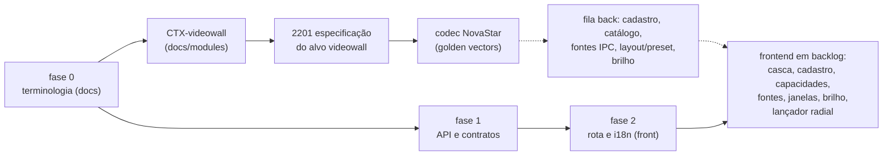

---
tags:
  - attlas
  - sprint-28
  - moc
sprint: Sprint 28 (10/8/26 - 16/8/26)
status: em execução. Planejada em 10/08 com duas frentes acopladas, o renome do mosaico para VMS e a integração do videowall externo NovaStar H9. **Renome entregue**: #1438 mergeada em 10/08, #1439 e #1440 em 11/08; a fase 3 (remoção do path legado) é o card 2481, em backlog aguardando deploy em todos os ambientes. **Videowall externo em execução**: #1453 (card 2435) mergeada em 12/08, entregando a porta do alvo de exibição e não camadas e presets como o título diz; #1529 em andamento com o cadastro do processador (2432), o primitivo de menu radial (2471) e o lançador radial (2477). **Replanejamento de 13/08**: a regra de negócio do videowall mudou, o painel passa a espelhar a tela da aplicação em vez de receber cena, e o card 2201 carrega a revisão inteira, absorvendo o 2440. A revisão foi escrita no repositório na branch `cameras/docs/SOFTWARE-2201` (PR #1578), sem código de produção, com duas atômicas de backend deletadas, três novas (`INT-016`, `UC-050`, `PROJ-019`) e uma nova no frontend (`UF-031`). **Segunda revisão de 13/08, superfície do frontend**: a rota de configuração `/cameras/vms/videowall` morreu; tudo do painel vive num dialog compartilhado aberto pelo lançador radial, com quatro views (espelhar com preview, processador, brilho, estado), e a rota e a page entregues na #1529 serão removidas pelo card 2437. **Implementação de 13/08 à noite**: a casca do dialog compartilhado entrou na própria PR #1592 (rota e page removidas, arco abrindo o dialog, contratos do espelho em libs/contracts); o codec NovaStar saiu na PR #1598 (2441) e o catálogo com o cliente da Open API (2433) fecha em PR própria na sequência, com a branch do 2433 carregando a do 2441 até ela mergear. A frente do analítico segue fora do foco, com as 14 PRs em draft. **Imprevisto de 14/08**: o `ms-cameras` estava caído no ambiente dev desde o deploy de 13/08 por falta da env `API_KEY_MASTER_KEY`, que o cadastro do processador passou a exigir, e o smoke test do deploy não detectou porque `docker compose ps` sem `-a` omite container parado; os cards 2504 e 2503 saíram na PR #1607, com a restauração do servidor feita à mão e a troca de qualidade do streaming ligada em todos os hosts do player. **Cláusula 16.13 em 14/08**: o user trouxe o texto literal do contrato de Quito, que era a lacuna de procedência declarada em `cameras.md`, e ela reabriu o replanejamento: o painel passa a ter dois modos, espelho para o operador e projeção nativa para o gesto automatizado de plano de resposta e de horário, com toda fonte servida pela plataforma. As PRs foram organizadas em pilha linear no GitHub (#1598 codec, #1592 replanejamento com a reconciliação, #1609 cliente da Open API), e sobraram oito cards de backend e dois de frontend a criar. **Tarde de 14/08**: a #1598 mergeou, a base da #1592 foi corrigida para a develop e a branch foi consolidada: canal de saúde por poll ISAPI para a câmera Hikvision, merge da develop resolvido a favor da #1607 e três correções da validação contra o equipamento real. O review do @claude foi redisparado, porque os disparos anteriores abortavam em silêncio com a base fora da develop. Na sequência a #1609 foi consolidada: commits órfãos de um worktree incorporados, base mergeada e os 13 achados do review do Igor corrigidos e respondidos; ficou MERGEABLE com estado CLEAN e review repedido. **Reconciliação do board em 17/08**: o ClickUp estava bem atrás do que já tinha mergeado (vários cards em backlog/to do/code review com PR mergeada há dias). Fechados: 2201 (#1592), 2432 (#1529), 2433 (#1609), 2435 (entregue por decisão, escopo restante descartado), 2437 (#1592), 2440 (absorvido pelo 2201), 2441 (#1598), 2471 (#1529), 2472 (#1529/#1592), 2503 e 2504 (#1607), 2514 (#1592, tomar/liberar o painel já implementado e testado antes mesmo do card existir formalmente). Movidos para in progress, por serem parciais (fundação mergeada, escrita real no equipamento H9 ainda atrás de adaptador no-op): 2434 e 2477. Board agora reflete o estado real do código.
atualizado: 2026-08-17
---

# Attlas - Sprint 28

Sprint de **duas frentes acopladas: renomear o mosaico atual para VMS e começar o videowall externo**.
A Sprint 27 fechou sem nenhuma entrega porque a semana foi de folga; o planejamento dela continua
válido, as 14 PRs de spec e código do analítico seguem em draft, e a frente do analítico fica fora do
foco desta semana por decisão de 10/08.

As duas frentes vêm da daily de 31/07 e já estão desenhadas nas notas de domínio, então esta semana é
execução de desenho pronto, não descoberta:

1. **Renome para VMS.** O mosaico de feeds no browser passa a se chamar VMS (Video Monitoring System)
   e o termo videowall fica reservado ao painel físico de Quito. Estratégia em 3 fases, arquivo por
   arquivo, em [[VMS]].
2. **Videowall externo (NovaStar H9).** O Attlas vira cliente da Open API do processador H9 da sala de
   controle de Quito. Requisitos no card [[SOFTWARE-2201 - Integração videowall externo (NovaStar H9)|SOFTWARE-2201]]
   e desenho fechado em [[Videowall externo (NovaStar H9)]].

A ordem dentro da semana não é arbitrária: o renome vem primeiro porque o videowall externo cria código
e specs novos que já nascem com o vocabulário certo, em vez de nascerem com `video-wall` e entrarem na
lista de renome.

## Comprometido (14 pts)

| # | Card | Pts | Entrega | Dia |
| --- | --- | --- | --- | --- |
| 1 | [[SOFTWARE-2431 - Renome para VMS - fase 0 terminologia\|2431]] `[Back]` renome fase 0, terminologia | 1 | docs-only: gravador externo vira NVR, glossário ganha VMS (a tela) e videowall (o painel físico) | Seg |
| 2 | [[SOFTWARE-2438 - Renome para VMS - fase 1 API e contratos\|2438]] `[Back]` renome fase 1, API e contratos | 3 | `src/video-wall/` vira `src/vms/`, contratos em `lib/vms/` com alias no barrel, Kong com os dois paths | Seg-Ter |
| 3 | [[SOFTWARE-2439 - Renome para VMS - fase 2 rota e i18n\|2439]] `[Front]` renome fase 2, rota e i18n | 3 | rota `/cameras/vms` com redirect, `vms.json` nos 4 locales mais bundles, migração do `localStorage` | Ter-Qua |
| 4 | [[SOFTWARE-2440 - Requisitos do videowall externo em arquivo próprio\|2440]] `[Back]` requisito do alvo videowall | 2 | **absorvido pelo 2201 em 13/08**: os requisitos foram escritos junto com a revisão do MOD e das atômicas | Qua |
| 5 | [[SOFTWARE-2201 - Integração videowall externo (NovaStar H9)\|2201]] `[Back]` especificação do alvo videowall | 3 | **passou a carregar o replanejamento de 13/08**: o painel espelha a tela em vez de receber cena, e a revisão vai de `cameras.md` até as atômicas | Qui |
| 6 | [[SOFTWARE-2441 - Codec NovaStar - assinatura e cifra\|2441]] `[Back]` codec NovaStar, assinatura e cifra | 2 | pasta `codec/` com MD5 e DES opcional, golden vectors, fecha sem equipamento | Sex |

Os cards 1 e 4 eram de documento e destravavam os demais. Com a absorção do 4 pelo 5, o card de
especificação passou a ser também o de requisito, e o motivo é que o replanejamento reescreveu os dois ao
mesmo tempo: separá-los deixaria requisito e especificação incoerentes por um PR de distância.

### O videowall passa a ser alvo de exibição do VMS (decisão de 10/08)

Decisão do user, e ela reorganiza a frente do H9 antes de existir código. O videowall externo deixa de
ser módulo irmão e entra como **submódulo do VMS**: mesma cena, mesmo layout, mesma célula, saída
diferente. O que sustenta é a célula já ser **geometria proporcional** e não posição em grade fixa,
então projetar no painel é multiplicar pela resolução do equipamento, função pura.

O que mudou de concreto nos cards da frente:

| Antes | Depois |
| --- | --- |
| Módulo próprio `src/videowall-processor/` | Submódulo em `src/video-wall/targets/novastar-h9/` |
| Prefixo de rota próprio | Tudo sob `/api/vms`, equipamento em `/api/vms/videowall/*` |
| Endpoint para projetar cena no painel | Ativação de cena com o alvo pedido, resolvida por strategy |
| Requisito em `docs/modules/videowall.md` com `RF-VWP-*` | Seção 3.2 de `cameras.md`, faixa `RF-VW-07` em diante |
| Módulo Angular novo `videowall-processor` | Painel dentro do feature module do VMS |
| RF-7 com escopo a detalhar | Equipamento global, tenancy no vínculo entre alvo e sistema |

Strategy fica nos três eixos que têm **duas implementações reais**: alvo de exibição, codec da
requisição (assinatura simples contra corpo cifrado em DES) e portão de capacidade (executar contra
recusar com 501). O eixo de fornecedor tem uma implementação só, então justifica a porta do cliente mas
não é strategy, e registrar isso evita abstração sem pagador. A projeção é de **mão única**, porque
janela sobreposta montada direto no equipamento não tem representação numa célula.

Aplicado nas specs no mesmo dia, na PR [#1438](https://github.com/atmanadmin/attlas-2026/pull/1438):
CROSS-045, MOD-006 (fase 4 nova), MOD-011 (terceiro regime de tenancy), `SPEC.md` do `ms-cameras`,
`cameras.md`, o README de módulos e a spec do front. Desenho completo em
[[Videowall externo (NovaStar H9)]] e [[VMS]].

### O painel passa a espelhar a tela da aplicação (replanejamento de 13/08)

Decisão do user, e ela troca o propósito da frente, não um detalhe dela. **O videowall não strema câmera
direto por RTSP: ele compartilha a tela da aplicação Attlas do cliente que está acessando o sistema.** A
parede exibe essa captura como fonte única numa janela em tela cheia, e quem compõe continua sendo o
Attlas. Duas seções acima desta descrevem o modelo anterior e ficam como registro do que foi revisado.

O achado que obrigou a escolher transporte: **o H9 não aceita página web nem URL como fonte**, a interface
web dele é o plano de controle. A tela só chega como vídeo codificado. Foi escolhido o RTSP servido pela
própria plataforma, com o browser capturando por `getDisplayMedia`, publicando por WHIP no MediaMTX que já
está no stack, e o equipamento puxando pelo card `H_2xRJ45 IP`. NDI ficou fora porque o card entrou na
linha H9 dois meses depois da entrega do equipamento de Quito e porque a descoberta dele não atravessa
sub-rede, o que introduziria o intermediário que o contrato veta.

| Antes de 13/08 | Depois |
| --- | --- |
| A parede recebe a cena, com célula convertida em geometria de janela | A parede recebe a tela do operador, em janela única em tela cheia |
| Cada câmera publicada como fonte que o equipamento puxa direto | Uma fonte por processador: o caminho do espelho servido pela plataforma |
| Janelas e presets de composição gerenciados pela plataforma | Compor a parede é operação do equipamento, na interface dele |
| Projetar cena é a ativação com o alvo pedido | Tomar e liberar o espelho, com dono exclusivo, e ativar cena com alvo videowall é recusado |
| O vídeo nunca passa pela plataforma | O vídeo do espelho passa pela plataforma, e credencial de câmera nunca mais vai ao equipamento |
| Containment sustentado pela célula ser geometria proporcional | Containment sustentado pelo espelho nascer de uma sessão de VMS |

**O custo consciente**: cena no painel por plano de resposta e exibição programada por horário ficam como
não atendidos, porque plano executa sem operador na frente e sob espelhamento não há tela para espelhar.
Está escrito como lacuna com o motivo, não silenciado. Brilho agendado continua valendo.

**O que ninguém precisa desfazer**: não existe uma linha do adaptador NovaStar no repo. O que está
mergeado é a porta de cena com o adaptador do browser e o cadastro do processador, e os dois continuam
válidos. As atômicas `INT-013` e `INT-014` foram deletadas, e entraram `INT-016`, `UC-050` e `PROJ-019`.
Detalhe do levantamento de hardware em [[Pesquisa - transporte do espelhamento de tela]], e o texto do contrato em [[Cláusula 16.13 do contrato de Quito]].

### A cláusula 16.13 do contrato aparece, e o painel ganha dois modos (14/08)

O user trouxe o **texto literal da cláusula 16.13, "Módulo de gestión de videowall"**, do contrato de
Quito. É exatamente o documento que a seção 3.2 de `cameras.md` declarava como lacuna: os requisitos
`RF-VW-07` em diante estavam parafraseados a partir do levantamento de 15/07 e do refino de 31/07, e a
própria nota de procedência dizia que fechar a lacuna exigia obter a cláusula e substituir a paráfrase pela
citação. Agora ela está citada literalmente, em espanhol, com a tabela das doze obrigações mapeadas para o
requisito que responde por cada uma.

A citação reabriu o replanejamento do dia anterior. O primeiro parágrafo da cláusula exige integração com o
módulo de planos de resposta automatizados, para "automatizar acciones como reproducciones predefinidas y
operaciones programadas directamente en el videowall", e espelhamento de tela não atende isso: um plano
dispara às três da manhã, sem operador na frente, e sem operador não existe tela para espelhar. Sete das
doze obrigações já estavam cobertas sem tocar em nada; cinco colidiam, e todas as cinco se resolviam pela
mesma distinção, que é a existência de um operador.

O painel passa a ter **dois modos de exibição**:

| Modo | Quando | Fonte |
| --- | --- | --- |
| Espelho | Existe operador na consola | Uma fonte por processador: a captura da tela, servida pela plataforma |
| Projeção nativa | Gesto automatizado, sem operador | Uma fonte por câmera da cena, também servida pela plataforma |

O detalhe que faz isso não ser um retorno ao desenho de 10/08 é **de onde o equipamento puxa cada câmera**:
da plataforma, nunca da câmera. Credencial de câmera continua sem trafegar para equipamento de terceiro, que
era o ganho de domínio declarado do replanejamento, e a projeção passa a ser servida pelo mesmo MediaMTX que
já serve o streaming, com remuxagem sem recodificar. Renderizador headless na plataforma foi descartado: não
existe um precedente de Chromium sem cabeça no monorepo, e transcodificar por parede o tempo todo atrita com
a regra de que publicação fora do formato aceito é recusada em vez de convertida.

Decisões do user nesta rodada, quatro:

1. **Pilha linear de verdade no GitHub**, com as PRs empilhadas em vez de todas em cima de `develop`.
2. **Projeção nativa via MediaMTX**, e não renderizador headless nem híbrido.
3. **Escopo da rodada**: reconciliação de spec mais a PR que faltava do cliente da Open API, sem código de
   projeção nem de mensageria.
4. **Plano preempta o operador**, com registro e aviso a quem foi deslocado, no mesmo precedente que o PTZ
   de Emergências já tem; exibição programada, ao contrário, cede ao operador e registra que cedeu.

O que mudou nos requisitos: `RF-VW-09`, `RF-VW-11` e `RF-VW-12` reescritos, `RF-VW-10` passa de retirado a
atendido pelo espelho com lacuna nomeada, `RF-VW-14` e `RF-VW-15` saem de não atendidos, `RF-VW-13` continua
fora com argumento novo (o antigo tinha ficado falso) e `RF-VW-18` fica vivo e diferido. Sobra **uma única
lacuna declarada**: página web na parede sem operador na frente, porque nenhum card do chassi renderiza HTML
e a projeção decodifica vídeo, não página.

A posse do painel deixa de ser sessão de espelho e passa a ser **ocupação com tipo**, porque as duas
ocupações disputam a mesma parede e dois modelos significariam dois donos e nenhuma resposta para o que a
parede está mostrando. Isso foi ajustado no schema enquanto ele ainda estava fora do git, o que custou um
arquivo em vez de uma segunda migration.

As atômicas `INT-013` e `INT-014`, que a revisão de 13/08 deletava, voltaram com `status: superseded`
apontando para as substitutas, que é o que o guia de specs manda; no frontend, as duas UF retiradas voltaram
encolhidas, uma sem publicação nem campo de credencial e a outra como leitura da geometria derivada.

### A consolidação da #1592 na tarde de 14/08

A #1598 do codec mergeou e a base da #1592 foi corrigida para a develop. Junto veio uma descoberta de
processo: o workflow do @claude aborta em silêncio quando a base do PR não é a develop, então os dois
disparos anteriores nunca produziram review. O disparo foi refeito depois da consolidação e desta vez o
workflow respondeu.

A branch recebeu quatro avanços no dia: os últimos ajustes do review do Igor, o canal de saúde por poll
ISAPI para a câmera Hikvision (o firmware dela vem com ONVIF desabilitado, então o coordinator passa a
resolver o canal de monitoramento por fabricante e o worker faz heartbeat de `GET /ISAPI/System/status`
com o mesmo cliente Digest do probe de credenciais), o merge da develop e três correções achadas na
validação contra o equipamento real: a parada do poll ficou imediata, o heartbeat deixou de reportar o
tempo do handshake Digest (~800ms, duas viagens) como latência de rede, o que classificava câmera
saudável como PARTIALLY_UNSTABLE, e o seed deixou de sobrescrever o snapshot operacional vivo a cada
boot.

No conflito do merge com o que a #1607 entregou, os arquivos do detalhe de câmera ficaram com a versão
já revisada da develop, que centraliza o passo adaptativo no StreamQualityController compartilhado e
deleta o arquivo de constants local; o CardEmptyState standalone, exclusivo da #1592, foi preservado
com o movimento para imports reaplicado.

**Fechamento do dia: #1592 e #1609 mergeadas.** O CI de integração da #1592 acusou duas falhas reais e
pré-existentes do trabalho do espelho: a tomada do painel abria o caminho no mediamtx antes de reservar
a sessão no banco (dois takes concorrentes geravam dois adds; corrigido com a reivindicação no banco
primeiro e setIngestPath depois, só para o vencedor) e o teste do mediamtx real estourava 120s porque a
imagem é FROM scratch, sem shell para a sonda de porta do testcontainers (corrigido esperando a linha de
log do listener HLS). A única falha restante era flake de teardown do email-queue do
ms-communication-channels, alheio ao PR. A #1592 mergeou às 16:39, a #1609 foi retargetada para a
develop e mergeou às 16:43. Nota de processo: duas sessões trabalhando o mesmo arquivo no mesmo checkout
colidiram num stash pop com marcadores de conflito; consolidado a favor do design commitado, sem perda.

A #1609 (cliente da Open API, card 2433) foi consolidada na sequência. Dois commits de correção do
review estavam órfãos num worktree temporário sem nunca terem sido empurrados (a leitura dos flags
booleanos pela mesma coerção do boot e a detecção de timeout que o dublê de teste escondia); eles
entraram na branch, a base foi mergeada com a resolução mantendo os dois lados (módulo do espelho e do
H9 convivendo, métodos novos dos dois lados no repositório do processador, chaves i18n unidas), e o
review do Igor (veredito bloquear, 13 achados) foi endereçado por completo no commit ccb336c00c:
errorCode dedicado para processador inalcançável e trava indisponível, corpo do fornecedor sobrevivendo
à tradução no detalhe, TTL do write-lock derivado do timeout, leitura do corpo limitada na fonte, enum
de capacidade promovido para os contratos, comentários sem a promessa de flip sem restart, rename do
constants e quatro testes novos. As 13 threads foram respondidas uma a uma, o review foi repedido e a
#1609 ficou MERGEABLE com estado CLEAN.

## Frente do renome entregue (#1438 em 10/08, #1439 e #1440 em 11/08)

As três fases do renome foram escritas e abertas no mesmo dia, com todo o markdown numa PR só e as
duas de código fatiadas em seguida. As três saíram de `develop`, sem empilhamento, e o ID de spec
alocado foi o **CROSS-045**.

| Card | PR | Conteúdo |
| --- | --- | --- |
| [[SOFTWARE-2431 - Renome para VMS - fase 0 terminologia\|2431]] | [#1438](https://github.com/atmanadmin/attlas-2026/pull/1438) | Spec CROSS-045 mais todo o markdown: prosa dos docs, glossário com os três termos, e o conteúdo de MOD-006, UC-014/015/016, MOD-011 e do `SPEC.md` |
| [[SOFTWARE-2438 - Renome para VMS - fase 1 API e contratos\|2438]] | [#1439](https://github.com/atmanadmin/attlas-2026/pull/1439) | Só o caminho público: os dois controllers atendem `vms` além de `video-wall`, Kong publica `/api/vms`, testes provam as duas rotas. 7 arquivos |
| [[SOFTWARE-2439 - Renome para VMS - fase 2 rota e i18n\|2439]] | [#1440](https://github.com/atmanadmin/attlas-2026/pull/1440) | Rota `/cameras/vms` com redirect, namespace i18n, ícones e a chave de armazenamento com migração |

Ordem de merge obrigatória, 1438 depois 1439 depois 1440: a PR do frontend só funciona em runtime com
`/api/vms` já no gateway, e o teste unitário não pega essa dependência.

**Review da #1439 resolvido em 11/08** (commit `4a2308e435`, 6 achados do Felipe): o bloqueante era
`/api/cameras/vms` caindo no allowlist público por-id do Kong (regex vence prefixo simples) e
respondendo sem JWT; entrou a rota `ms-cameras-vms-picker` espelhando a `ms-cameras-manufacturers`.
Os demais: asserção de 201 na paridade do uc-016, paridade do uc-014 comparando o envelope inteiro, e
os comentários da janela agora ancorados no card de limpeza [[SOFTWARE-2481 - Renome VMS - fase 3 remove o path legado|SOFTWARE-2481]],
criado em 11/08 no `backlog` da lista da 28 (critério para iniciar: deploy do renome em todos os
ambientes, CROSS-045 seção 6). Threads resolvidas e novo review solicitado.

### O corte de escopo no backend, decidido em 10/08

A primeira versão da PR do backend movia `src/video-wall/` para `src/vms/` e migrava os contratos para
`lib/vms/`, com 22 aliases obsoletos para o front seguir compilando. Deu **98 arquivos, 91 deles sem
nada observável**. O escopo foi cortado para **7 arquivos** por dois motivos concretos:

1. **Ficava com dois vocabulários no mesmo arquivo.** As tabelas continuam `VideoWallLayout`,
   `VideoWallScene` e `VideoWallSceneCell`, porque nome de tabela é valor persistido. Renomear as
   classes em volta produzia um `VmsScenesRepository` operando em `prisma.videoWallScene`, que é pior
   que manter tudo no vocabulário antigo.
2. **Criava dívida para pagar um renome cosmético.** Nome de símbolo não aparece na tela, na URL, no
   payload nem no banco. Migrar os contratos exigia a camada de aliases mais um card só para removê-la.

O que sobra no backend é o caminho público, e ele muda por necessidade desta sprint: o videowall
externo H9 vai expor os próprios endpoints, e dois caminhos quase idênticos no mesmo gateway seria a
confusão que o renome existe para evitar. Se algum dia a implementação for renomeada, vai junto da
migration que renomeia as tabelas, num card só, para schema e código nunca divergirem.

Outras decisões que saíram da execução:

- **A colisão do token VMS era tripla, não dupla.** Além do gravador externo, o `ms-pmv` usa VMS para
  Variable Message Sign, com cerca de 90 ocorrências em testes e o glossário de `pmv.md`. Essa segunda
  colisão fica e se resolve por contexto; nenhuma PR toca `apps/ms-pmv` nem os connectors, e o CI verde
  daquele projeto é a prova.
- **A dependência quebrada do UC-028 foi corrigida de carona** (apontava para um ID de atômica que não
  existe).
- **Quatro bundles i18n monolíticos foram deletados**, cerca de 186 KB cada, sem nenhum import no
  repositório e congelados em 21/07 com 40 das 160 chaves do namespace. Eram resíduo do split em
  arquivo por módulo.
- **O renome das tabelas Prisma continua fora**, junto da migration do cadastro do processador
  ([[SOFTWARE-2432 - Cadastro do processador H9|2432]]), assim como a pasta do módulo Angular e os
  selectors, que ficam para o card do dono do módulo.

### O corte deixou um import órfão, e o CI levou duas execuções para dizer isso

A varredura que restaurou o escopo trocou as URLs dos testes de volta, mas deixou um import de teste
apontando para `src/vms/vms.constants`, pasta que o próprio corte havia revertido. A suíte de
integração não resolvia o módulo e derrubava o job. Corrigido no commit `f3ad030d`, e o Integration
Test passou em 4m40s na sequência, o que confirma a causa.

Duas lições que valem para além desta PR:

- **Lint verde não prova que import relativo resolve**, e o Build ficou `skipping`. O único check que
  acusou foi o de integração.
- **O log de job que o GitHub entrega desse step está truncado.** O `ms-cameras` derrama o pino
  inteiro no stdout, cerca de 7,5 MB por execução, e o log devolvido para de crescer antes do resumo
  do jest. Isso me fez ler "processo morto" onde havia uma suíte falhando normalmente. A prova da
  truncagem é que a PR #1438, que passou, tem log igualmente sem resumo. O output completo está em
  `/tmp/nx-integration.log` no runner, e a linha de base do projeto é 15 suítes com 102 testes.
  Também vale saber que os três runners vivem na mesma máquina virtual, então duração de job não é
  comparável entre execuções com quantidades diferentes de projetos.

## Imprevisto de 14/08 (5 pts, PR #1607)

Não estava planejado e entrou na frente por queda de ambiente. O `ms-cameras` respondia 503 no ambiente
dev havia 14 horas, e a investigação da reclamação de streaming em cima disso levantou um segundo
problema independente, no player compartilhado. Os dois foram numa PR só porque o segundo só é
verificável com o serviço no ar.

| # | Card | Pts | Entrega | Dia |
| --- | --- | --- | --- | --- |
| 1 | [[SOFTWARE-2504 - Queda do ms-cameras por env ausente e smoke test cego\|2504]] `[Back]` env obrigatória e smoke test do deploy | 2 | `API_KEY_MASTER_KEY` no `EnvironmentVariables` para abortar na borda, smoke test conferindo cada serviço pelo próprio status | Sex |
| 2 | [[SOFTWARE-2503 - Qualidade do streaming em todo host do player\|2503]] `[Front]` qualidade manual e adaptativa em todo host | 3 | `StreamQualityController` compartilhado com estado por câmera, eventos ligados nos seis hosts, frames descartados no detector | Sex |

A lição do 2504 é de processo e não de código: o smoke test do deploy era estruturalmente incapaz de
detectar a falha mais grave que existe, que é o processo não subir, porque conferia só estados
intermediários numa listagem que não inclui container parado. Enquanto o `.env.docker` de cada serviço
continuar sendo mantido na mão no host, toda env nova obrigatória é uma queda em potencial no próximo
deploy, e o que resta é falhar rápido e ruidosamente.

## Fila de backend (14 pts)

Ordem de entrada. É o resto da frente do videowall externo, não é sobra de sprint. Entra em status
`to do` na lista da Sprint 28.

**Progresso até 13/08**: o 2435 foi entregue na PR #1453, mergeada em 12/08, com conteúdo diferente do
título dele, a porta do alvo de exibição e não camadas e presets. O 2432 está em execução na PR #1529, que
também carrega o primitivo de menu radial (2471) e o lançador radial (2477), porque o cadastro do
processador e a superfície de operação saíram na mesma frente de trabalho. O replanejamento de 13/08
reescopou o 2434 e acrescentou dois cards a abrir.

| Card | Pts | Espera o quê |
| --- | --- | --- |
| [[SOFTWARE-2432 - Cadastro do processador H9\|2432]] `[Back]` cadastro do processador H9 | 3 | a especificação (2201); migration puramente aditiva sobre tabela que nasce vazia, e o transporte do espelho entra no mesmo cadastro |
| [[SOFTWARE-2433 - Catálogo de capacidades e cliente da Open API\|2433]] `[Back]` catálogo de capacidades e cliente | 3 | codec e especificação; capacidade presumida responde 501 com código estável |
| [[SOFTWARE-2434 - Câmeras como fontes IPC\|2434]] `[Back]` **reescopado**: a tela espelhada como fonte do painel | 3 | cadastro e catálogo; cria o caminho de ingestão antes de mandar o equipamento puxar dele |
| [[SOFTWARE-2435 - Layout, janelas e presets\|2435]] `[Back]` layout, janelas e presets | 3 | **entregue**, e o que faltava dele virou escopo retirado, não dívida |
| [[SOFTWARE-2436 - Brilho e estado observável\|2436]] `[Back]` brilho e estado observável | 2 | catálogo e cliente; o estado ganha o espelho vigente com dono e início |
| a abrir `[Back]` sessão de espelhamento com dono | a pontuar | a fonte do espelho (2434); tomar, liberar e tomada administrativa, com o dono no lease. Atômica `UC-050`, já escrita |
| a abrir `[Back]` expiração de espelho órfão | a pontuar | a sessão de espelhamento; critério é presença de publicação, nunca contagem de espectadores. Atômica `PROJ-019`, já escrita |

**Correção de 10/08**: a linha do 2432 dizia que a migration daquele card seria a janela única do renome
das tabelas `VideoWall*`. Isso saiu ao escrever a atômica: a regra de migration proíbe renomear tabela
numa migration única, porque no instante do commit um pod ainda na versão anterior recebe erro de tabela
inexistente e a tela do VMS responde 500 durante o rollout. Renome de tabela é card próprio e multi-passo,
e levar de carona também mudaria a classe de rollback do 2432 de segura para destrutiva, prendendo os
cards 2433 a 2436 atrás de uma mudança cosmética.

## Frente de frontend do videowall (20 pts, em backlog)

Especificada em 10/08, depois de o desenho das 3 PRs do renome estar fechado. São 8 cards em `backlog`,
porque nenhum deles começa antes de 2432 e 2433 mergeados, e nenhum trabalha com mock: uma tela que
desenha mural presumido é pior que uma tela vazia, porque o operador decidiria olhando composição
inventada.

**Superfície decidida, e é dupla.** Configurar é raro e vive numa rota própria dentro do feature module
do VMS, `/cameras/vms/videowall`. Operar é frequente e vive no mosaico, num botão flutuante que abre as
ações em arco sem trocar de tela. O 2437 tinha descrição de "módulo novo separado do VMS", que ficou
vencida pela decisão de submódulo, e foi reescopado e renomeado.

**Revisado em 13/08**: eram seis abas de configuração e sobraram três, porque a de fontes, a de janelas e a
de presets caíram junto com a composição no equipamento. Dois cards foram retirados e um novo é necessário,
para a captura da tela.

| Card | Pts | Entrega |
| --- | --- | --- |
| [[SOFTWARE-2437 - Tela do processador de videowall\|2437]] `[Front]` contratos, serviço e casca da configuração | 3 | contratos do equipamento, serviço REST, rota com as abas e o mapa dos códigos de erro do painel |
| [[SOFTWARE-2471 - Primitivo compartilhado de menu radial\|2471]] `[Front]` primitivo de menu radial | 3 | `z-radial-menu` em `libs/ui-shared`, reusando o overlay e o hover do `z-menu` já existente |
| [[SOFTWARE-2472 - Cadastro do processador no frontend\|2472]] `[Front]` cadastro do processador | 3 | formulário com credencial somente escrita, o transporte do espelho e o vínculo com os sistemas autorizados |
| [[SOFTWARE-2473 - Capacidades e estado observável no frontend\|2473]] `[Front]` capacidades e estado observável | 2 | alcance, firmware lido, espelho vigente com dono e validade por informação; capacidade presumida atenua o controle |
| [[SOFTWARE-2474 - Câmeras e página web como fontes no frontend\|2474]] `[Front]` **reescopado**: captura da tela e sessão de espelho | 3 | pedir a captura ao browser, publicar, e tratar recusa do diálogo e encerramento pelo controle do browser |
| [[SOFTWARE-2475 - Prévia da geometria projetada\|2475]] `[Front]` janelas e presets de composição | 3 | **retirado e fechado**: a plataforma deixou de compor a parede |
| [[SOFTWARE-2476 - Brilho do painel no frontend\|2476]] `[Front]` brilho do painel | 1 | faixa vinda do equipamento, um envio por gesto, nada de intervalo assumido |
| [[SOFTWARE-2477 - Lançador radial do alvo de exibição\|2477]] `[Front]` lançador radial do alvo de exibição | 2 | tomar e liberar o painel do mosaico, com os itens indisponíveis atenuados e o motivo |

### O vocabulário das telas espelha o VMS (decisão de 13/08)

Os rótulos visíveis do videowall externo usam os nomes que o VMS já ensinou ao operador: a aba de fontes
se chama Câmeras, a de janelas se chama Layout e a de presets se chama Cenas, nos quatro idiomas. Fonte,
janela e preset continuam como termos de domínio nas specs e na Open API do equipamento, e os fragmentos
de URL não mudam. A paridade de gestos também ganhou requisito próprio: o RF-VW-18 registra a rotação de
cenas no painel físico, que a Open API do H9 atende nativamente com playlists de presets, com o
equipamento contando o tempo.

> [!warning] Vencido em parte pelo replanejamento de 13/08
> As abas de fontes, janelas e presets deixaram de existir, então o espelhamento de vocabulário passa a
> valer só para o que sobrou. E o **RF-VW-18 fica sem propósito**: rotação de cenas no painel passa a ser
> simplesmente a rotação do mosaico, que a parede reflete, sem nada a delegar ao equipamento. Ele está
> definido na branch da PR #1529 e não em `develop`, então a reconciliação acontece quando aquela PR
> integrar. Até lá o identificador fica reservado em `cameras.md`, para não colidir.

Três decisões que as specs fixaram e que não eram óbvias no planejamento:

1. **A rota estática da configuração entra antes da paramétrica de cena.** Um parâmetro de caminho casa
   com qualquer segmento, então declarada depois ela seria capturada como se fosse uma cena chamada
   "videowall". É a mesma armadilha que o backend resolve com a rota do picker, e o único guardião é o
   teste de rota.
2. **Cena com edição não salva não é projetável.** O backend projeta a cena persistida, então projetar
   com edição pendente colocaria na parede uma versão diferente da que o operador está vendo. O item
   fica atenuado pedindo para salvar, e salvar automático foi recusado por gravar sem o operador pedir.
3. **O submódulo dá preservação de estado de graça.** O serviço de edição do mosaico é escopado ao
   módulo, e a rota de configuração vive no mesmo módulo, então ir configurar e voltar preserva a
   composição, e o guarda de descarte já libera a transição por comparação de prefixo. Num módulo
   Angular irmão nada disso seria de graça.

**Fora desta frente, com motivo**: `RF-VW-14` (cena no painel por plano de resposta) e `RF-VW-15`
(programação horária) não têm card de frontend porque não têm atômica no backend nesta safra. Mover a
pasta do módulo Angular e renumerar os 25 UF segue fora, é diff mecânico gigante que conflita com a
branch do H9 e a renumeração é decisão do dono da pasta. A implementação do analítico continua fora do
foco, ver a seção seguinte.

## Fora do foco, na lista

Cards herdados da lista da Sprint 27, que encerrou em 09/08 sem nenhum deles tocado (semana de folga).
Nenhum entra no track das duas frentes desta semana.

**Analítico em container: fora da sprint, sem prazo.** Os 14 cards não são fila desta semana nem estão
esperando um gatilho aqui: a frente foi despriorizada em 10/08 e voltou ao **sem prazo**, indexada com
as PRs em [[00 - Sem prazo (backlog)]]. Ficam em `backlog` na lista da Sprint 28 no ClickUp só para
terem lista ativa, no mesmo padrão do comparativo. As notas foram movidas para `Sprint/Sem prazo/`.

**Prontos para começar** (status `to do`, fora do track, só se abrir tempo):

| Card | Espera o quê |
| --- | --- |
| [[SOFTWARE-2005 - Permissões nas rotas de câmeras - mapa das 86 rotas\|2005]] mapa das 86 rotas de câmeras | nada, pronto para começar |
| [[SOFTWARE-2400 - Aplicar enforcement de permissão nas rotas de câmeras\|2400]] aplicar o enforcement | tabela de decisão do 2005 |

**Sem prazo mesmo** (status `backlog`, pausados desde 27/07, ver [[00 - Sem prazo (backlog)]]):

| Card | Espera o quê |
| --- | --- |
| [[SOFTWARE-2314 - Performance do streaming de vídeo\|2314]] performance do streaming | instrumentação por câmera |
| [[SOFTWARE-2315 - Comparativo Attlas 25x26 - video wall\|2315]] comparativo video wall | baseline do 2314 |
| [[SOFTWARE-2316 - Comparativo Attlas 25x26 - arquitetura de hardware e streaming\|2316]] comparativo hardware/streaming | baseline do 2314 |
| [[SOFTWARE-2009 - Escalabilidade horizontal do ms-cameras em Kubernetes\|2009]] escalabilidade horizontal (épico) | reescopo do que sobrou após a fatia 1 (PR #1175); home movida da lista da Sprint 23 em 10/08 |

## As duas frentes, em sequência

O elo de `fase 2` para o frontend não é decorativo: as chaves de i18n e a rota do videowall externo
nascem no namespace `vms`, que só existe depois da fase 2 mergeada.

O desenho de cada elo está nas notas de domínio e não se repete aqui: alcance do renome arquivo por
arquivo e regra do que nunca se renomeia em [[VMS]], catálogo de capacidades, autoridade do
`ms-cameras`, persistência global sem tenant, cifra do `secretKey` e zero retry em escrita em
[[Videowall externo (NovaStar H9)]].

## Riscos

1. **O acesso ao equipamento não chegou.** A VM que alcança o H9 segue a requisitar pelo gestor, então
   `pId`, `secretKey` e os paths exatos da API continuam pendentes. O desenho absorve isso de
   propósito: o catálogo de capacidades marca cada chamada como confirmada ou presumida, capacidade
   presumida responde código estável de não verificada, e quando o acesso chegar o fecho é uma PR que
   só troca o status e adiciona golden vectors reais. Nenhum card da semana trava por falta do
   equipamento.
2. **Ordem de deploy do renome.** Front e Kong deployam em pipelines separados; a fase 1 mantém a rota
   antiga e o alias de tipo no barrel por uma sprint, senão qualquer ordem de deploy dá 404 na tela.
   Remover o caminho antigo é card de outra sprint.
3. **Colisão de sigla no `ms-pmv`.** Lá VMS é Variable Message Sign, com cerca de 90 ocorrências em
   testes. Regra dura das PRs do renome: nenhuma toca `apps/ms-pmv/**` nem `apps/ms-connector-*/**`, e
   o CI verde do `ms-pmv` é a prova de que nada vazou.
4. **Duas frentes na mesma semana.** Se escorregar, quem cede é o codec, último comprometido, e a fila
   inteira empurra para a Sprint 29 sem quebrar dependência.
5. **As 14 PRs do analítico envelhecem em draft.** A develop andou durante a folga com merges de outros
   squads, e cada semana parada aumenta o custo de rebase. Tirar as specs de draft e pedir review cedo
   reduz o risco sem consumir a semana.
6. **Fase 2 é card de front.** O default do dev é backend; decidir na daily se a fase 2 sai pela mesma
   mão que fez a fase 1, que é o desenho natural, ou se vai para o dono do módulo Angular.

## Pendências de processo

- **Feito em 10/08, board ClickUp aplicado**: os 11 cards novos criados na lista da Sprint 28
  (2431, 2438, 2439, 2440, 2441 comprometidos; 2432 a 2437 na fila), todos com tag `squad 2` e em
  `to do`; o 2201 movido da lista da Sprint 25, posto em `to do` e renomeado para "[Back] Videowall
  externo: especificação do módulo (NovaStar H9)" (descrição intocada, por causa do anexo); os 19
  herdados da 27 movidos preservando status (14 do analítico em `in progress`, 2005 e 2400 em
  `to do`, 2314/2315/2316 em `backlog`). Cards de outros devs na lista da 27 não foram tocados.
  Higiene extra: o 2201 e o 2009 tinham ficado com localização secundária pendurada na lista da 27
  (task em múltiplas listas do ClickUp, que o move de home não limpa); removida nos dois, e a home do
  2009 foi movida da lista da Sprint 23 para a da 28 em `backlog`, no padrão do comparativo. Ainda em
  10/08, os 14 cards do analítico foram corrigidos de `in progress` para `backlog`: a frente está fora
  do foco da semana e in progress sinalizava trabalho em curso que não existe.
- **Feito em 14/08, pontos gravados**: a pendência dos pontos no campo nativo, aberta desde 10/08 porque o
  MCP não escreve esse campo, foi fechada pela REST API, que aceita `points` no payload. Todos os cards da
  frente ficaram com valor: 1 no 2431 e 2476; 2 no 2440, 2441, 2436, 2473, 2477, 2475, 2515, 2519 e 2520;
  3 no 2438, 2439, 2201, 2432, 2433, 2434, 2435, 2437, 2471, 2472, 2474, 2514, 2516, 2517 e 2518. O 2475
  desceu de 3 para 2 porque foi reescopado para leitura.
- **Feito em 10/08**: notas próprias criadas em `Sprint/28/`, uma por card novo, incluindo as sete da
  frente de frontend (2471 a 2477), e a do 2437 reescrita para o novo escopo.
- **Feito em 10/08, frente de frontend do videowall no ClickUp**: 7 cards criados na lista da Sprint 28
  em `backlog`, todos com tag `squad 2`, e o 2437 reescopado, renomeado para "[Front] Videowall externo:
  contratos, serviço e casca da configuração" e movido de `to do` para `backlog`.
  As 9 specs foram escritas no repositório: 8 UF no módulo do videowall e 1 no módulo compartilhado,
  mais a Fase 9 no MOD do videowall e a Fase 11 no MOD compartilhado.
- **Feito em 14/08, board ClickUp aplicado** (com o token novo do user; o anterior tinha expirado): sete
  cards criados na lista da Sprint 28 em `backlog`, todos com tag `squad 2`, assignee e **pontos gravados
  pela API**, que o MCP não escrevia: 2514 (tomar e liberar o painel, 3), 2515 (expiração de ocupação órfã,
  2), 2516 (câmeras da cena como fontes servidas pela plataforma, 3), 2517 (projetar e liberar cena pelo alvo
  videowall, 3), 2518 (despacho de comando de videowall no motor de planos, 3), 2519 (consumidor do comando
  de plano e echo, 2) e 2520 (fontes de câmera do painel no frontend, 2). O 2433 foi movido para
  `code review`, com a PR #1609 aberta. O 2435 e o 2475 foram reabertos, renomeados e reescopados, o primeiro
  para as camadas derivadas da geometria da cena e o segundo para a prévia dessa geometria em leitura. O 2434,
  o 2436 e o 2474 receberam comentário com o recorte novo, em vez de ter a descrição reescrita. Nota própria
  criada para cada um dos sete cards novos.
- **Pilha do GitHub em uso pela primeira vez nesta frente**: #1598 (codec) na base, #1592 (replanejamento
  mais reconciliação) em cima dela, #1609 (cliente da Open API) no topo. Duas consequências que precisam de
  disciplina: o merge é de baixo para cima e a base de cada PR precisa ser retargetada para `develop` na
  hora, porque o repositório não apaga branch ao mergear e o GitHub não faz o retarget sozinho; e o CI de PR
  só dispara com base `develop`, então enquanto a pilha existe o CI das PRs empilhadas roda por dispatch
  manual do workflow.
- Cobrar o acesso à VM que alcança o H9 (gestor requisitou em 31/07, sem resposta registrada).
- Registrar na daily a decisão do risco 6 (quem executa a fase 2) e o destino das três PRs de spec do
  analítico (tirar de draft e pedir review, ou esperar a frente voltar).

## Rollover para a Sprint 29 (17/08)

Sprint encerrada para efeito de tracking. Os 34 cards que não fecharam (Closed) foram movidos para a
lista `Sprint 29 (17/8/26 - 23/8/26)` no ClickUp e, no vault, as 16 notas que viviam em `Sprint/28/`
foram para `Sprint/29/` (as do analítico e do backlog sem prazo ficaram em `Sprint/Sem prazo/`, como
sempre estiveram). Detalhe do rollover e o que continua em aberto: [[Attlas - Sprint 29]].

## Relacionados

[[Attlas - Sprint 27]] · [[Attlas - Sprint 29]] · [[VMS]] · [[Videowall externo (NovaStar H9)]] · [[Cláusula 16.13 do contrato de Quito]] · [[SOFTWARE-2201 - Integração videowall externo (NovaStar H9)]] · [[00 - Sem prazo (backlog)]]
