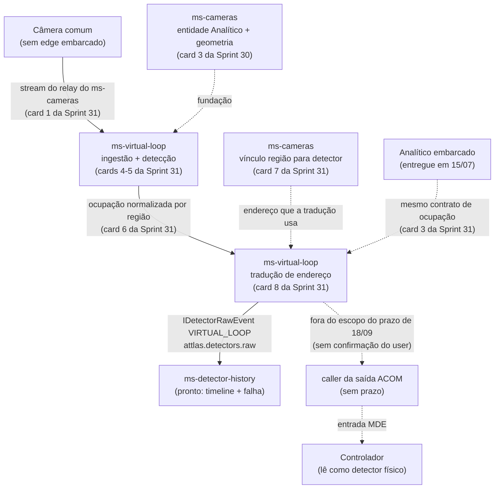

---
tags:
  - attlas
  - task
  - sprint-32
  - analitico
  - detectores
card: SOFTWARE-2200
clickup: https://app.clickup.com/t/86ajj1xv4
titulo: "[Back] Prova de campo do analítico em container até a timeline do detector"
frente: Analítico
tamanho: 2 pts
status: comprometido na Sprint 32 (7-13/09/26), movido do sem prazo em 25/08 junto com o prazo externo de 18/09. Histórico anterior preservado abaixo (fila da Sprint 27, SEM PRAZO desde 10/08). PR em draft segue aberta (plano de teste).
sprint: "[[Attlas - Sprint 32]]"
atualizado: 2026-08-25
---

# SOFTWARE-2200 - Prova de campo do analítico em container

Card de origem da frente de analítico em container, movido da Sprint 25 para a 27 e reescopado. O título
antigo era "Testar módulo de analítico desacoplado" e incluía a atuação no controlador via ACOM. A
atuação saiu para card próprio, e este ficou com o que é prova de verdade: **detecção de vídeo de câmera
comum aparecendo na timeline do `ms-detector-history`**.

> [!warning] Rota corrigida em 25/08, contra o reescopo de 24/08
> As seções abaixo, escritas em 31/07, ainda citam `ms-connector-virtual-loop` como serviço produtor
> separado e os cards `SOFTWARE-2385/2386/2389/2390` como os que abrem a cadeia. Isso mudou no reescopo de
> 24/08 (ver [[Attlas - Sprint 31]]): não existe `ms-connector-virtual-loop` como serviço - a tradução de
> endereço e a publicação em `attlas.detectors.raw` vivem **dentro do `ms-virtual-loop`**. O vínculo
> região-detector e a publicação viraram, respectivamente, os cards 7 e 8 da pilha da Sprint 31. O
> diagrama e as referências no fim desta nota já apontam para os cards corretos; o texto histórico abaixo
> fica como registro de como o plano evoluiu, não como rota vigente.

## Em uma frase

Câmera sem analítico embarcado, motor em container gerando a detecção do laço, publicando a ocupação
normalizada por região direto no Kafka, o `ms-virtual-loop` traduzindo para o evento de detecção padrão do
Attlas, e a detecção chegando ao histórico com contadores coerentes.

## Estado verificado no código (revisão histórica de 31/07, ver o aviso acima)

Duas premissas de 15/07 mudaram. As outras se confirmaram.

- **Rota embarcada (2134) é só feedback visual.** `ms-cameras/analytics-realtime` consome
  `traffic-motion-detection.detections` do broker do device e emite WS `camera:analytics:detection` e
  `camera:analytics:frame`. `IAnalyticsDetectionEvent` diz explícito "purely for visual feedback". Não
  publica em `attlas.detectors.raw`. **Confirmado.**
- **CORRIGIDO no fim do dia 31/07: já existe produtor real de `attlas.detectors.raw`.** A PR #1216 do
  SOFTWARE-2360 mergeou às 16:15 UTC e o `ms-controllers` passou a publicar o raw no **caminho ACP**
  (MOD-044, INT-118, PROJ-009, 75 arquivos, com relatório de teste de campo). O simulador deixou de ser o
  único produtor. A cadeia da semana continua sendo o gap do **caminho de vídeo**, que ninguém cobre, mas
  a frase "ninguém produz o raw" morreu e não deve ser repetida em spec nem em card.
- **O sumidouro está pronto.** `ms-detector-history` consome o raw, valida por `isDetectorRawEvent`, faz
  upsert do `MetaDetector`, persiste `DetectionRecord`, expõe `GET /detectors/:id/timeline` e gera falha
  em `attlas.detectors.fault`. Dá para testar sozinho injetando evento no tópico. **Confirmado.**
  Ressalva de 03/08: hoje nenhum serviço consome `attlas.detectors.fault`, então o plano de teste
  confere que o evento de falha foi publicado, não que algum alarme dispara.
- **CORRIGIDO: a ACOM não está apenas especificada, está implementada.** O `ms-controllers` tem
  `src/acom/` inteiro: CRUD com `AcomAssociation` (controlador, slot, canal), cliente TCP com
  `getDeviceState` e `setDeviceParameters` (INT-081 e INT-082), codec de frame, pollers realtime de
  status e de dados, e escrita no padrão commit-depois-do-ACK. A peça que falta para atuar não é o
  transporte, é o **caller** que decide escrever a saída quando o laço detecta.
- **CORRIGIDO: o cadastro do detector virtual quase existe, mas o vínculo nasce no `ms-cameras`, não
  no `ms-traffic-model`.** O model `Detector` do `ms-traffic-model` já tem `controllerId`, `slot`,
  `channel` e `type` com `VIRTUAL_LOOP` (valor 1 do enum numérico), porém não existe hoje um cadastro
  autoritativo de detector em lugar nenhum do repo, e o `ms-traffic-model` não expõe endpoint próprio
  para isso (o detector vive embutido na Lane). O vínculo entre a região da câmera e o endereço do
  detector é responsabilidade do `ms-cameras`, que é o dono do domínio Cameras - card 7 da
  [[Attlas - Sprint 31]] desde o reescopo de 24/08.
- **Serviços da cadeia seguem esqueletos**, exceto pela entidade Analítico e geometria em banco que a
  [[Attlas - Sprint 30]] cria. `ms-virtual-loop`, `ms-atspm` e `ms-dai` são scaffolds de "Hello API".
  Reais e prontos: `ms-detector-history`, `ms-controllers`, `ms-traffic-model` e a base de analítico do
  `ms-cameras`.
- **Contratos servem inteiros.** `IDetectorRawEvent`, `DetectorTechnology.VIRTUAL_LOOP`,
  `DetectorPurpose.VEHICLE`, `DETECTOR_TOPICS.RAW`, `DETECTOR_SAMPLE_DURATION_MS` de 100 ms,
  `IDetectorAddress` e o `deriveDetectorId` (UUID v5) do core-common. O que falta em
  `@attlas/contracts` é só o tópico de ocupação normalizada, que nasce como card 2 da
  [[Attlas - Sprint 31]] (`libs/contracts/src/lib/analytics/`, greenfield).

## Rotas em jogo (corrigido em 25/08)

Linha cheia é a rota analítica, escopo das três sprints do analítico (30/31/32): observação e histórico,
nunca atua no controlador, alimenta ATSPM, relatórios e falha.

Linha pontilhada é a atuação, onde a detecção viraria presença real na entrada do controlador. Segue sem
prazo, com o transporte ACOM já pronto e faltando só o caller - ver [[Attlas - Sprint 30]], seção "Não
entra nesta semana".

## Plano de teste (este card)

1. **Smoke do sumidouro, que isola do produtor.** Publicar um `IDetectorRawEvent` de laço virtual em
   `attlas.detectors.raw` com o simulador de linha de comando do repositório e conferir em
   `GET /detectors/:id/timeline` que o `DetectionRecord` foi persistido e o `MetaDetector` criado.
2. **`ms-virtual-loop` no ar**, apontado para o stream escolhido no ADR (card 1 da Sprint 31), com região
   provisionada (Sprint 30) e detecção publicada.
3. **Cadeia completa**: ocupação normalizada saindo do `ms-virtual-loop` e a tradução de endereço
   publicando o raw, sem serviço connector separado no meio.
4. **Veículo cruzando o laço**: UP e DOWN na timeline, com contadores RLE coerentes em unidades de
   100 ms.
5. **Caminho de falha**: manter presença contínua além do timeout e confirmar que `fault` foi
   publicado em `attlas.detectors.fault`. Nenhum serviço consome esse tópico hoje, então o critério
   é o evento estar lá, não um alarme disparando.

Evidência colada no card em cada passo. A identidade derivada tem que bater com o endereço do
detector registrado pelo vínculo do card 7 da Sprint 31, senão o histórico cria um `MetaDetector` órfão e
ninguém percebe.

## Reuso (mapa)

- **Base de integração com o analítico**: `ms-cameras/analytics-realtime` (`device-stream.consumer.ts`,
  `camera-regions.controller.ts`, `atman-region.mapper.ts`, digest HTTP). O producer de ocupação nasce
  daí, trocando o sink WS por producer Kafka sem perder a resolução de `region_id` para índice estável.
- **Contratos prontos**: `@attlas/contracts/detectors` mais `deriveDetectorId` em `core-common`.
- **Sumidouro pronto**: `ms-detector-history` (consumer, timeline, fault, scheduler de detector
  silencioso).
- **Template de connector**: `ms-connector-une` e `ms-connector-neo` (producer Kafka, cache de cadastro
  em Redis, health, config) - reusado como referência de estilo dentro do `ms-virtual-loop`, que agora
  incorpora a tradução de endereço.
- **ACOM pronta para quando a atuação entrar**: `ms-controllers/src/acom/`.

O model `Detector` do `ms-traffic-model` (com `type` numérico `VIRTUAL_LOOP`) não é o alvo de reuso
para o vínculo região-detector: ele não tem endpoint próprio, não expõe `index` linear e não é o
cadastro autoritativo. O endereço vem do vínculo que o card 7 da Sprint 31 cria no `ms-cameras`.

## O que o merge da fase 2 respondeu, e o que sobrou

Três das oito perguntas que eu ia levar ao alinhamento já têm resposta versionada no repo:

- **Onde a fase 2 mora**: `apps/ms-controllers/docs/modules/MOD-044-detector-raw-publication.md`, mais
  INT-118, PROJ-009 e um relatório de teste de campo. O plano de integração citado pela `INT-117` segue
  fora do repo, mas o que ele decidia está reproduzido nas specs versionadas.
- **Quem publica no ACP**: o `ms-controllers`, com reversão declarada no `docs/modules/detectors.md`. A
  mesma nota **mantém** `ms-connector-une` como produtor do seu protocolo; a menção a
  `ms-connector-virtual-loop` no mesmo doc está desatualizada desde o reescopo de 24/08 - a tradução do
  laço virtual vive no `ms-virtual-loop`, atualizar esse doc é DoD do card 8 da [[Attlas - Sprint 31]].
- **Forma do evento**: `build-detector-raw-events.ts` mostra a projeção canônica, com `sampledAt` e os dois
  índices de amostra compartilhados por canal, canal sem identidade derivada nunca publicado, e os
  invariantes que o guard cobra. É o gabarito que o `ms-virtual-loop` tem que respeitar.

Sobraram, e viraram conteúdo de spec no card 8 da Sprint 31 em vez de bloqueio:

1. **Publicação em dobro.** A tabela do MOD-044 mapeia `MDE + Vehicle` e o módulo `VirtualLoop` do NEO para
   `VIRTUAL_LOOP`. Se um dia o laço virtual atuar por ACOM, o produtor ACP publica aquela presença e o
   `ms-virtual-loop` também. Quem é a fonte de verdade? Risco 5 da [[Attlas - Sprint 31]].
2. **Reuso da janela RLE.** A lógica agnóstica de protocolo (janela, trim de runs, derivação de
   identidade) está dentro do `ms-controllers`. Extrair para lib ou espelhar no `ms-virtual-loop` com card
   de unificação datado?
3. **Endereçamento**: índice de canal físico do controlador ou faixa sintética?
4. **Critério de aceite**: basta aparecer na timeline, ou ATSPM e traffic-model precisam estar prontos?

## Referências

- Rota embarcada, base do reuso: [[SOFTWARE-2134 - Analítico de vídeo ao vivo (detecção + bounding boxes)]].
- ADR de alimentação de vídeo (substitui o SOFTWARE-2385): [[Analítico servidor - ADR de alimentação e SPEC do ms-virtual-loop]].
- Vínculo região-detector (substitui o SOFTWARE-2389): [[Analítico servidor - Vínculo região para endereço de detector]].
- Tradução de endereço (substitui o SOFTWARE-2390, sem connector separado): [[Analítico servidor - Tradução de endereço e publicação do detector raw]].
- Plano do domínio de detecção: `docs/modules/detectors.md`.
- Planejamento vigente: [[Attlas - Sprint 32]] · [[Attlas - Sprint 31]] · [[Attlas - Sprint 30]].
- Planejamento original do card (histórico): [[Attlas - Sprint 27]].
